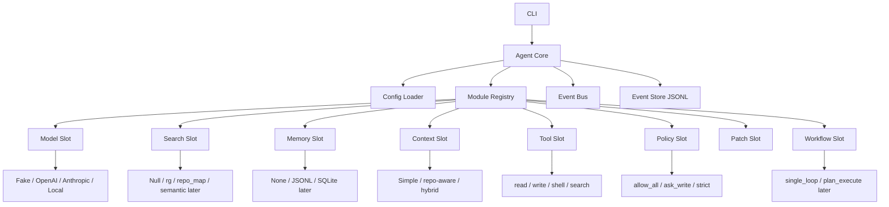
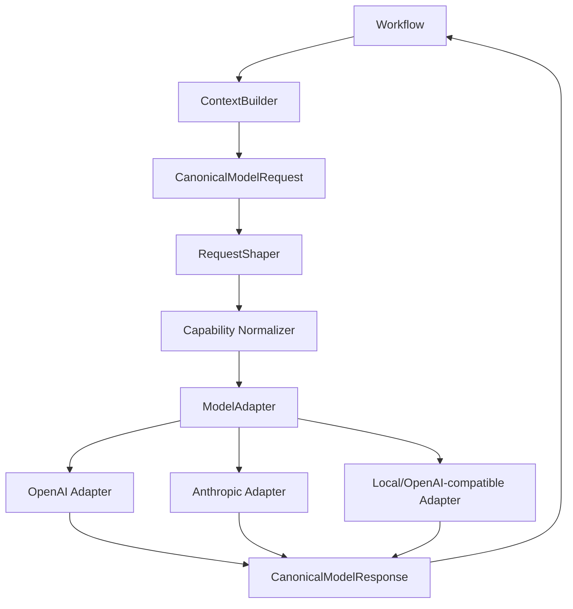
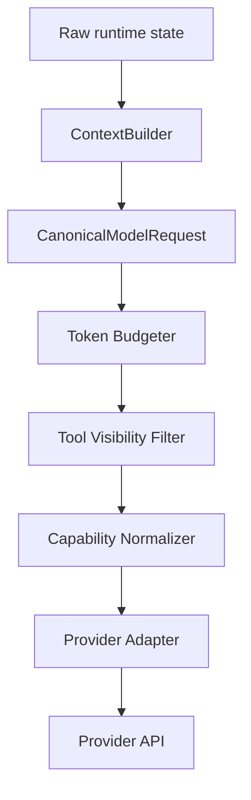
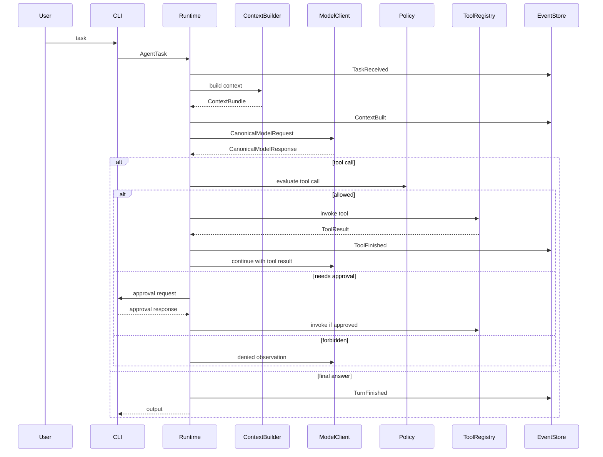
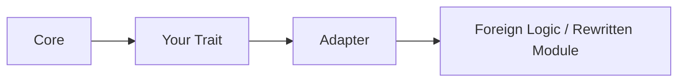

# Modular Coding Agent Skeleton v0.1

Финальная стартовая спецификация для реализации Rust CLI-first модульного coding-agent каркаса.

Цель документа: дать архитектурную рамку, с которой можно начинать писать код в Codex/Claude, не превращая проект сразу в тяжёлую платформу.

---

## 0. Главная идея

Проект — это не клон Claude Code, Codex CLI, OpenCode или ForgeCode.

Проект — это **модульный каркас-конструктор**:

```text
маленькое стабильное ядро
+ заменяемые module slots
+ простые DTO-контракты
+ fake/stub реализации на старте
+ возможность адаптировать чужие идеи/модули через adapters
```

Главная проверка архитектуры:

```text
Если заменить search=rg на search=repo_map,
или memory=none на memory=jsonl,
или model=fake на model=openai,
core runtime не должен меняться.
```

---

## 1. Не-цели v0

В первой версии не делать:

- полноценный marketplace плагинов;
- in-process hot-reload Rust dylib;
- WASM runtime;
- ACP/MCP как основу ядра;
- произвольный multi-agent DAG;
- обязательный RAG;
- сложную TUI;
- полноценный аналог Claude Code/Codex;
- fork чужого проекта целиком.

Разрешено делать тупые реализации, если контракт уже правильный.

---

## 2. Архитектурный принцип

### Правильная форма

```text
Core -> Contract -> Module Implementation
```

### Неправильная форма

```text
Module A -> Module B -> Module C -> Core знает всё обо всех
```

Модули не должны зависеть друг от друга напрямую.
Они могут общаться только через core/runtime context и DTO.

---

## 3. Общий граф системы



---

## 4. Стабильное ядро

Core должен быть маленьким и скучным.

Core отвечает за:

- загрузку конфига;
- создание module registry;
- wiring активных реализаций;
- запуск workflow;
- передачу DTO между модулями;
- запись событий;
- cancellation/timeout базового уровня;
- централизованную обработку ошибок.

Core не отвечает за:

- конкретный prompt style;
- конкретный поиск;
- конкретную память;
- конкретный provider;
- конкретный patch algorithm;
- конкретную политику approval.

---

## 5. Module slots v0

| Slot | Назначение | Стартовая реализация | Будущие реализации |
|---|---|---|---|
| `ModelClient` | общение с LLM | `FakeModelClient` | OpenAI, Anthropic, local, OpenAI-compatible |
| `SearchBackend` | поиск по проекту | `RgSearch` / `NullSearch` | repo map, tree-sitter, semantic |
| `MemoryStore` | память | `NoMemory` / `JsonlMemory` | SQLite, vector, hybrid |
| `ContextBuilder` | сбор контекста | `SimpleContextBuilder` | budgeted, repo-aware, memory-aware |
| `ToolRegistry` | доступные tools | hardcoded tools | dynamic registry, MCP later |
| `ApprovalPolicy` | разрешения | `AskWritePolicy` | strict, trusted, headless |
| `PatchApplier` | применение изменений | direct write | unified diff, git-aware patch |
| `Workflow` | ход агента | `SingleLoopWorkflow` | plan/execute/review, subagents later |
| `Renderer` | вывод | plain text | TUI, JSON, ACP later |

---

## 6. Стандарт модуля

Каждый модуль должен иметь manifest.

```rust
#[derive(Debug, Clone, Serialize, Deserialize)]
pub struct ModuleManifest {
    pub id: String,
    pub kind: ModuleKind,
    pub version: String,
    pub api_version: String,
    pub capabilities: Vec<String>,
    pub description: Option<String>,
}

#[derive(Debug, Clone, Serialize, Deserialize)]
pub enum ModuleKind {
    Model,
    Search,
    Memory,
    Context,
    Tool,
    Policy,
    Patch,
    Workflow,
    Renderer,
}
```

Правило совместимости:

```text
core.api_version == module.api_version
```

В v0 можно сделать проще: все built-in модули компилируются вместе, но manifest уже есть.

---

## 7. Стандарт DTO

На границах только простые сериализуемые типы.

```rust
#[derive(Debug, Clone, Serialize, Deserialize)]
pub struct AgentTask {
    pub text: String,
    pub cwd: PathBuf,
}

#[derive(Debug, Clone, Serialize, Deserialize)]
pub struct ContextChunk {
    pub source: String,
    pub path: Option<PathBuf>,
    pub content: String,
    pub score: Option<f32>,
    pub metadata: serde_json::Value,
}

#[derive(Debug, Clone, Serialize, Deserialize)]
pub struct ContextBundle {
    pub chunks: Vec<ContextChunk>,
    pub summary: Option<String>,
    pub token_estimate: Option<u32>,
}

#[derive(Debug, Clone, Serialize, Deserialize)]
pub struct ToolCall {
    pub id: CallId,
    pub name: String,
    pub args: serde_json::Value,
}

#[derive(Debug, Clone, Serialize, Deserialize)]
pub struct ToolResult {
    pub call_id: CallId,
    pub ok: bool,
    pub output: String,
    pub error: Option<String>,
    pub metadata: serde_json::Value,
}
```

---

# 8. Стандартизация модельной архитектуры

Это обязательный слой. Без него OpenAI/Anthropic/local-провайдеры начнут протекать во все модули.

## 8.1 Цель

Внутри системы должен существовать один canonical model format:

```text
Agent Core -> CanonicalModelRequest -> ModelAdapter -> Provider API
Provider API -> ModelAdapter -> CanonicalModelResponse -> Agent Core
```

Core, workflow, tools, memory и context builder не должны знать, какой provider используется.

---

## 8.2 Граф модельного слоя



---

## 8.3 Canonical messages

Не привязывать внутренние сообщения к OpenAI/Anthropic/Gemini schema.

```rust
#[derive(Debug, Clone, Serialize, Deserialize)]
pub enum MessageRole {
    System,
    Developer,
    User,
    Assistant,
    Tool,
}

#[derive(Debug, Clone, Serialize, Deserialize)]
pub struct CanonicalMessage {
    pub id: MessageId,
    pub role: MessageRole,
    pub parts: Vec<ContentPart>,
    pub name: Option<String>,
    pub tool_call_id: Option<CallId>,
    pub metadata: serde_json::Value,
}
```

---

## 8.4 Content parts

Модельные сообщения должны быть typed, а не просто строки.

```rust
#[derive(Debug, Clone, Serialize, Deserialize)]
pub enum ContentPart {
    Text { text: String },
    Context { chunk: ContextChunk },
    FileRef { path: PathBuf, content: Option<String> },
    ToolCall { call: ToolCall },
    ToolResult { result: ToolResult },
    Patch { patch: Patch },
    ReasoningSummary { text: String },
}
```

В v0 достаточно `Text`, `ToolCall`, `ToolResult`, `Context`.
Остальное можно добавить позже.

Важно: не хранить и не требовать raw chain-of-thought. Разрешён только `ReasoningSummary`, если provider его отдаёт или если система сама делает summary.

---

## 8.5 Canonical request

```rust
#[derive(Debug, Clone, Serialize, Deserialize)]
pub struct CanonicalModelRequest {
    pub model: ModelRef,
    pub instructions: Vec<InstructionBlock>,
    pub messages: Vec<CanonicalMessage>,
    pub tools: Vec<ToolSpec>,
    pub tool_choice: ToolChoice,
    pub response_format: ResponseFormat,
    pub sampling: SamplingConfig,
    pub reasoning: ReasoningConfig,
    pub limits: ModelLimits,
    pub cache: CacheHints,
    pub metadata: serde_json::Value,
}
```

```rust
#[derive(Debug, Clone, Serialize, Deserialize)]
pub struct InstructionBlock {
    pub kind: InstructionKind,
    pub text: String,
    pub priority: u8,
}

#[derive(Debug, Clone, Serialize, Deserialize)]
pub enum InstructionKind {
    System,
    Developer,
    Project,
    UserPreference,
}
```

Почему инструкции отдельно от messages:

- разные providers по-разному поддерживают system/developer/project rules;
- request shaper может правильно собрать их под конкретную модель;
- context builder не должен заниматься provider-specific prompt layout.

---

## 8.6 Canonical response

```rust
#[derive(Debug, Clone, Serialize, Deserialize)]
pub struct CanonicalModelResponse {
    pub message: CanonicalMessage,
    pub tool_calls: Vec<ToolCall>,
    pub finish_reason: FinishReason,
    pub usage: Option<TokenUsage>,
    pub provider_metadata: serde_json::Value,
}

#[derive(Debug, Clone, Serialize, Deserialize)]
pub enum FinishReason {
    Stop,
    ToolCalls,
    Length,
    ContentFilter,
    Error,
    Unknown,
}
```

Даже если provider отдаёт tool calls внутри content blocks, adapter приводит их к `tool_calls`.

---

## 8.7 Streaming standard

Внутри core должен быть один stream event enum.

```rust
#[derive(Debug, Clone, Serialize, Deserialize)]
pub enum ModelStreamEvent {
    TextDelta { text: String },
    ToolCallDelta { call_id: CallId, name: Option<String>, args_delta: String },
    ToolCallFinished { call: ToolCall },
    ReasoningSummaryDelta { text: String },
    Usage { usage: TokenUsage },
    Done { finish_reason: FinishReason },
    Error { message: String },
}
```

CLI/TUI/ACP потом будут слушать эти события, а не provider-specific stream.

---

## 8.8 Model capabilities

Каждый provider/model должен объявить capabilities.

```rust
#[derive(Debug, Clone, Serialize, Deserialize)]
pub struct ModelCapabilities {
    pub supports_tools: bool,
    pub supports_parallel_tool_calls: bool,
    pub supports_streaming: bool,
    pub supports_json_schema: bool,
    pub supports_system_role: bool,
    pub supports_developer_role: bool,
    pub supports_cache_hints: bool,
    pub supports_reasoning_config: bool,
    pub supports_image_input: bool,
    pub supports_file_input: bool,
    pub max_input_tokens: Option<u32>,
    pub max_output_tokens: Option<u32>,
}
```

RequestShaper обязан:

- удалить неподдерживаемые features;
- downgrade-нуть request, если можно;
- вернуть понятную ошибку, если нельзя;
- записать event о downgrade.

---

## 8.9 Model adapter trait

```rust
#[async_trait::async_trait]
pub trait ModelAdapter: Send + Sync {
    fn id(&self) -> &'static str;
    fn capabilities(&self, model: &ModelRef) -> ModelCapabilities;

    async fn complete(
        &self,
        request: CanonicalModelRequest,
    ) -> anyhow::Result<CanonicalModelResponse>;

    async fn stream(
        &self,
        request: CanonicalModelRequest,
    ) -> anyhow::Result<BoxStream<'static, anyhow::Result<ModelStreamEvent>>>;
}
```

`ModelClient` может быть обёрткой над `ModelAdapter + RequestShaper`.

---

## 8.10 Provider-specific data

Provider-specific настройки разрешены только здесь:

```toml
[model]
provider = "openai"
model = "gpt-x"

[model.provider_config]
reasoning_effort = "medium"
service_tier = "auto"
```

Или:

```toml
[model]
provider = "anthropic"
model = "claude-x"

[model.provider_config]
thinking_budget_tokens = 4096
cache_system_prompt = true
```

Core не должен читать `reasoning_effort` или `thinking_budget_tokens` напрямую.
Это задача adapter/shaper.

---

## 8.11 Tool schema standard

Tool descriptions должны быть provider-neutral.

```rust
#[derive(Debug, Clone, Serialize, Deserialize)]
pub struct ToolSpec {
    pub name: String,
    pub description: String,
    pub input_schema: serde_json::Value,
    pub safety: ToolSafety,
    pub timeout_ms: Option<u64>,
    pub metadata: serde_json::Value,
}

#[derive(Debug, Clone, Serialize, Deserialize)]
pub enum ToolSafety {
    ReadOnly,
    WritesFiles,
    RunsCommands,
    Network,
    Dangerous,
}
```

Adapter уже сам превращает `ToolSpec` в OpenAI/Anthropic/local schema.

---

## 8.12 Request shaping pipeline



Порядок важен:

1. ContextBuilder собирает смысловой контекст.
2. TokenBudgeter режет/сжимает.
3. ToolVisibilityFilter оставляет только tools, доступные модели.
4. CapabilityNormalizer приводит request к возможностям модели.
5. ProviderAdapter делает wire format.

---

## 8.13 Главное правило модельной совместимости

```text
Ни один модуль, кроме model adapter/request shaper,
не должен импортировать типы OpenAI/Anthropic/Gemini/local provider SDK.
```

Если где-то в `workflow`, `context`, `memory`, `tools`, `policy` появляется provider-specific тип — архитектура ломается.

---

# 9. Основные traits v0

```rust
#[async_trait::async_trait]
pub trait ModelClient: Send + Sync {
    async fn complete(&self, request: CanonicalModelRequest) -> anyhow::Result<CanonicalModelResponse>;
}
```

```rust
#[async_trait::async_trait]
pub trait SearchBackend: Send + Sync {
    async fn search(&self, query: SearchQuery) -> anyhow::Result<Vec<ContextChunk>>;
}
```

```rust
#[async_trait::async_trait]
pub trait MemoryStore: Send + Sync {
    async fn remember(&self, item: MemoryItem) -> anyhow::Result<()>;
    async fn recall(&self, query: MemoryQuery) -> anyhow::Result<Vec<MemoryItem>>;
}
```

```rust
#[async_trait::async_trait]
pub trait ContextBuilder: Send + Sync {
    async fn build(&self, input: ContextBuildInput) -> anyhow::Result<ContextBundle>;
}
```

```rust
#[async_trait::async_trait]
pub trait Tool: Send + Sync {
    fn spec(&self) -> ToolSpec;
    async fn invoke(&self, input: ToolInput, ctx: ToolContext) -> anyhow::Result<ToolResult>;
}
```

```rust
pub trait ApprovalPolicy: Send + Sync {
    fn evaluate(&self, call: &ToolCall, ctx: &PolicyContext) -> PolicyDecision;
}
```

```rust
#[async_trait::async_trait]
pub trait PatchApplier: Send + Sync {
    async fn apply(&self, patch: Patch) -> anyhow::Result<PatchResult>;
}
```

```rust
#[async_trait::async_trait]
pub trait Workflow: Send + Sync {
    async fn run(&self, task: AgentTask, ctx: RuntimeContext) -> anyhow::Result<AgentOutput>;
}
```

---

# 10. Event log v0

В v0 достаточно JSONL.
SQLite позже.

```rust
#[derive(Debug, Clone, Serialize, Deserialize)]
pub enum Event {
    SessionStarted { session_id: SessionId, cwd: PathBuf },
    TaskReceived { task: AgentTask },
    ContextBuilt { chunks: usize, token_estimate: Option<u32> },
    ModelRequestPrepared { model: ModelRef },
    ModelResponseReceived { finish_reason: FinishReason },
    ToolCallRequested { call: ToolCall },
    ApprovalRequested { call_id: CallId, reason: String },
    ApprovalResolved { call_id: CallId, approved: bool },
    ToolFinished { result: ToolResult },
    MemoryWritten { kind: String },
    PatchApplied { result: PatchResult },
    TurnFinished { output: AgentOutput },
    Error { message: String },
}
```

Правило:

```text
event log = правда
любые индексы/кэши = производные
```

---

# 11. Runtime loop v0



---

# 12. Конфиг v0

```toml
[profile]
name = "dev-basic"

[model]
provider = "fake"
model = "fake-tool-model"
stream = false

[modules]
workflow = "single_loop"
search = "rg"
memory = "none"
context = "simple"
policy = "ask_write"
patch = "direct"
renderer = "plain"

[tools]
enabled = ["read_file", "write_file", "shell", "search"]

[policy.ask_write]
ask_before = ["write_file", "shell"]
allow = ["read_file", "search"]

[search.rg]
max_results = 50

[memory.jsonl]
path = ".agent/memory.jsonl"

[event_log]
path = ".agent/events.jsonl"
```

Позже:

```toml
[model]
provider = "openai"
model = "gpt-x"
stream = true

[modules]
search = "repo_map"
memory = "jsonl"
context = "repo_aware"
workflow = "plan_execute_review"
```

---

# 13. Структура проекта v0

Начать можно с одного crate.

```text
agent/
  Cargo.toml
  src/
    main.rs

    core/
      mod.rs
      runtime.rs
      registry.rs
      config.rs
      event_store.rs

    domain/
      mod.rs
      ids.rs
      events.rs
      task.rs
      context.rs
      tool.rs
      memory.rs
      model.rs
      patch.rs

    contracts/
      mod.rs
      model_client.rs
      model_adapter.rs
      search_backend.rs
      memory_store.rs
      context_builder.rs
      tool.rs
      approval_policy.rs
      patch_applier.rs
      workflow.rs

    model_standard/
      mod.rs
      canonical_request.rs
      canonical_response.rs
      content_part.rs
      capabilities.rs
      shaper.rs
      stream.rs

    modules/
      mod.rs
      model_fake.rs
      search_rg.rs
      search_null.rs
      memory_none.rs
      memory_jsonl.rs
      context_simple.rs
      policy_allow_all.rs
      policy_ask_write.rs
      tools_read.rs
      tools_write.rs
      tools_shell.rs
      tools_search.rs
      patch_direct.rs
      workflow_single_loop.rs
      renderer_plain.rs

    adapters/
      mod.rs
      openai_adapter.rs
      anthropic_adapter.rs
      aider_repo_map_stub.rs
      forge_context_stub.rs
      codex_policy_shape_stub.rs

    tests/
      module_swap.rs
      model_standard.rs
      fake_workflow.rs
```

Позже можно разнести в crates.

---

# 14. Как адаптировать чужие модули

## Правило

```text
Чужой код никогда не входит напрямую в core.
Только через adapter, реализующий твой trait.
```

## Схема



## Процесс адаптации

1. Найти у чужого проекта конкретную подсистему.
2. Понять её входы/выходы.
3. Написать свой DTO mapping.
4. Реализовать свой trait.
5. Добавить conformance test.
6. Проверить лицензию.
7. Не позволять чужому коду владеть runtime state.

---

# 15. Что брать из других проектов

## Aider

Брать идеи:

- repo map;
- git-first patch flow;
- compact context по кодовой базе.

В твоей архитектуре:

```text
SearchBackend = RepoMapSearch
ContextBuilder = RepoMapContextBuilder
PatchApplier = GitPatchApplier
```

## ForgeCode

Брать идеи:

- Context vs Conversation split;
- turn pipeline;
- request shaping;
- retrieval memory как отдельный слой.

В твоей архитектуре:

```text
ContextBuilder
ConversationStore later
MemoryStore
RequestShaper
```

## Claude Code patterns

Брать идеи:

- registered tools vs model-visible tools vs executed tools;
- permission pipeline;
- tool filtering;
- subagent/tool pool assembly later.

В твоей архитектуре:

```text
ToolRegistry
ToolVisibilityFilter
ApprovalPolicy
Workflow later
```

## Codex patterns

Брать идеи:

- approval через state;
- event log as source of truth;
- subagent = thread later;
- policy/orchestrator/runtime split.

В твоей архитектуре:

```text
EventStore
ApprovalState
ThreadState later
RuntimeLoop
```

## OpenCode

Брать идеи:

- typed parts;
- structured events;
- session run-state invariants;
- plugin/tool ideas.

Не брать целиком как основу v0.

---

# 16. Юридическое правило

Можно:

- брать идеи;
- переписывать своими словами/кодом;
- использовать MIT/Apache/BSD совместимый код с сохранением license notices;
- делать adapter к внешнему executable/tool.

Опасно:

- копировать GPL/AGPL код в свой core, если хочешь permissive/коммерческую свободу;
- тащить большие куски без лицензий;
- смешивать чужие типы с твоим core;
- строить архитектуру вокруг чужого внутреннего API.

---

# 17. MVP-порядок реализации

## Phase 0 — domain + config

Сделать:

- IDs;
- DTO;
- Event enum;
- config loader;
- module manifest;
- module registry skeleton.

Никакой LLM пока не нужен.

## Phase 1 — model standard + fake model

Сделать:

- `CanonicalModelRequest`;
- `CanonicalModelResponse`;
- `ContentPart`;
- `ModelCapabilities`;
- `FakeModelClient`.

Цель:

```text
fake model returns ToolCall(read_file)
```

## Phase 2 — tools + policy

Сделать:

- read file;
- write file;
- shell;
- search tool;
- ask_write policy;
- allow_all policy.

Цель:

```text
tool call -> policy -> execute -> event log
```

## Phase 3 — simple runtime loop

Сделать:

- `SingleLoopWorkflow`;
- context builder;
- tool result feedback to model;
- final answer.

Цель:

```text
fake model -> tool -> fake final answer
```

## Phase 4 — rg search + simple memory

Сделать:

- `RgSearch`;
- `NoMemory`;
- `JsonlMemory`;
- context = task + search hits + memory recall.

Цель:

```text
search=rg -> search=null через config
memory=none -> memory=jsonl через config
```

## Phase 5 — real model adapter

Сделать один provider:

- OpenAI или Anthropic;
- через `ModelAdapter`;
- без протекания provider types в core.

Цель:

```text
model=fake -> model=real через config
```

## Phase 6 — module swap tests

Тесты:

```text
search rg/null не меняет runtime
memory none/jsonl не меняет runtime
policy allow_all/ask_write не меняет tools
model fake/real не меняет workflow
```

---

# 18. Definition of Done v0

v0 считается успешной, если:

1. CLI принимает задачу.
2. Config выбирает модули.
3. Fake model может вызвать tool.
4. Tool проходит через policy.
5. Результат пишется в event log.
6. SearchBackend можно заменить через config.
7. MemoryStore можно заменить через config.
8. ModelClient можно заменить через config.
9. Provider-specific типы не видны за пределами adapter.
10. Есть хотя бы 4 module swap tests.

---

# 19. Тесты совместимости модулей

```rust
#[tokio::test]
async fn swapping_search_backend_does_not_change_runtime() {
    // config A: search=rg
    // config B: search=null
    // same workflow, same model, same core
}
```

```rust
#[tokio::test]
async fn fake_and_real_model_share_same_canonical_contract() {
    // FakeModelClient and OpenAIAdapter both accept CanonicalModelRequest
}
```

```rust
#[tokio::test]
async fn provider_specific_types_do_not_escape_adapter() {
    // Compile-time архитектурная проверка через module boundaries.
}
```

```rust
#[tokio::test]
async fn tool_visibility_and_execution_are_separate() {
    // tool registered != tool visible != tool executed
}
```

---

# 20. Первый prompt для Codex/Claude

Скопируй это в Codex/Claude как стартовую задачу:

```text
We are implementing a Rust CLI-first modular coding-agent skeleton.
Do not build a full agent yet.
Implement only the v0 architecture foundation.

Hard requirements:
1. Core must not depend on provider-specific model SDK types.
2. All model providers must use CanonicalModelRequest and CanonicalModelResponse.
3. Modules are selected by config and wired through traits.
4. Implement FakeModelClient first.
5. Implement Tool trait, read_file tool, shell tool, and ask_write policy.
6. Implement Event enum and JSONL EventStore.
7. Implement SingleLoopWorkflow that can:
   - build simple context,
   - call fake model,
   - receive tool call,
   - evaluate policy,
   - execute tool,
   - append events,
   - return final output.
8. Do not add RAG, MCP, ACP, TUI, WASM, dynamic plugins, or subagents yet.
9. Keep DTOs serde-serializable.
10. Add module swap tests for search, memory, policy, and model.

Project structure should follow:
- src/domain
- src/contracts
- src/model_standard
- src/core
- src/modules
- src/adapters

Focus on clean boundaries, not features.
```

---

# 21. Главная мантра проекта

```text
Сначала совместимые контракты.
Потом тупые реализации.
Потом adapter к чужим идеям.
Потом реальные provider/tools.
Потом сложная память/retrieval/subagents.
```

Если следовать этому порядку, скелет не станет бесполезным даже при появлении 100500 будущих фич.

