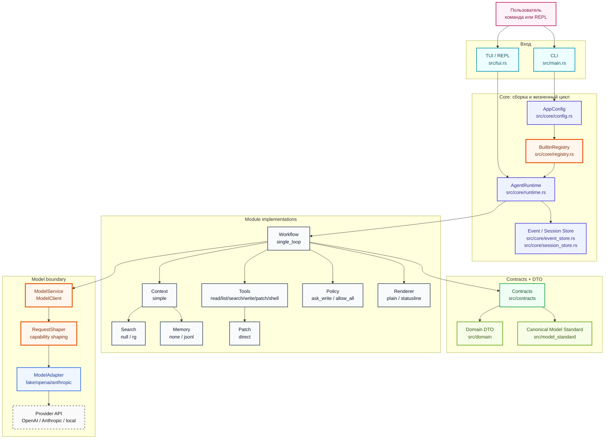
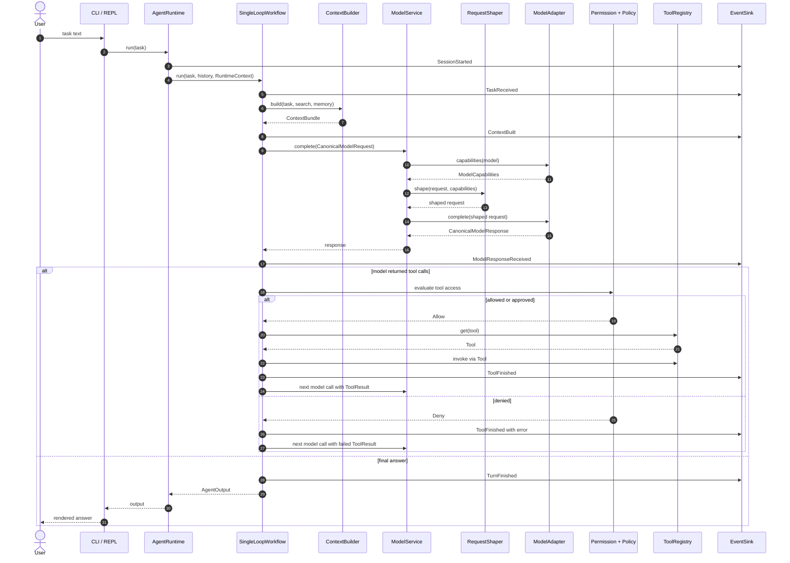
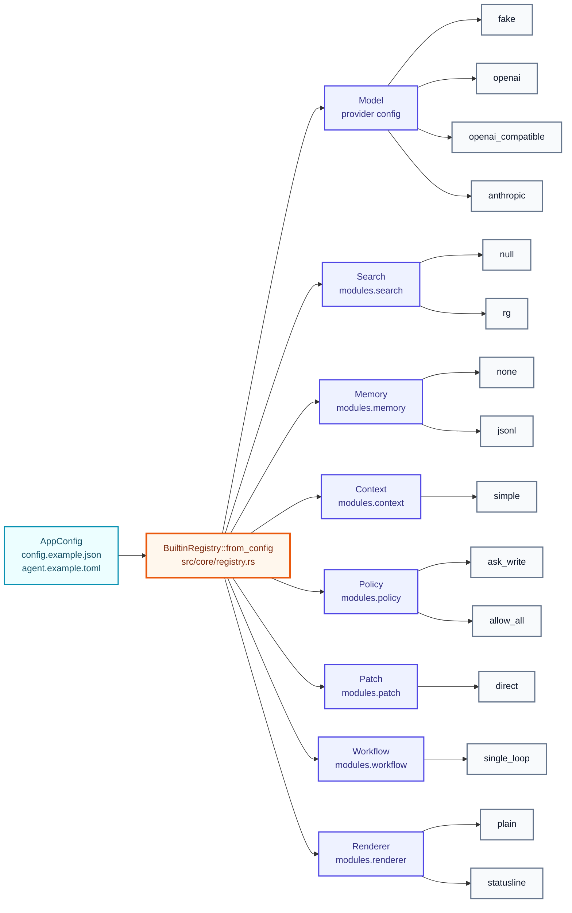
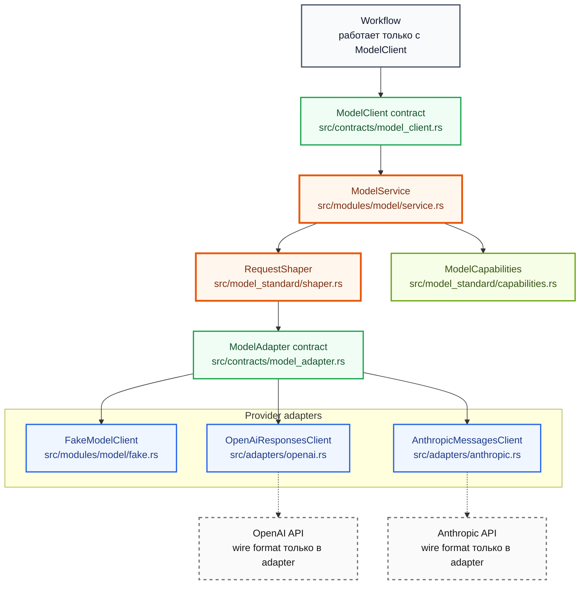
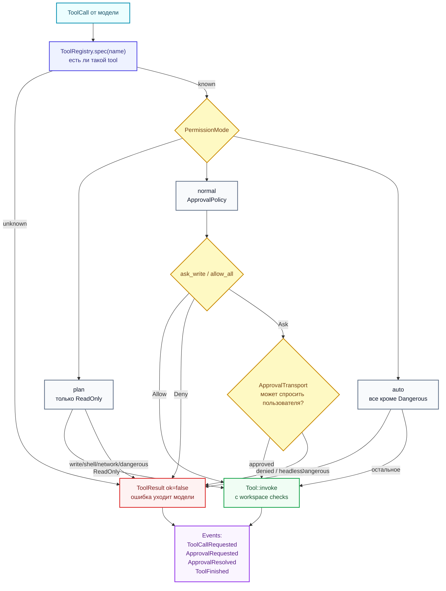
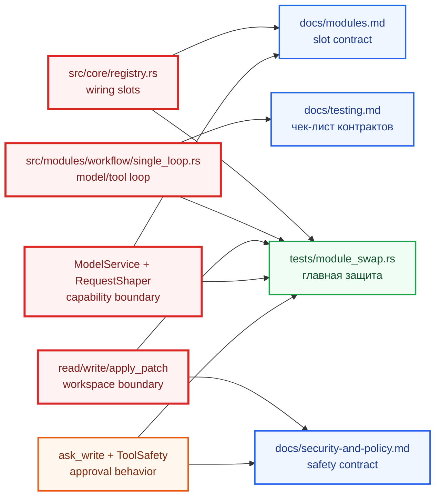
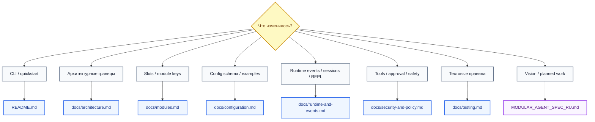

# Mermaid-карта проекта Modular Agent

Снимок: `2026-04-27 14:48:24 MSK`

Эта версия карты сделана как визуальный обзор. Ее удобно открывать в Markdown-просмотрщике с поддержкой Mermaid и сравнивать с будущими снимками из `map/`.

## 1. Большая Картина



Главная форма проекта:

```text
Core -> Contract -> Module Implementation
```

Если новая функциональность не проходит через `src/contracts`, `src/modules`, `src/adapters` или явно добавленный contract, это подозрительное место.

## 2. Runtime Flow Одного Turn-а



## 3. Slots: Где Проект Специально Заменяемый



Правило: если добавляешь новую реализацию slot-а, она должна появиться в `BuiltinRegistry::from_config`, config example, тесте заменяемости и документации.

## 4. Model Boundary После Текущих Изменений



Что важно:

- workflow не должен знать OpenAI/Anthropic schema;
- adapters реализуют `ModelAdapter`;
- runtime получает `ModelClient` через `ModelService`;
- `RequestShaper` режет request под capabilities до provider call.

## 5. Tool Safety Gate



Главное правило: tool нельзя исполнять в обход `ToolRegistry`, `PermissionMode`, `ApprovalPolicy` и собственного workspace/path check.

## 6. Риски И Что Их Ловит



## 7. Документы Как Навигация



`README.md` и `docs/*` описывают фактическое состояние. `MODULAR_AGENT_SPEC_RU.md` описывает vision/spec/roadmap, поэтому его нельзя читать как факт без разделения `implemented` и `planned`.
