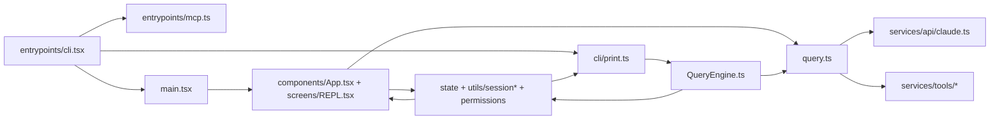

# Общий обзор

## Коротко

Claude Code в этом репозитории состоит из пяти больших слоев:
- bootstrap и диспетчер режимов запуска
- orchestration для interactive и headless сценариев
- query loop и API-взаимодействие с моделью
- registry/assembly слои для commands, tools, skills, plugins, MCP
- state, permissions, session storage, resume/recovery

Самая частая ошибка при reverse engineering:
- рисовать проект как простой CLI с одной точкой входа
- игнорировать `cli/print.ts` и `QueryEngine.ts`
- считать `commands.ts` и `tools.ts` финальными runtime-списками
- недооценивать слои `toolPool`, `permissionSetup`, `onChangeAppState`, `sessionRestore`

## Высокоуровневая схема

## Основные файлы

- `src/entrypoints/cli.tsx`
- `src/main.tsx`
- `src/cli/print.ts`
- `src/screens/REPL.tsx`
- `src/QueryEngine.ts`
- `src/query.ts`
- `src/commands.ts`
- `src/tools.ts`
- `src/utils/toolPool.ts`
- `src/state/onChangeAppState.ts`
- `src/utils/sessionStorage.ts`
- `src/utils/conversationRecovery.ts`
- `src/utils/sessionRestore.ts`

## Что важно помнить

- `entrypoints/cli.tsx` это мультиплексор fast-path веток, а не просто старт TUI.
- `main.tsx` управляет interactive жизненным циклом.
- `cli/print.ts` управляет headless/SDK жизненным циклом.
- `query.ts` это общее ядро turn loop.
- `commands.ts` и `tools.ts` это только часть картины, потому что дальше накладываются skills, plugins, MCP, deny rules и coordinator filtering.
