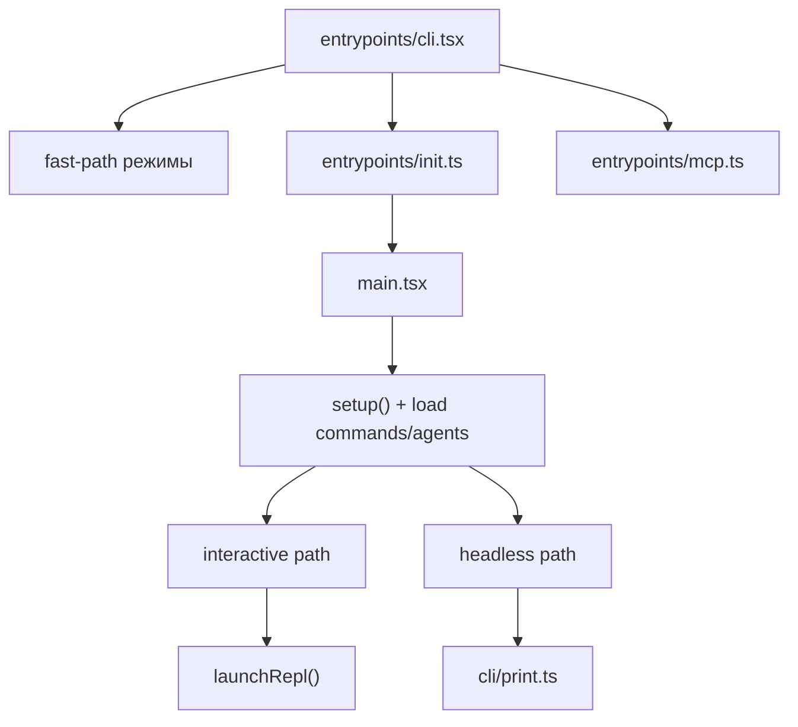

# Bootstrap И Старт

## Главный вывод

Стартовая цепочка здесь нелинейная.  
`src/entrypoints/cli.tsx` сначала разбирает быстрые режимы, и только потом передает управление в тяжелый runtime.

## Ключевые файлы

- `src/entrypoints/cli.tsx`
- `src/entrypoints/init.ts`
- `src/main.tsx`
- `src/entrypoints/mcp.ts`
- `src/cli/print.ts`

## Что делает bootstrap

`src/entrypoints/cli.tsx`:
- обрабатывает `--version` без загрузки большого графа модулей
- включает специальные режимы вроде bridge, daemon, bg sessions, templates
- может уйти в отдельные fast-path ветки, не заходя в обычный interactive flow
- только после этого тянет тяжелый runtime

`src/entrypoints/init.ts`:
- включает config system
- применяет safe env vars
- поднимает graceful shutdown
- запускает асинхронные prefetch и фоновые инициализации
- готовит сетевую конфигурацию, proxy, mTLS, telemetry, remote settings

`src/main.tsx`:
- разделяет interactive и non-interactive режимы
- параллелит `setup()` и загрузку commands/agents
- подготавливает tools, settings, session context, plugins, skills
- в зависимости от режима уходит либо в `launchRepl`, либо в `cli/print.ts`

## Схема запуска

## Практические замечания

- Нельзя рисовать `cli.tsx` как один линейный вход в TUI.
- `main.tsx` и `cli/print.ts` нужно анализировать как два разных orchestration-центра.
- `setup()` в `main.tsx` не просто подготовка каталога; вокруг него завязан cwd/worktree/session flow.
- Важная деталь: часть инициализации запускается заранее и параллельно ради времени старта.
