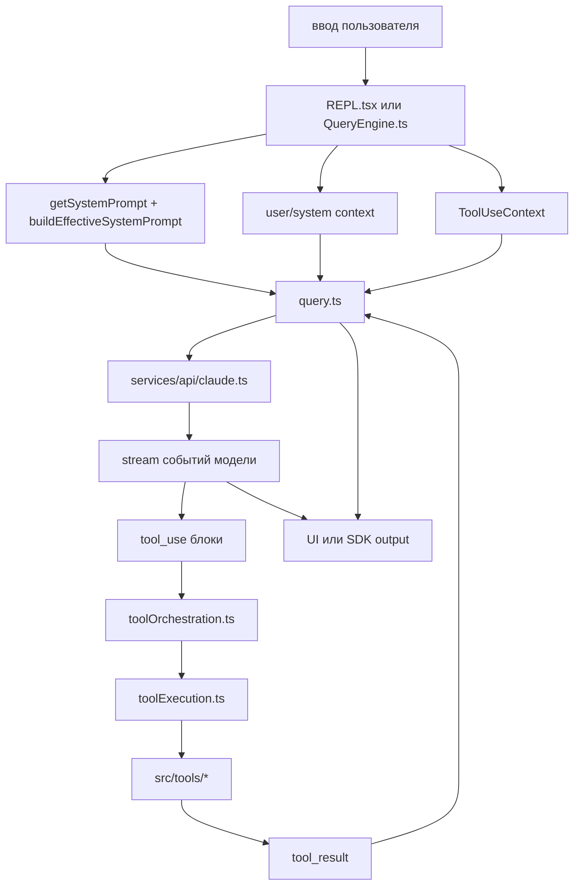

# Runtime Loop

## Главный вывод

Основной агентный цикл сходится в `src/query.ts`.  
Interactive и headless режимы подают в него данные разными путями, но дальше логика в основном общая.

## Ключевые файлы

- `src/screens/REPL.tsx`
- `src/QueryEngine.ts`
- `src/query.ts`
- `src/services/api/claude.ts`
- `src/services/tools/toolOrchestration.ts`
- `src/services/tools/toolExecution.ts`
- `src/utils/systemPrompt.ts`

## Interactive путь

В interactive режиме `REPL.tsx`:
- принимает ввод пользователя
- собирает `system prompt`
- подтягивает `user context` и `system context`
- формирует `ToolUseContext`
- запускает `query()`
- принимает поток событий и обновляет UI

## Headless путь

В headless режиме `cli/print.ts` и `QueryEngine.ts`:
- собирают состояние без Ink UI
- вызывают `ask()` / `submitMessage()`
- прокидывают управление в `query()`
- маппят поток сообщений в SDK/stream-json представление

## Схема turn loop

## На что смотреть особенно внимательно

- `query.ts` делает больше, чем просто API call.
- Там есть continuation logic, compaction, stop hooks, tool summaries и обработка recovery-сценариев.
- `services/api/claude.ts` это слой нормализации запроса к Anthropic SDK, betas, cost/usage и model-specific поведения.
- `toolOrchestration.ts` делит tool calls на concurrency-safe и serial batch execution.
- `toolExecution.ts` это отдельный слой поверх registry, permissions и fallback-механик.
