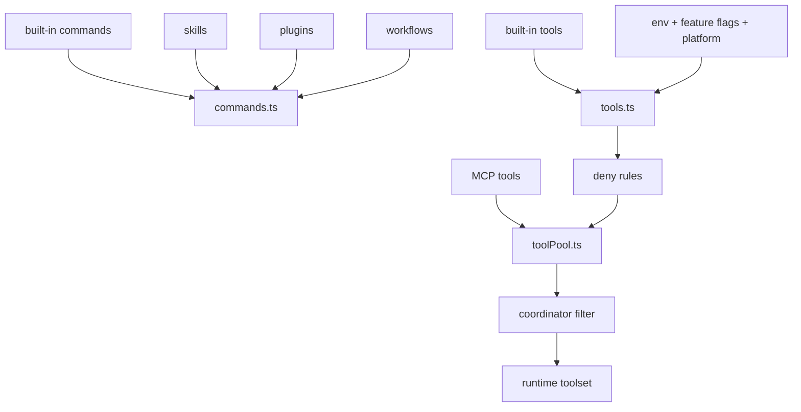

# Commands, Tools, Skills, Plugins

## Главный вывод

`src/commands.ts` и `src/tools.ts` не дают "финальный список" сами по себе.  
Это базовые registry-слои, поверх которых потом накладываются:
- dynamic skills
- plugin commands
- MCP tools
- deny rules
- feature flags
- env/platform checks
- coordinator mode filtering

## Ключевые файлы

- `src/commands.ts`
- `src/tools.ts`
- `src/Tool.ts`
- `src/utils/toolPool.ts`
- `src/services/tools/toolOrchestration.ts`
- `src/services/mcp/client.ts`
- `src/services/mcp/config.ts`

## Как собираются команды

Команды приходят из нескольких источников:
- built-in команды
- bundled skills
- dynamic skills
- plugin commands
- workflow commands

После сборки они еще проходят runtime-фильтрацию по доступности.

## Как собираются инструменты

Базовый flow такой:
- `tools.ts` строит базовый набор built-in tools
- часть tools подключается только по feature flag или env
- MCP tools добавляются отдельно
- `filterToolsByDenyRules` режет недоступные инструменты
- `mergeAndFilterTools` объединяет built-in и MCP наборы
- `applyCoordinatorToolFilter` может еще сильнее урезать итоговый список

## Схема assembly

## Практические замечания

- `getAllBaseTools()` нельзя считать реальным runtime-набором.
- `Tool.ts` важен как контрактный слой: именно там определяются типы, `ToolUseContext` и ожидания к выполнению tool call.
- Для диаграмм обязательно отделяй registration от execution.
- Если анализируешь multi-agent часть, отдельно смотри `AgentTool` и связанные helper-модули, потому что это уже не просто один tool, а orchestration layer.

## Три разных множества

При разборе проекта полезно держать в голове три разных набора:
- `registered tools`  
  Все инструменты, которые вообще могут быть зарегистрированы в `tools.ts`.
- `allowed tools`  
  Инструменты после feature/env checks, deny rules, MCP merge и coordinator filtering.
- `executed tools`  
  Инструменты, до которых реально дошел `tool_use` в `toolOrchestration.ts` и `toolExecution.ts`.

Если смешать эти три слоя в одной схеме, будет казаться, что модель всегда видит и может вызвать весь реестр, а это неверно.
