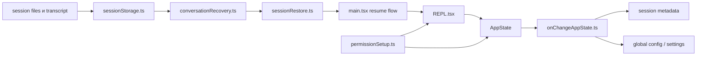

# State, Permissions, Resume

## Главный вывод

Самая коварная часть проекта не в рендеринге UI и не в API, а в синхронизации состояния:
- permission mode
- session metadata
- persisted config
- transcript storage
- resume/recovery pipeline

Если этот слой не нарисовать отдельно, понимание проекта будет кривым.

## Ключевые файлы

- `src/state/AppStateStore.ts`
- `src/state/onChangeAppState.ts`
- `src/utils/permissions/permissionSetup.ts`
- `src/utils/sessionStorage.ts`
- `src/utils/conversationRecovery.ts`
- `src/utils/sessionRestore.ts`
- `src/utils/systemPrompt.ts`

## Что делает state sync

`onChangeAppState.ts`:
- синхронизирует `permission mode`
- обновляет external session metadata
- пишет часть состояния в global config
- перекидывает изменения в env/settings слой

Полезное разделение для анализа:
- `локальное UI-состояние`
- `persisted config`
- `внешняя синхронизация session metadata`

Это не один общий store, а несколько контуров, связанных через `onChangeAppState.ts`.

`permissionSetup.ts`:
- собирает и нормализует permission mode
- режет опасные правила
- работает с auto mode и plan mode
- влияет на то, какие tools вообще доступны модели

## Что делает resume pipeline

`sessionStorage.ts`:
- пишет transcript и session metadata
- хранит дополнительное состояние вокруг сессии

`conversationRecovery.ts`:
- загружает сообщения и собирает структуру для продолжения разговора

`sessionRestore.ts`:
- восстанавливает session state, file history, agent context и связанные метаданные

## Схема восстановления

## Практические замечания

- Resume нельзя сводить к операции "прочитать JSONL".
- `onChangeAppState.ts` это не мелкий callback, а ключевой sync-gateway.
- Permission layer влияет не только на диалоги подтверждения, но и на видимый модели набор инструментов.
- `buildEffectiveSystemPrompt()` тоже связан с orchestration: порядок prompt sources меняет поведение агента, а не просто текст.
- Для диаграмм resume лучше отдельно отмечать:
  - восстановление сообщений
  - file history
  - attribution
  - hook state
  - orphaned tool results
