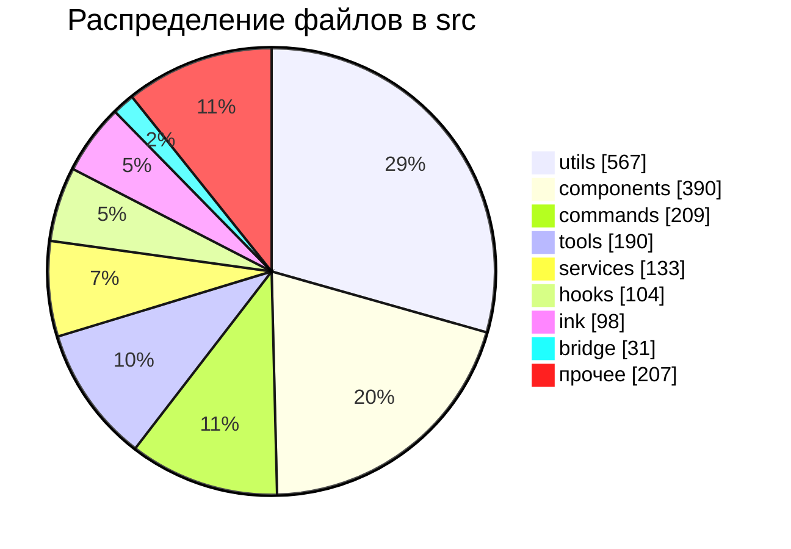

# Карта Кодовой Базы

## Срез по папкам

В `src/` найдено `1929` файлов.

Крупнейшие зоны:
- `utils`: 567
- `components`: 390
- `commands`: 209
- `tools`: 190
- `services`: 133
- `hooks`: 104
- `ink`: 98
- `bridge`: 31
- прочее: 207

## Диаграмма распределения

## Что это значит

- Проект очень тяжелый по инфраструктуре и вспомогательным слоям.
- Чистое "ядро агента" занимает меньшую часть дерева, чем кажется.
- Большой объем в `utils` означает, что важная логика часто разложена по маленьким helper-модулям, а не сосредоточена в одном месте.
- Большой объем в `components` и `ink` показывает, что CLI здесь фактически терминальное приложение, а не просто парсер флагов и stdout printer.

## Приоритет чтения

Если цель понять поведение агента, я бы шел так:
1. `src/entrypoints/cli.tsx`
2. `src/main.tsx`
3. `src/cli/print.ts`
4. `src/screens/REPL.tsx`
5. `src/query.ts`
6. `src/services/api/claude.ts`
7. `src/tools.ts`
8. `src/utils/toolPool.ts`
9. `src/state/onChangeAppState.ts`
10. `src/utils/sessionStorage.ts`
11. `src/utils/conversationRecovery.ts`
12. `src/utils/sessionRestore.ts`

## Следующие полезные темы для отдельных папок

- prompt assembly
- permission system
- AgentTool и multi-agent orchestration
- MCP subsystem
- bridge/remote control
- compact/memory subsystem
