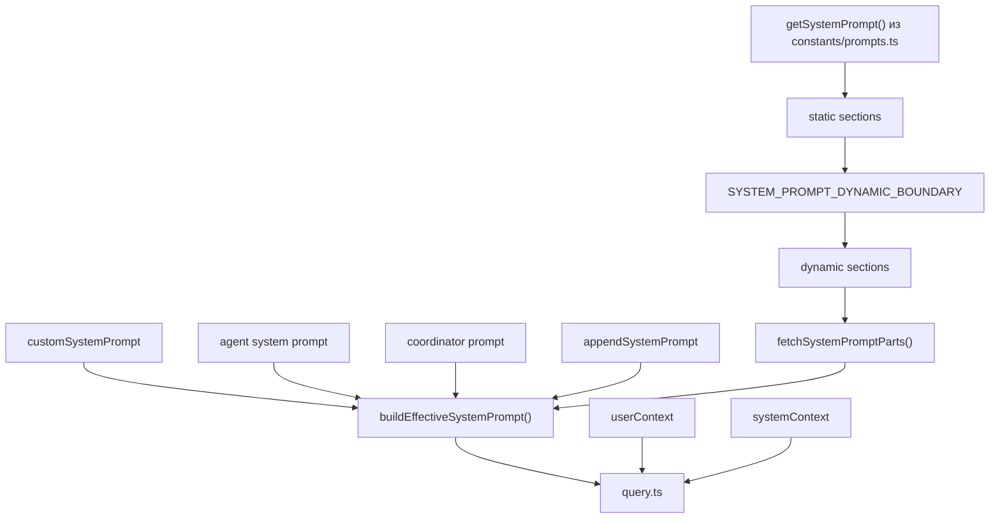

# Prompt Assembly

## Главный вывод

В Claude Code prompt assembly это не один `system prompt`, а конвейер из нескольких слоев:
- базовый system prompt
- dynamic sections
- agent/coordinator/custom override
- append prompt
- user context
- system context

При этом в разных режимах часть слоев может:
- полностью пропускаться
- заменять другие слои
- переноситься в dynamic tail после cache boundary

## Ключевые файлы

- `src/constants/prompts.ts`
- `src/utils/systemPrompt.ts`
- `src/utils/queryContext.ts`
- `src/screens/REPL.tsx`
- `src/QueryEngine.ts`

## Базовый конвейер

`constants/prompts.ts`:
- строит базовый system prompt через `getSystemPrompt()`
- делит prompt на static и dynamic части
- вставляет `SYSTEM_PROMPT_DYNAMIC_BOUNDARY`
- добавляет session-specific guidance, memory, env info, language, output style, MCP instructions и другие секции

`utils/systemPrompt.ts`:
- поверх базового prompt применяет final assembly policy
- умеет:
  - `overrideSystemPrompt` полностью заменить все остальное
  - coordinator prompt подменить default path
  - agent prompt заменить default prompt
  - в proactive mode не заменить, а добавить agent instructions поверх default
  - `appendSystemPrompt` всегда положить в хвост, кроме override path

`utils/queryContext.ts`:
- собирает `defaultSystemPrompt`, `userContext`, `systemContext`
- умеет пропускать default/system context, если задан `customSystemPrompt`
- используется entrypoint-слоем, чтобы не создавать циклы зависимостей

## Приоритеты prompt-слоев

Из `buildEffectiveSystemPrompt()`:
1. `overrideSystemPrompt`
2. coordinator mode prompt
3. agent system prompt
4. `customSystemPrompt`
5. `defaultSystemPrompt`
6. `appendSystemPrompt`

Но есть важная оговорка:
- в proactive mode agent prompt не заменяет default, а добавляется поверх него как отдельный блок

## Схема сборки

## Что важно в `getSystemPrompt()`

`getSystemPrompt()` в `constants/prompts.ts`:
- умеет уходить в `CLAUDE_CODE_SIMPLE`
- имеет отдельный proactive path
- делит содержимое на cacheable static block и dynamic block
- добавляет session-specific guidance только после dynamic boundary
- умеет не включать MCP instructions, если включен delta-механизм

Это важно, потому что prompt здесь связан не только с поведением модели, но и с prompt caching.

## Что важно в `fetchSystemPromptParts()`

Если задан `customSystemPrompt`, то:
- default prompt не строится
- `systemContext` не запрашивается

Это легко пропустить при поверхностном чтении, но поведение меняется заметно: custom prompt не просто дописывается, а фактически обрубает часть стандартной сборки.

## REPL vs QueryEngine

Interactive путь через `REPL.tsx`:
- берет `getSystemPrompt()`
- отдельно берет `getUserContext()` и `getSystemContext()`
- потом вызывает `buildEffectiveSystemPrompt()`

Headless путь через `QueryEngine.ts`:
- использует `fetchSystemPromptParts()`
- добавляет coordinator user context
- при custom prompt и memory override может дополнительно вставить memory mechanics prompt

То есть final prompt assembly в REPL и headless не идентичны на 100 процентов, хотя ядро общее.

## Практические замечания

- Нельзя рисовать prompt как один монолитный текстовый блок.
- Нужно отдельно показывать:
  - base/default prompt
  - final policy layer
  - user context
  - system context
- `SYSTEM_PROMPT_DYNAMIC_BOUNDARY` это архитектурный элемент, а не просто строковая константа.
- `customSystemPrompt` не только добавляет свой текст, но и меняет весь способ сборки.
- В prompt assembly переплетены:
  - поведение агента
  - session-specific guidance
  - prompt caching
  - MCP instructions
  - memory mechanics
