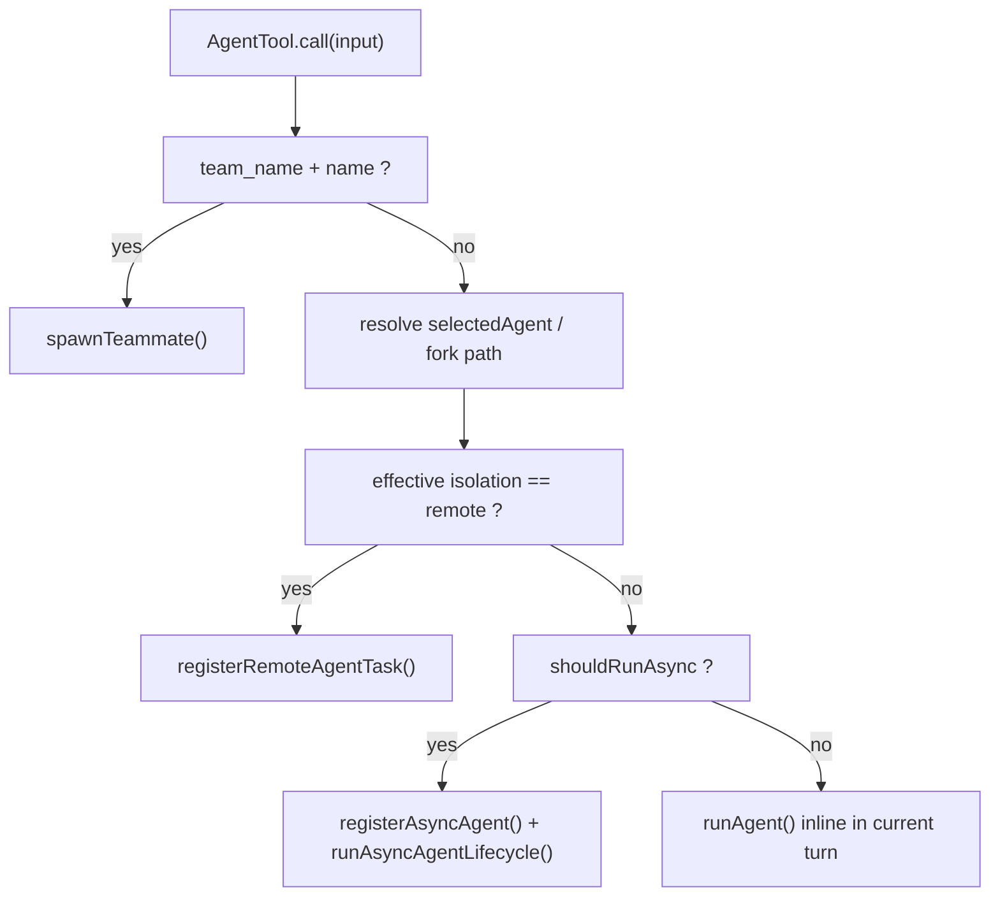
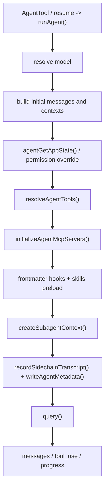
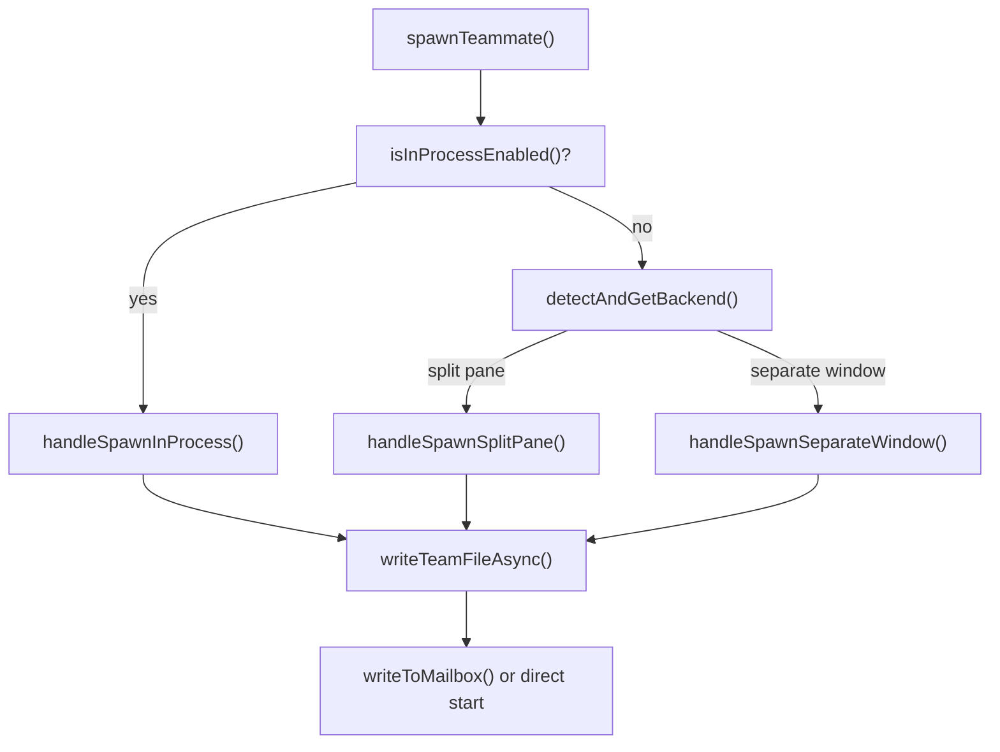
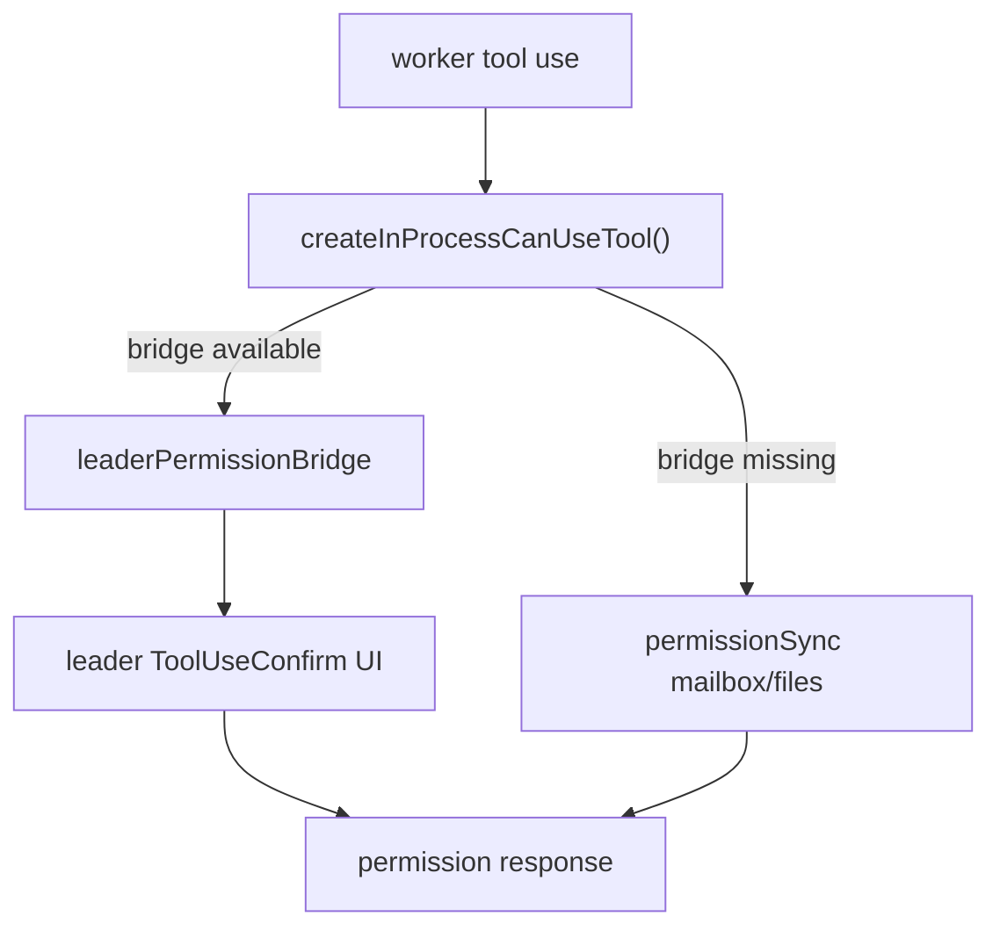
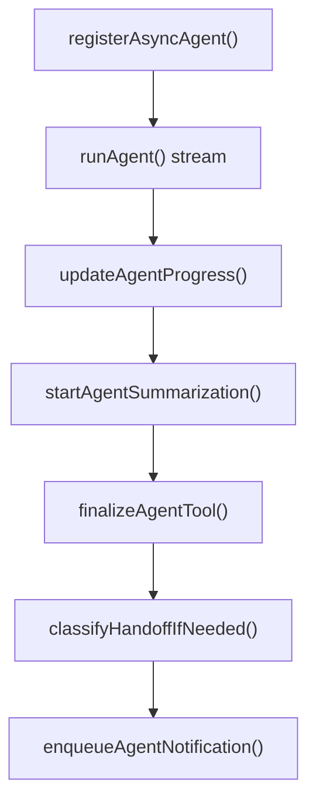

# Multi-Agent И AgentTool

## Главный вывод

`AgentTool` в Claude Code это не "инструмент для запуска еще одного агента" в узком смысле.

Правильнее смотреть на него как на единый диспетчер делегирования, который умеет запускать как минимум четыре разных режима:
- `teammate spawn` для swarm/team режима
- локальный синхронный subagent внутри текущего turn
- локальный фоновый subagent через task framework
- удаленный agent в CCR

И уже под этим внешним API лежат разные runtime-слои:
- `AgentTool.tsx` решает, какую ветку execution выбрать
- `runAgent.ts` исполняет локального subagent
- `spawnMultiAgent.ts` поднимает teammate-процессы и swarm backend
- `LocalAgentTask` / `InProcessTeammateTask` / `RemoteAgentTask` дают общую task-модель для UI и resume

## Ключевые файлы

- `src/tools/AgentTool/AgentTool.tsx`
- `src/tools/AgentTool/runAgent.ts`
- `src/tools/AgentTool/resumeAgent.ts`
- `src/tools/AgentTool/agentToolUtils.ts`
- `src/tools/AgentTool/loadAgentsDir.ts`
- `src/tools/AgentTool/builtInAgents.ts`
- `src/tools/AgentTool/forkSubagent.ts`
- `src/tools/shared/spawnMultiAgent.ts`
- `src/utils/swarm/backends/registry.ts`
- `src/utils/swarm/inProcessRunner.ts`
- `src/utils/swarm/leaderPermissionBridge.ts`
- `src/utils/swarm/permissionSync.ts`
- `src/tasks/LocalAgentTask/LocalAgentTask.tsx`
- `src/tasks/InProcessTeammateTask/InProcessTeammateTask.tsx`
- `src/tasks/RemoteAgentTask/RemoteAgentTask.tsx`
- `src/screens/REPL.tsx`

## Что здесь считается "агентом"

В коде есть несколько разных сущностей, которые снаружи легко перепутать:

- `built-in agents`
  Примеры: `GENERAL_PURPOSE_AGENT`, `PLAN_AGENT`, `EXPLORE_AGENT`, `VERIFICATION_AGENT`.
- `custom agents`
  Пользовательские или проектные agent definitions.
- `plugin agents`
  Агенты, пришедшие из plugin layer.
- `fork agent`
  Синтетический встроенный агент, который не живет как обычный definition в списке built-ins, а включается через экспериментальный путь.
- `teammates`
  Это уже не просто subagent definition, а отдельная multi-agent модель со своей identity, team file, mailbox и backend.

## Откуда берутся agent definitions

`loadAgentsDir.ts` собирает все доступные определения и потом схлопывает их по `agentType`.

Группы идут в таком порядке:
- `built-in`
- `plugin`
- `userSettings`
- `projectSettings`
- `flagSettings`
- `policySettings`

`getActiveAgentsFromList()` кладет их в `Map` по `agentType`, поэтому более поздний слой переопределяет более ранний.

Это важная деталь архитектуры:
- built-in agents это только нижний базовый слой
- реальные active agents могут быть переопределены сверху
- policy layer имеет максимальный приоритет

Дополнительно `filterAgentsByMcpRequirements()` вырезает агентов, которым нужны недоступные MCP servers.

## Как AgentTool выбирает execution path

Главная развилка находится в `AgentTool.call()`.

Схема грубо такая:

### Ветка 1. Team spawn

Если одновременно есть:
- `team_name` или текущий `teamContext`
- `name`

то `AgentTool` уходит в `spawnTeammate()` из `spawnMultiAgent.ts`.

Это уже не обычный local subagent, а teammate в swarm-модели.

### Ветка 2. Fork path

Если `subagent_type` не задан и эксперимент `forkSubagent` включен, используется `FORK_AGENT`.

Тогда:
- дочерний агент наследует полный parent context
- получает родительский `systemPrompt` почти байт-в-байт
- получает exact tool pool родителя
- все spawns форсятся в async path

### Ветка 3. Local async agent

Если `run_in_background=true`, либо agent definition сама фонова, либо включены некоторые orchestration-флаги, то идет async path:
- `registerAsyncAgent()`
- `runAsyncAgentLifecycle()`
- `runAgent()` внутри фонового task

### Ветка 4. Local sync agent

Если фон не нужен, `AgentTool` запускает `runAgent()` прямо внутри текущего turn и ждет завершения.

### Ветка 5. Remote agent

В исходниках есть еще remote branch:
- `effectiveIsolation === 'remote'`
- precheck через `checkRemoteAgentEligibility()`
- teleport/CCR запуск
- регистрация через `registerRemoteAgentTask()`

Это отдельный execution path, а не вариант локального `runAgent()`.

Важно: в текущем source этот участок еще и build-time gated под ant/external сборки.

## Как исполняется локальный subagent

Центральный локальный рантайм сидит в `runAgent.ts`.

### Что он делает

1. Вычисляет `resolvedAgentModel`.
2. Подготавливает `initialMessages`.
3. Решает, нужно ли урезать `claudeMd` и `gitStatus` для некоторых built-in агентов.
4. Строит отдельный `agentGetAppState()` с переопределенным permission mode.
5. Резолвит tools через `resolveAgentTools()`.
6. Достраивает agent-specific MCP servers.
7. Регистрирует frontmatter hooks и preload skills.
8. Создает отдельный `subagent ToolUseContext` через `createSubagentContext()`.
9. Пишет transcript/metadata в sidechain storage.
10. Запускает общий `query()` loop.

### Схема local runtime

## Очень важное отличие: tool pool ребенка не равен tool pool родителя

В `AgentTool.tsx` worker tools собираются отдельно:
- берется `appState.toolPermissionContext`
- mode заменяется на `selectedAgent.permissionMode ?? 'acceptEdits'`
- дальше вызывается `assembleToolPool()`

То есть обычный subagent получает собственный tool pool, а не просто наследует текущие ограничения родителя.

Исключение:
- `fork path`

Там включается `useExactTools`, и ребенок получает exact tools родителя ради cache-identical prompt prefix.

## Что делает resolveAgentTools

`agentToolUtils.ts` решает две задачи:
- фильтрует доступные tools для агентного рантайма
- резолвит `tools` и `disallowedTools` из agent definition

Ключевые правила:
- MCP tools пропускаются для агентов всегда
- есть глобальные disallow-наборы для всех агентов
- есть отдельные disallow-наборы для custom agents
- async agents получают только allowlist, если не включены особые swarm-исключения
- `Agent(...)` может не только разрешать сам AgentTool, но и нести `allowedAgentTypes`

Отсюда важная мысль:
- `AgentTool` одновременно является runtime tool
- и контейнером policy для того, каких subagents вообще можно порождать

## Teammate branch это вообще другой runtime

`spawnMultiAgent.ts` не использует `runAgent()` напрямую как основной механизм запуска внешних teammates.

Он выбирает backend:
- `in-process`
- pane/split backend
- legacy tmux window backend

### Схема teammate spawn

### In-process teammate

`handleSpawnInProcess()`:
- создает identity `agentName@teamName`
- вызывает `spawnInProcessTeammate()`
- затем `startInProcessTeammate()`
- prompt передается напрямую в рантайм, без mailbox

### Pane / tmux teammate

`handleSpawnSplitPane()` и `handleSpawnSeparateWindow()`:
- выбирают backend
- строят CLI command на запуск еще одного Claude Code процесса
- прокидывают identity через CLI args
- отправляют prompt через mailbox

То есть для pane/tmux teammate старт идет как отдельный процесс, а initial prompt доезжает через inbox/mailbox слой.

## Скрытый слой: permission bridge между leader и worker

Если смотреть только на `AgentTool` и `runAgent`, кажется, что любой teammate сам обрабатывает permissions.

Для swarm это не так.

### Что здесь происходит

- `REPL.tsx` регистрирует bridge через `registerLeaderToolUseConfirmQueue()` и `registerLeaderSetToolPermissionContext()`
- `leaderPermissionBridge.ts` хранит эти setters на module-level
- `inProcessRunner.ts` в `createInProcessCanUseTool()` пытается использовать именно лидерский `ToolUseConfirm` dialog
- если bridge недоступен, используется mailbox/file-based fallback из `permissionSync.ts`

### Что дает этот слой

- worker не поднимает свой отдельный React permission UI
- leader остается единственной точкой approve/deny
- permission updates могут возвращаться назад к worker и синхронизироваться по team mailbox

### Важный architectural point

Для multi-agent режима permission flow это уже не просто `hasPermissionsToUseTool() -> dialog`.

Реальная схема для teammate выглядит так:

Именно поэтому swarm permission path надо считать отдельным transport/sync слоем, а не частью обычного local-agent исполнения.

## Task layer: три разных типа фоновых сущностей

Здесь особенно легко нарисовать неверную диаграмму.

### 1. `LocalAgentTask`

Это фоновые локальные subagents, запущенные через `AgentTool` async path.

Особенности:
- task id совпадает с `agentId`
- output file инициализируется как symlink на transcript sidechain
- есть progress tracking, summaries, notifications
- kill идет через свой `AbortController`

### 2. `InProcessTeammateTask`

Это task-обертка для teammate lifecycle.

Особенности:
- хранит `identity`, `pendingUserMessages`, `shutdownRequested`
- поддерживает отправку сообщений teammate во время просмотра transcript
- в UI используется для teammate navigation

Важная тонкость:
- `registerOutOfProcessTeammateTask()` тоже кладет pane/tmux teammates в task с типом `in_process_teammate`

То есть имя типа здесь историческое и не означает буквально "этот teammate точно исполняется in-process".

### 3. `RemoteAgentTask`

Это удаленные CCR/teleport сессии.

Особенности:
- живут через `sessionId`, polling и sidecar metadata
- имеют свой restore path
- уведомляют main session через `task-notification`

## Async lifecycle локального агента

Фоновые локальные агенты крутятся через `runAsyncAgentLifecycle()`.

Что он делает:
- читает stream из `runAgent()`
- накапливает `agentMessages`
- считает progress и tool usage
- по желанию запускает background summarization
- завершает `LocalAgentTask`
- затем отправляет `task-notification`

Тонкость:
- task сначала переводится в terminal state
- и только потом делаются handoff classifier и worktree cleanup

Это нужно, чтобы `TaskOutput` не зависал, если cleanup или classifier долго работают.

## Resume path

Resume у агентного слоя тоже отдельный.

`resumeAgentBackground()`:
- читает transcript и metadata
- фильтрует поломанные/незавершенные куски истории
- восстанавливает `contentReplacementState`
- пытается вернуть `worktreePath`
- заново поднимает async lifecycle через `runAsyncAgentLifecycle()`

Смысл тут такой:
- resume не "продолжает тот же promise"
- он реконструирует состояние по sidechain данным и запускает новый runtime loop поверх восстановленной истории

Для remote задач аналогичную роль играет `restoreRemoteAgentTasks()`, который читает sidecar metadata и заново цепляется к живым CCR sessions.

## Fork path как отдельный подрежим

`forkSubagent.ts` показывает, что fork это не просто shorthand для `subagent_type=general-purpose`.

У fork-ветки есть отдельные свойства:
- synthetic `FORK_AGENT`
- `permissionMode: 'bubble'`
- `model: 'inherit'`
- запрет рекурсивного fork
- placeholder `tool_result` blocks ради prompt cache reuse
- принудительный async model

Это архитектурно больше похоже на lightweight process forking поверх общего query loop, чем на обычный выбор другого agent definition.

## Где это цепляется к REPL

`REPL.tsx` важен не как место исполнения subagent, а как место orchestration вокруг них:
- восстановление `remote tasks`
- просмотр teammate/local-agent transcript
- инъекция сообщений в teammate
- вызов `resumeAgentBackground()` из UI
- регистрация shared permission queue и app state bridge для in-process teammates
- синхронизация swarm permission path с leader UI и mailbox polling

То есть `REPL` это внешний orchestrator UI, а не ядро агентного исполнения.

## Практические замечания для собственного агента

- Не смешивай в одну сущность `agent definition`, `agent runtime`, `teammate process` и `background task`.
- Если хочешь повторить архитектуру Claude Code, минимум нужен слой task abstraction поверх agent loop.
- Отдельный `subagent context` обязателен. Простое "позвать ту же функцию query еще раз" быстро ломает state, permissions и resume.
- Resume лучше строить на sidechain transcript + metadata, а не на попытке сериализовать живые async процессы.
- Если нужен multi-agent, сразу отделяй:
  - local inline workers
  - local background workers
  - external teammates
  - remote/cloud workers
- Fork-like режим полезен только если умеешь держать cache-stable prompt prefix и жестко ограничивать рекурсию.

## Самые важные ловушки в этой части проекта

- `AgentTool` не равен `runAgent`.
- `teammate spawn` не равен `subagent spawn`.
- `in_process_teammate` в task state не гарантирует реальный in-process backend.
- child tool permissions обычно пересобираются заново, а не просто наследуются.
- `remote agent` не входит в local `runAgent` pipeline.
- `fork path` меняет не только prompt, но и модель наследования tools, context и async semantics.
- `permission bridge` для swarm живет отдельно от обычного `useCanUseTool()` и ломает слишком упрощенные диаграммы.
