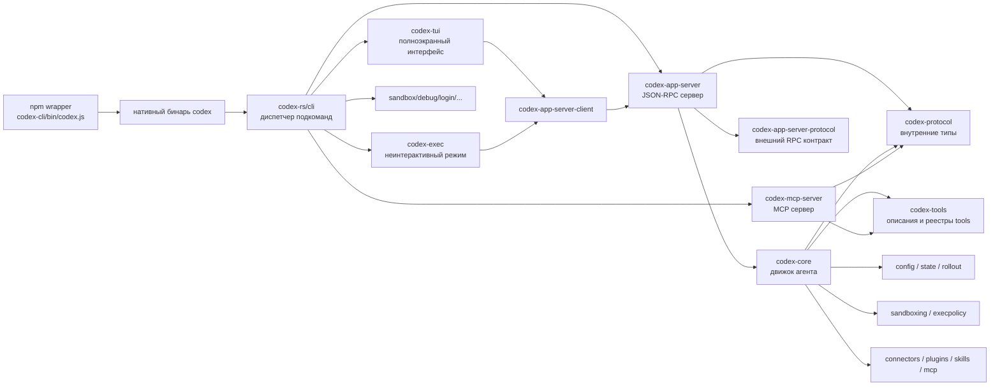

# Высокоуровневая архитектура Codex

## Как это читать

- `codex-cli/bin/codex.js` только находит и запускает нужный нативный бинарь.
- Главный управляющий вход в Rust находится в `codex-rs/cli`.
- `tui` и `exec` не являются ядром. Это клиентские поверхности.
- Обе поверхности опираются на `codex-app-server-client`.
- `app-server` выступает серверной прослойкой между интерфейсом и `core`.
- `core` является главным местом, где живет агентная логика.
- `protocol` и `tools` нужны сразу нескольким слоям и потому вынесены отдельно.

## Главный вывод

Если цель — понять, как реально работает Codex, то основной маршрут чтения такой:

`cli -> tui/exec -> app-server -> core -> protocol/tools`

Не стоит тратить слишком много времени только на `cli`: он важен как карта режимов, но не как центр системы.
