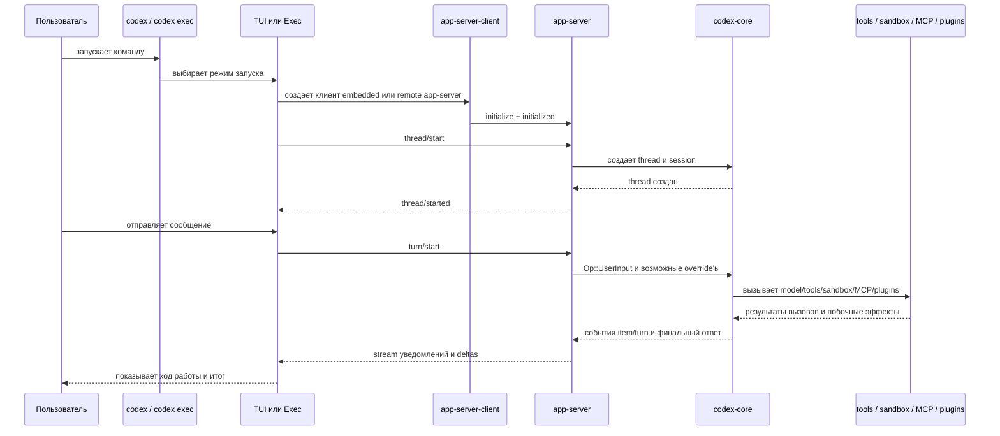

# Поток запуска и одного turn

## Что здесь важно

- Для Codex ключевая сущность не просто "чат", а иерархия `thread -> turn -> item`.
- `thread/start` создает или поднимает контекст разговора.
- `turn/start` запускает конкретный ход агента.
- `app-server` конвертирует внешний RPC-запрос во внутренние операции `core`.
- `core` уже решает, что именно вызывать: модель, shell, patch, MCP, плагины и так далее.
- Результат идет назад не одним куском, а потоком событий и дельт.

## Практический смысл

Эта схема объясняет, почему TUI и `exec` можно рассматривать как разные интерфейсы над одной и той же серверно-агентной начинкой.

Именно поэтому для собственного агента полезно разделять:

- внешний интерфейс;
- серверный протокол;
- движок выполнения;
- слой инструментов и окружения.
