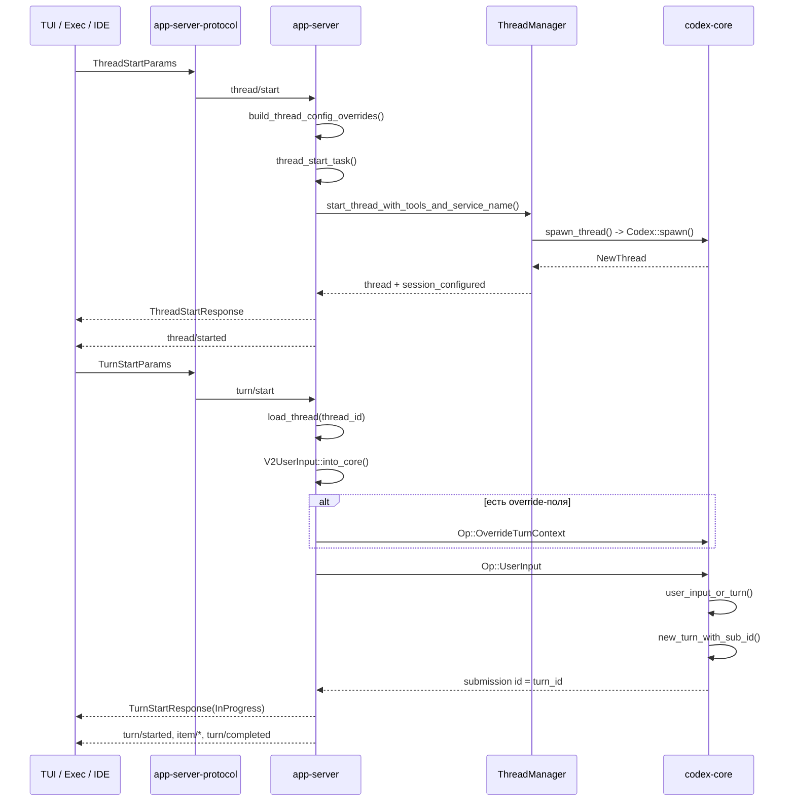

# Последовательность `thread/start` и `turn/start`

## Что видно по схеме

- `thread/start` в первую очередь создает session/thread.
- `turn/start` не создает новый thread, а работает внутри существующего.
- App-server разделяет изменение turn context и сам пользовательский ввод.
- `turn_id` появляется из внутренней submission-операции `core`.

## Практический урок

Если хочешь строить своего агента не как игрушку, а как систему, полезно повторить именно эту механику:

- отдельный session lifecycle;
- отдельный turn lifecycle;
- отдельный поток событий;
- отдельный шаг для mutation context;
- отдельный шаг для user input.
