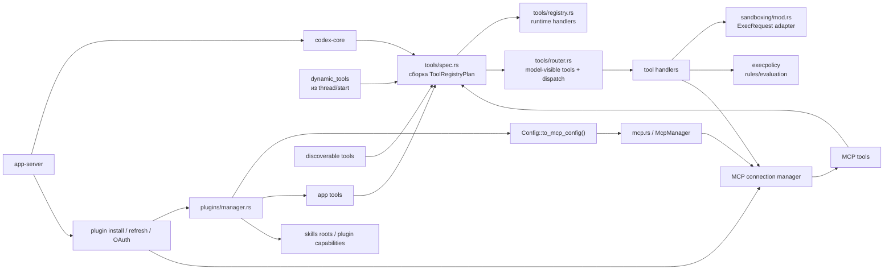

# Карта `tools / MCP / plugins / sandbox`

## Как это читать

- Источники инструментов сходятся в `tools/spec.rs`.
- Оттуда строится runtime-реестр и router.
- Плагины расширяют capabilities, в том числе через MCP и app tools.
- MCP дает живой внешний runtime инструментов и ресурсов.
- Sandbox и execpolicy включаются тогда, когда tool нужно реально исполнять в системе.

## Главный вывод

В Codex слой возможностей устроен как конвейер:

`plugins/config/MCP/dynamic_tools -> tool registry -> tool router -> handler -> sandbox/runtime`

Это полезная архитектура для собственного агента, потому что она масштабируется намного лучше, чем один жестко прошитый список функций.
