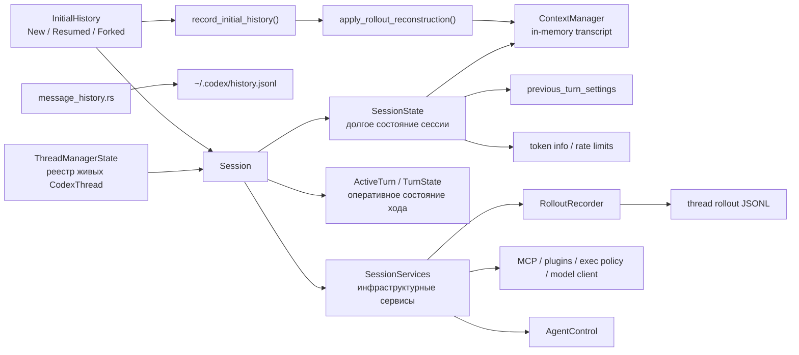

# Карта состояния и истории в `codex-core`

## Главное

- `SessionState` хранит содержимое сессии.
- `SessionServices` хранит сервисы выполнения.
- `TurnState` хранит оперативку одного turn.
- rollout нужен для resume/fork/rollback.
- `history.jsonl` — отдельный глобальный журнал, не то же самое, что rollout.
