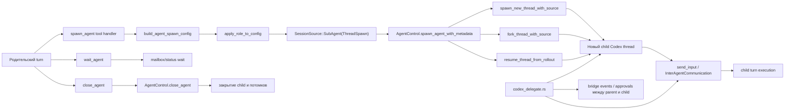

# Поток sub-agent в Codex

## Главное

- sub-agent — это обычный child thread того же движка;
- роль и path задаются при spawn;
- `AgentControl` является control plane;
- `codex_delegate` является bridge между parent и child runtime.
