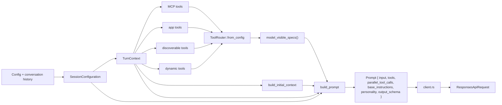

# Pipeline сборки prompt и tool set

## Главное

- prompt строится слоями, а не одной строкой;
- tools собираются на каждый turn заново;
- model-visible tool set отделен от полного runtime-набора;
- `client.rs` уже только превращает внутренний `Prompt` во внешний API request.
