# Pipeline выполнения команды, approvals и sandbox

```mermaid
flowchart LR
    A["Model tool call<br/>shell / shell_command / exec_command"] --> B["Tool handler<br/>parse + normalize args"]
    B --> C["apply_granted_turn_permissions<br/>normalize additional permissions"]
    C --> D["intercept_apply_patch?"]
    D --> E["ExecPolicyManager<br/>create_exec_approval_requirement_for_command"]
    E --> F["ToolOrchestrator"]

    F --> G["Approval needed?"]
    G -->|yes| H["Session.request_command_approval"]
    H --> I["TurnState.pending_approvals"]
    I --> J["EventMsg::ExecApprovalRequest"]
    J --> K["app-server<br/>CommandExecutionRequestApproval"]
    K --> L["client/UI"]
    L --> M["Op::ExecApproval"]
    M --> N["handlers::exec_approval -> notify_approval"]
    N --> F

    G -->|no| O["select initial SandboxAttempt"]
    F --> O

    O --> P["Runtime<br/>ShellRuntime / UnifiedExecRuntime"]
    P --> Q["build_sandbox_command"]
    Q --> R["SandboxManager / env_for"]

    R --> S["ExecRequest"]
    S --> T["execute_env<br/>one-shot shell"]
    S --> U["UnifiedExecProcessManager<br/>open PTY/session"]

    T --> V["result"]
    U --> V

    V --> W["sandbox denied?"]
    W -->|yes and policy allows| X["retry approval if needed"]
    X --> Y["second attempt with SandboxType::None"]
    Y --> P
    W -->|no| Z["tool output / events"]
```

## Главное

- approval, sandbox и retry централизованы в `ToolOrchestrator`;
- `exec_policy` решает `Skip / NeedsApproval / Forbidden`;
- `shell` и `unified_exec` отличаются в основном runtime-слоем;
- UI связан с runtime через event/op round-trip, а не напрямую.
