# Round-trip встроенного `request_permissions`

```mermaid
flowchart LR
    A["Model вызывает request_permissions"] --> B["RequestPermissionsHandler"]
    B --> C["normalize permission profile"]
    C --> D["Session.request_permissions"]
    D --> E["TurnState.pending_request_permissions"]
    E --> F["EventMsg::RequestPermissions"]
    F --> G["app-server"]
    G --> H["client/UI permission dialog"]
    H --> I["Op::RequestPermissionsResponse"]
    I --> J["handlers::request_permissions_response"]
    J --> K["notify_request_permissions_response"]
    K --> L["grant to TurnState or SessionState"]
    L --> M["future shell/exec call sees granted permissions"]
```

## Главное

- `request_permissions` не запускает команду;
- он меняет permission context будущих запусков;
- grant может быть на `turn` или на `session`.
