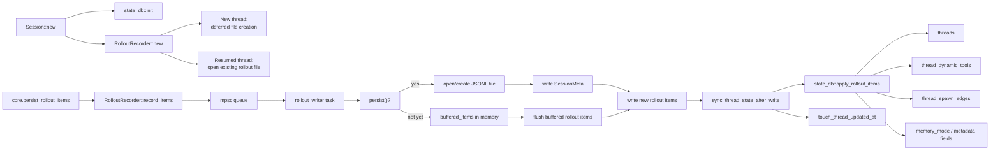

# Write path: JSONL rollout и синхронизация SQLite

## Главное

- JSONL и SQLite обновляются вместе в одном writer loop;
- файл является каноническим журналом;
- SQLite является производным индексом;
- новый thread может жить с deferred materialization до первого `persist()`.
