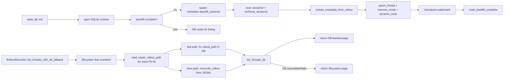

# Read path: backfill, read-repair и fallback на filesystem

## Главное

- SQLite не считается безусловно истинной;
- listing сначала использует filesystem для repair;
- backfill делает старые rollout-файлы queryable через SQLite;
- fallback на filesystem остается всегда.
