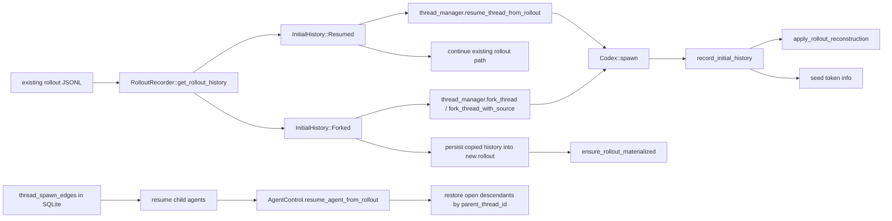

# Resume, fork и восстановление thread graph

## Главное

- `resume` продолжает старый журнал;
- `fork` создает новый журнал из snapshot старого;
- SQLite graph помогает восстановить дерево sub-agent после restart.
