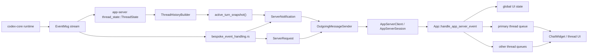

# Поток событий: `core` -> `app-server` -> `TUI`

## Главное

- `core` не кормит TUI напрямую;
- `app-server` держит projection и protocol mapping;
- TUI получает уже клиентский поток `ServerNotification` и `ServerRequest`.
