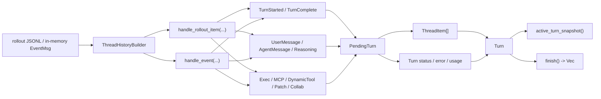

# `ThreadHistoryBuilder` как проекция журнала в UI history

## Главное

- builder превращает сырой журнал в `Turn` и `ThreadItem`;
- один и тот же reducer используется и для replay истории, и для текущего активного turn;
- app-server опирается на этот слой, чтобы UI видел coherent history, а не raw events.
