# Round-trip server request между `app-server` и TUI

```mermaid
flowchart LR
    A["core needs approval / input / elicitation"] --> B["bespoke_event_handling.rs"]
    B --> C["ServerRequest"]
    C --> D["OutgoingMessageSender"]
    D --> E["AppServerSession::next_event()"]
    E --> F["app_server_adapter.handle_server_request_event"]

    F --> G["PendingAppServerRequests::note_server_request"]
    G --> H["thread queue / popup / form in TUI"]

    H --> I["user decision in AppCommand"]
    I --> J["PendingAppServerRequests::take_resolution"]

    J --> K["AppServerSession::resolve_server_request(...)"]
    J --> L["AppServerSession::reject_server_request(...)"]

    K --> M["app-server callback resolved"]
    L --> M

    M --> N["core continues turn"]
```

## Главное

- у запроса есть полный цикл от runtime до UI и обратно;
- `PendingAppServerRequests` является correlation layer на стороне TUI;
- это позволяет человеку участвовать в loop агента как в явном protocol step.
