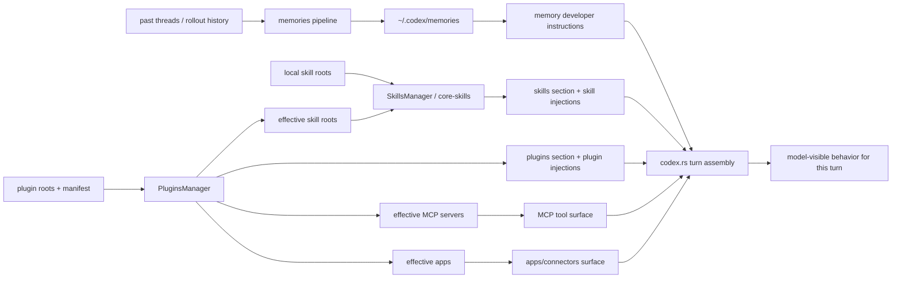

# Long-term behavior: три слоя поверх runtime

## Главное

- память, skills и plugins живут отдельно;
- они сходятся только в turn assembly;
- итогом является не один prompt, а целая behavior surface для модели.
