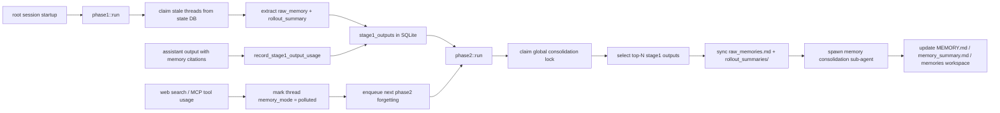

# Memory pipeline, usage и forgetting

## Главное

- память строится в два этапа: extraction и consolidation;
- usage реально влияет на отбор памяти;
- forgetting встроен в тот же pipeline через `polluted`.
