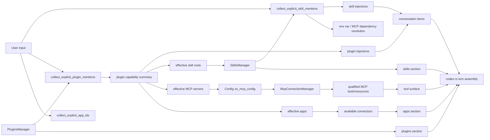

# Skills, plugins и MCP: путь до model-visible capabilities

## Главное

- explicit mentions включают skills/plugins/apps отдельно;
- plugin расширяет и skill roots, и MCP/apps surface;
- итоговая capability surface собирается в `codex.rs` прямо перед turn.
