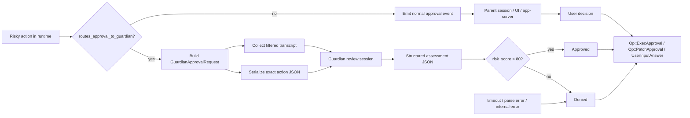

# Guardian: auto-review risky actions

## Главное

- guardian стоит прямо на approval gate;
- он смотрит не весь history, а curated transcript плюс exact action;
- логика fail-closed встроена по умолчанию.
