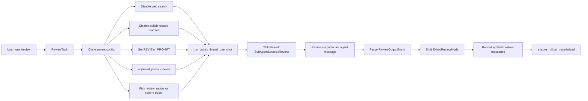

# `/review`: отдельный review-only subagent

## Главное

- `/review` не является частью approval safety path;
- это отдельная task-машина с собственным prompt и жесткими ограничениями;
- результат не только показывается UI, но и материализуется в rollout history.
