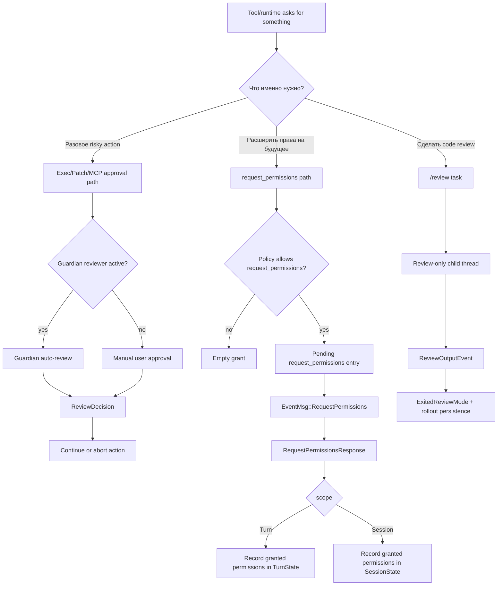

# `request_permissions` и routing review-контуров

## Главное

- `guardian` и `/review` решают разные задачи;
- `request_permissions` меняет capability context, а не одобряет одну команду;
- состояние permissions записывается отдельно для turn и session.
