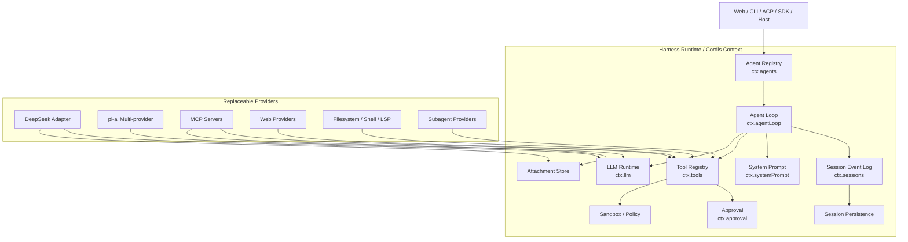
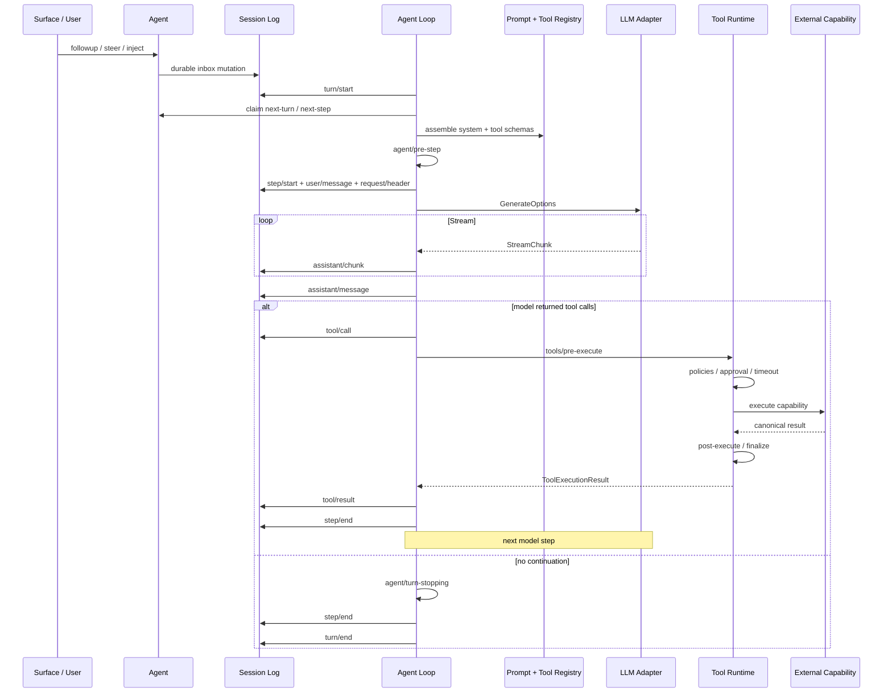
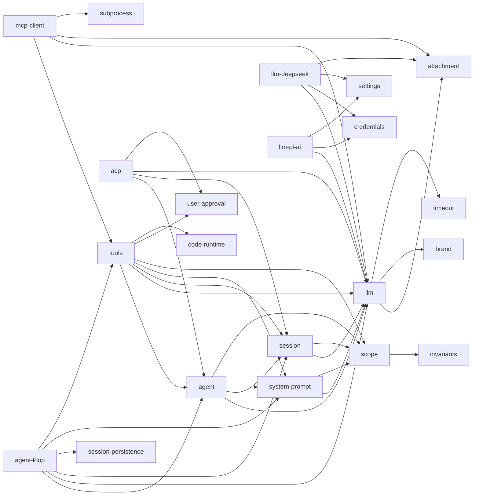
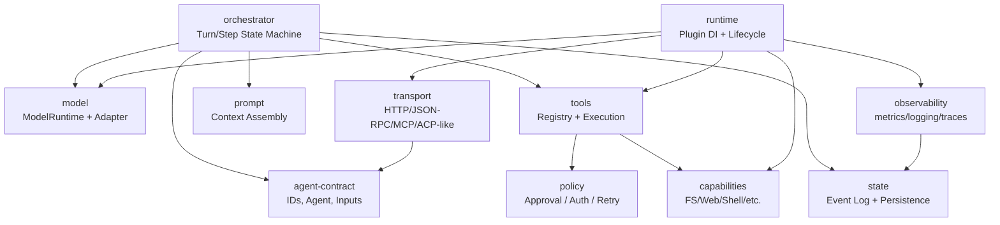

# DeepSeek Harness как основа модульного агента: архитектурный разбор `deepseek-ai/deepseek-harness`

- Статус: подробный upstream research snapshot, не current contract Proteus.
- Дата среза: 2026-08-21.
- Проверенный commit: `b150a551b8d465e31e418e1b2eaf5e79bbb7d28e`.
- Proteus-specific выводы и принятый порядок работ:
  [`docs/research/deepseek-harness-lessons-2026-08-21.md`](../../../docs/research/deepseek-harness-lessons-2026-08-21.md).

Служебные citation markers исходного research-сеанса удалены: проверяемые
первичные URL закреплены inline и в карте источников в конце документа.

## Executive summary

[DeepSeek Harness](https://github.com/deepseek-ai/deepseek-harness) — не просто «agent loop с tools», а достаточно последовательно спроектированная **плагинная agent-runtime платформа**. Главная архитектурная идея репозитория буквально сформулирована как *Everything is a Plugin*: LLM-адаптеры, tool registry, session log, persistence, agent loop, sandbox, approvals, web, MCP, UI-мосты и даже многие policy-механизмы подключаются через Cordis-контекст и могут заменяться независимо. При этом проект по состоянию на 21 августа 2026 года остается **developer preview** и прямо предупреждает о compatibility-breaking changes.

Для дизайна собственного модульного агента наиболее ценные идеи Harness следующие:

| Идея | Оценка для собственного агента |
|---|---|
| **Service Definition → Service Provider → Consumer** вместо импорта конкретной реализации | **Перенять почти без изменений.** Это главный источник модульности Harness. |
| Agent loop зависит от контрактов `agent`, `llm`, `tools`, `session`, а расширения не зависят от loop | **Обязательно перенять.** Orchestrator должен быть replaceable. |
| Единственный источник истины — append-only session event log | **Перенять, но сделать raw-token logging опциональным.** Это сильно упрощает replay, crash recovery, debugging и fork. |
| «Если нечто увидела модель — это должно быть реконструируемо из log» | **Очень сильный invariant.** Хорошая защита от скрытого mutable state и нерепродуцируемых агентов. |
| LLM как routed adapter interface с provider-neutral stream protocol | **Перенять.** Особенно отделение retry policy от adapter. |
| Tools как registry + JSON Schema + execution middleware + policy pipeline | **Перенять.** Это лучше прямого `Map<string, fn>`. |
| Reversible plugin effects / disposers / scoped contexts | **Перенять.** Решает hot reload, temporary agents и plugin isolation на уровне lifecycle. |
| Параллельные tool calls с fail-closed classifier | **Перенять концепцию**, но при развитии добавить resource-aware scheduling. |
| Approval и sandbox как отдельные capabilities, а не условия внутри tools | **Перенять.** Это хороший security boundary. |
| Cordis как универсальный event/service microkernel | **Перенять концепцию, не обязательно сам Cordis.** Для небольшого проекта можно реализовать значительно более узкий typed runtime. |

Главный вывод: **DeepSeek Harness полезнее рассматривать не как библиотеку, которую надо обернуть вокруг вашего агента, а как reference architecture для agent operating system.** Его наиболее сильная сторона — не prompting и не DeepSeek-интеграция, а четко проведенные boundaries между orchestration, model transport, durable state, tools, capabilities и presentation.

При этом Harness достаточно большой: generated module graph включает десятки отдельных packages для core, LLM, web, filesystem, sandbox, subagents, sessions, storage, interaction, SDK, ACP, MCP, hooks, extensions, UI и вспомогательных capability families. Для нового модульного агента копировать такую гранулярность с первого дня не стоит; разумный начальный вариант — примерно **восемь–двенадцать контрактных модулей**, которые затем расщепляются только при появлении второго provider/consumer.

Исследование ниже привязано к актуальному состоянию `master`, которое я анализировал на SHA [`b150a551`](https://github.com/deepseek-ai/deepseek-harness/commit/b150a551b8d465e31e418e1b2eaf5e79bbb7d28e). Корневой manifest на этом срезе имеет version `0.1.1-rc.2`, `pnpm@11.7.0`, ESM и Node engine `^22.19.0 || >=24.0.0`.

## Назначение, архитектура и модель исполнения

### Что проект фактически представляет собой

На верхнем уровне Harness — это **плагинный runtime для долгоживущих LLM agents**, в котором один процесс собирается из capabilities. В [`packages/README.md`](https://github.com/deepseek-ai/deepseek-harness/blob/b150a551b8d465e31e418e1b2eaf5e79bbb7d28e/packages/README.md) выделены, помимо core, отдельные семейства для LLM, subprocess, shell, terminal, filesystem, sandbox, LSP, web, skills, compaction, context, subagents, jobs, workflows, persistence, credentials, settings, SDK, ACP, interaction, web host/client и даже runtime self-modification.

То есть архитектурно это ближе к:

> **microkernel + dependency injection + event-sourced agent runtime + capability providers**

чем к типичной конструкции:

> `while (!done) { llm(); executeTools(); }`.

Cordis обеспечивает microkernel-часть. `Context` является registry сервисов, plugin объявляет `inject` dependencies, сервисы общаются через typed events, а каждое подключение должно иметь reversible lifecycle через effect/disposer.

Ключевое правило самого репозитория: extension plugins должны зависеть от **Service Definitions**, а не конкретных providers; отдельно подчеркивается, что `dsh-agent-loop` заменяем и UI/tool/hook plugins должны зависеть от `dsh-agent`, а не от loop implementation.

### Архитектурная «ось»

Core subsystem состоит из шести концептуальных частей:

| Пакет | Ответственность | Основной API |
|---|---|---|
| `core/scope` | scope primitives без service dependencies | `createScope`, `scopeOf`, `scopeTarget` |
| `core/session` | append-only event log, runtime source of truth | `ctx.sessions`, `Session` |
| `core/system-prompt` | сборка prompt sections | `ctx.systemPrompt` |
| `core/tools` | registry, schemas, execution/policies | `ctx.tools` |
| `core/agent` | публичная agent capability и registry | `ctx.agents`, `Agent` |
| `core/agent-loop` | конкретная state machine, управляющая turns/steps | `ctx.agentLoop` |

Именно `agent-loop` связывает остальные seams, но расширениям предлагается не импортировать его напрямую. `scope` специально расположен ниже `session` и `system-prompt`, чтобы избежать dependency cycles.

Упрощенная архитектура выглядит так:



Это моя редуцированная визуализация; полный generated graph находится в [`docs/module-graph.md`](https://github.com/deepseek-ai/deepseek-harness/blob/b150a551b8d465e31e418e1b2eaf5e79bbb7d28e/docs/module-graph.md). Он строится из `peerDependencies`, и в нем стрелка `A --> B` означает, что пакет A зависит от B.

### Agent как capability, а не loop object

Публичный [`Agent`](https://github.com/deepseek-ai/deepseek-harness/blob/b150a551b8d465e31e418e1b2eaf5e79bbb7d28e/packages/core/agent/src/types.ts) содержит identity, config, session, inbox, state и собственный scoped `ctx`. Его control surface включает cancellation, idle synchronization, maintenance и несколько видов доставки input.

Ключевая форма API:

```ts
send(message, target, wakeup)
followup(message)
steer(message)
inject(message)
cancel(cause, options)
whenIdle()
```

Важно различие:

`followup` создает следующий обычный turn; `steer` пытается повлиять на ближайшую step boundary; `inject` добавляет model-facing context для ближайшего pre-step, но сам не будит idle agent. Inbox разделен на `next-turn` и `next-step`, причем изменения очереди имеют durable projection.

Это существенно лучше API вида `agent.run(prompt) -> answer`, если вы проектируете долгоживущего агента. Такой интерфейс естественно поддерживает background events, file-change notifications, subagent callbacks, cron, UI steering и external automation.

### Event-sourced state — главная архитектурная ставка

[`Session`](https://github.com/deepseek-ai/deepseek-harness/blob/b150a551b8d465e31e418e1b2eaf5e79bbb7d28e/docs/subsystems/session.md) — append-only sequence `SessionEvent`. Отдельной mutable «chat history» нет: model history повторно выводится из event log.

Среди базовых событий:

```text
turn/start
step/start
user/message
request/header
assistant/chunk
assistant/message
tool/call
tool/result
step/end
turn/end
```

Кроме того, `SessionEventMap` merge-extensible: plugin способен добавить собственные durable event types. Незнакомое обязательное событие при load нельзя тихо игнорировать; `ignorable: true` должно быть выставлено явно только для informational events.

Очень важен `request/header`: Harness пишет в log эффективную LLM-конфигурацию, rendered system prompt и tool schemas. Следовательно, model request можно реконструировать из durable state, а не из скрытых текущих plugin variables.

Для собственного модульного агента это одна из лучших идей репозитория.

### Реальный data flow одного turn

Архитектурная документация описывает turn как последовательность boundaries: input claim → prompt/schema assembly → pre-step interception → model call → tool dispatch → continuation/stop.



Критически важно: tool results и model-visible context сначала становятся canonical state, а затем используются для следующего request. Это дает понятную transactional boundary между «выполнилось что-то во внешнем мире» и «модель узнала об этом».

## Модули, зависимости, интерфейсы и extension points

### Карта подсистем

Полная структура значительно шире core. Наиболее важные семейства для проектировщика агента:

| Family | Что изолирует | Replaceable providers / consumers |
|---|---|---|
| `core` | orchestration и общие контракты | agent loop, tools, prompt, session |
| `llm` | model transport | direct DeepSeek, pi-ai multi-provider |
| `session` | durability и projections | JSONL, SQLite, titles, telemetry |
| `interaction` | human-in-the-loop | approval, questions, commands, presets |
| `sandbox` | process filesystem confinement | Linux/macOS/Windows implementations |
| `fs`, `shell`, `terminal`, `lsp` | локальные execution capabilities | local/sandboxed providers |
| `web` | web search/fetch | DeepSeek, Exa, Perplexity, HTTP fetch |
| `mcp` | external tools | MCP client |
| `subagent` | delegation | in-process, ACP, Claude Code, Codex, DSH SDK |
| `jobs` / `workflow` | long/background execution | local/worker-thread engines |
| `sdk` | управление runtime из другого процесса | stdio JSON-RPC server + TS/Python clients |
| `acp` | interoperability | Agent Client Protocol server |
| `extensions` | self-modification | dynamic Cordis package runner |
| `settings` / `credentials` | dynamic config/secrets | file/local providers |
| `attachment` / `spill` | durable large/binary data | local stores |

Эта inventory является явной частью package architecture документации.

### Центральный dependency graph

Из полного generated graph можно вытащить наиболее важные направления:



Эти edges присутствуют непосредственно в generated `docs/module-graph.md`. Особенно показательна зависимость `agent-loop → agent`, а не наоборот: публичная agent abstraction не знает о concrete loop. Аналогично provider packages идут в сторону abstract capability.

### LLM adapter seam

[`LlmAdapter`](https://github.com/deepseek-ai/deepseek-harness/blob/b150a551b8d465e31e418e1b2eaf5e79bbb7d28e/docs/subsystems/llm-streaming.md) — один из самых удачных interfaces проекта.

Минимальный required method:

```ts
abstract stream(
  options: GenerateOptions
): AsyncIterable<StreamChunk>
```

Дополнительно adapter может предоставить provider metadata, model catalog, exact-model resolution, context-window information, default max tokens, reasoning levels и retry policy. Route регистрируется через `ctx.llm.registerAdapter(...)`; registration handle поддерживает atomic replacement route set.

`GenerateOptions` — provider-neutral request:

```text
provider
model
messages
system?
tools?
reasoningEffort?
temperature?
maxTokens?
stop?
signal?
sessionId?
purpose?
```

При этом provider выбирает **adapter route**, а model ID остается adapter-specific. Это означает, что Core не должен знать различия между DeepSeek, OpenAI, Anthropic или self-hosted gateway.

Еще важнее streaming vocabulary:

```text
block-start
text-delta
reasoning-delta
tool-call-delta
block-end
usage
finish
```

`index` связывает interleaved blocks. Raw tool arguments остаются JSON strings до завершения соответствующего tool-call block. После stream общий `BlockAssembler` формирует canonical `ContentBlock[]`.

Такой protocol намного надежнее, чем позволять каждому adapter возвращать собственные OpenAI-style objects прямо в agent loop.

### Ошибки и retries у LLM

Provider failure нормализуется в `LlmFailure` со стабильными fields вроде `code`, `status`, `providerRetryAfterMs`, `requestId`. Один вызов adapter считается **ровно одной provider attempt**; библиотечные retries adapter должен отключать. Retry policy располагается выше adapter, в agent-level recovery, чтобы новая попытка оставалась видимой через durable turn/step state.

Отдельно нормализованы, например:

`CONTEXT_WINDOW_EXCEEDED`, `EMPTY_RESPONSE`, timeout/abort cases. Shipping remote adapters имеют idle watchdog; документация указывает пяти­минутный default для stream idle timeout.

Это именно тот layering, который я рекомендую сохранить: **transport identifies; orchestration decides**.

### Tool subsystem

В Harness model-facing schema и executable tool deliberately разделены.

Model получает только:

```ts
interface ToolSchema {
  name: string
  description: string
  parameters: Record<string, unknown>
}
```

А runtime хранит более богатый `ToolDefinition`:

```ts
execute(args: unknown, exec: ToolRunContext): Promise<unknown>
```

плюс mandatory output schema/render, optional `timeoutMs`, `isConcurrencySafe`, `finalizeContent`, `presentCall`, `presentResult`. Runtime-only metadata не отправляется модели — `schemas()` строит отдельную allowlisted projection.

Это хорошая security/performance практика: execution semantics не должны случайно попадать в prompt.

Tool execution проходит pipeline:

```text
pre-execute
   ↓
monotonic guards
   ↓
execute wrappers
   ↓
tool body
   ↓
post-execute
   ↓
finalizeContent
   ↓
immutable tools/result
```

`pre-execute` используется для allow/deny/ask decisions, `execute` — для around middleware, `post-execute` — для inspecting/replacing result. Для каждого invocation есть opaque execution token, call ID, optional parent/root call ID и обязательный cancellation signal.

Аргументы и outputs runtime-валидируются с JSON Schema subset; invalid input идет как `INVALID_ARGS`, invalid canonical output — `INVALID_TOOL_OUTPUT`.

### Cordis plugin model

В [`docs/cordis-primer.md`](https://github.com/deepseek-ai/deepseek-harness/blob/b150a551b8d465e31e418e1b2eaf5e79bbb7d28e/docs/cordis-primer.md) plugin представлен либо function plugin с `apply(ctx)`, либо `Service` subclass. Dependencies задаются через `inject`, а Cordis откладывает activation до появления нужных services.

Events имеют несколько semantics:

| Режим | Использование |
|---|---|
| `emit` | notification |
| `waterfall` | around middleware / replacement / short circuit |
| `parallel` | async fan-out |
| `serial` | ordered async listeners |

Особенно важен `waterfall`: middleware либо вызывает `next()`, либо становится owner решения и short-circuit'ит downstream. Это используется вокруг LLM, tools и approval paths.

Все регистрации должны быть reversible. Это позволяет safely unload plugin, удалить его tool schemas/listeners/services и не оставить dangling global state.

### Основные extension points

| Требуется расширить | Правильная точка | Не следует менять |
|---|---|---|
| Новый LLM/provider | `LlmAdapter` + `ctx.llm.registerAdapter()` | `agent-loop` |
| Новый tool | `ctx.tools.register()` / `ToolDefinition` | LLM adapters |
| Tool authorization | `tools/pre-execute` / approval service | тело каждого tool |
| Timeout/observability wrapper | `tools/execute` | tool implementations |
| Новый durable state | merge extension `SessionEventMap` | mutable side-map |
| Новый prompt contribution | `ctx.systemPrompt` | hardcoded system string |
| Agent-specific feature | `agent.ctx` / scope | global registry |
| Input/event from external world | `inject`, `steer`, `followup` | direct mutation history |
| Новый persistence backend | `SessionPersistence` | `Session` |
| MCP integration | `mcp-client → ctx.tools` | agent loop |
| New process isolation | sandbox/capability provider | shell tool itself |
| Human approval | `ctx.approval` answerer | tool-specific UI |
| Different frontend | `ctx.agents` + session events / APIs | model/tool core |

Это соответствует explicit extension model самого Harness.

## LLM, tools, external services, протоколы и форматы

### Direct DeepSeek integration

[`@deepseek-ai/dsh-llm-deepseek`](https://github.com/deepseek-ai/deepseek-harness/blob/b150a551b8d465e31e418e1b2eaf5e79bbb7d28e/packages/llm/llm-deepseek/README.md) реализует direct DeepSeek Chat Completions path через `fetch` + SSE и переводит provider wire stream в общие `StreamChunk`. Route называется `deepseek-official`, чтобы он мог сосуществовать с pi-ai route `deepseek`.

Конфигурация поддерживает, среди прочего, `baseURL`, credential reference, thinking/reasoning effort, model catalog, max output tokens, context window, retry policy, stream timeout и image/Files limits. Настройки перечитываются per operation; credentials также разрешаются per request, поэтому изменение settings/key не требует перезапуска adapter.

Для изображений direct adapter использует Files API там, где это возможно; при failure file-ID resolution весь request перестраивается с теми же normalized image bytes как base64 data URLs. Adapter специально не смешивает file IDs и inline images в одном request.

### Generic pi-ai adapter

[`dsh-llm-pi-ai`](https://github.com/deepseek-ai/deepseek-harness/blob/b150a551b8d465e31e418e1b2eaf5e79bbb7d28e/packages/llm/llm-pi-ai/README.md) является generic multi-provider adapter. Он может использовать provider catalog `@earendil-works/pi-ai`, модифицировать его route/model settings либо полностью объявить custom OpenAI-compatible/self-hosted route configuration.

Для **явно конфигурируемых protocol overrides** код текущего среза выставляет ровно три значения:

```ts
const PROTOCOLS = {
  'openai-completions': ...,
  'openai-responses': ...,
  'anthropic-messages': ...,
}
```

Это не предположение — массив `supportedProtocols()` просто возвращает keys этой таблицы.

Через native provider catalog pi-ai способен сохранять provider-specific implementations, которые Harness не пытается реконструировать из универсальной `apiKey + baseURL` конфигурации; документация прямо приводит Bedrock, Vertex, Azure и Codex как случаи со специальной auth/config semantics. Поэтому корректная формулировка такова: **для hand-declared routes официально перечислены три protocol strings; catalog-backed providers могут использовать более широкий pi-ai surface.**

### MCP

MCP bridge — один из наиболее практически полезных extension examples.

[`dsh-mcp-client`](https://github.com/deepseek-ai/deepseek-harness/blob/b150a551b8d465e31e418e1b2eaf5e79bbb7d28e/packages/mcp/mcp-client/README.md) подключает внешний Model Context Protocol server и преобразует его tools в обычные Harness tools:

```text
raw MCP name:
search

model-facing name:
mcp__myServer__search
```

Так model loop вообще не обязан знать, пришел tool из собственного TypeScript package или через MCP.

Поддерживаются два MCP transport:

| MCP transport | Config |
|---|---|
| `stdio` | executable + args + optional cwd/env |
| `streamable-http` | URL + optional headers |

Имеются dynamic `tools/list_changed`, timeout вызовов, abort propagation, automatic reconnect с exponential backoff и atomic tool-generation replacement. При outage last-good tool set остается зарегистрированным до exhausted reconnect budget; вызовы в этот период fail.

При этом **MCP Resources и Prompts не интегрированы**; bridge currently переносит только Tools. Output rich content тоже ограничен: durable rich bridge реализован для image, а audio/embedded resources превращаются в diagnostics или остаются execution-local.

### Межпроцессный SDK

SDK stack использует **newline-delimited JSON-RPC 2.0** поверх caller-owned streams; shipping server работает по stdio. Каждый compact JSON frame завершается `\n`. Есть TypeScript client и отдельно Python SDK.

Основные protocol messages:

| Направление | Method / notification |
|---|---|
| client → runtime | `initialize` |
| client → runtime | `session/prompt` |
| client → runtime | `shutdown` |
| runtime → client | `session.event` |
| runtime → client | `session.status` |
| runtime → client | `subagent.started` |
| runtime → client | `subagent.finished` |

`session/prompt` возвращает durable enqueue receipt, а не «готовый ответ». Клиент наблюдает open-ended event stream и agent status. Это важное следствие asynchronous agent model.

Недостатки текущего SDK protocol явно задокументированы: protocol-version negotiation отсутствует, нет cancel/session-close методов, а server→client requests пока фактически не используются.

### ACP

Отдельно существует Agent Client Protocol server: automation-only bridge поверх **ACP JSON-RPC stdio**. Он умеет создавать agents, передавать text/image prompts, получать committed assistant text/images, разрешать one-shot permissions и отменять работу.

ACP deliberate минимален: не экспортирует editor navigation, command/mode surfaces, plans, reasoning, title или live tool presentation. Один connection может владеть несколькими sessions; prompts независимы по session.

Текущие limitations: только fresh sessions; resume/list/delete/fork отсутствуют; дополнительные workspaces и MCP servers через ACP не поддерживаются; output — только committed answers, без token-level progress; отдельного per-session close нет.

### Web и внешние сервисы

`web` subsystem содержит provider-neutral `ctx.web`; providers на текущем дереве включают DeepSeek native search, Exa, Perplexity и HTTP(S) fetch. Model-facing `tool-web` сидит поверх этой abstraction.

Поэтому зависимость выглядит:

```text
Model
  ↓
web_search / web_fetch tool
  ↓
ctx.web
  ↓
selected provider
  ├─ DeepSeek Search
  ├─ Exa
  ├─ Perplexity
  └─ HTTP(S) fetch
```

Важное архитектурное свойство: модель не знает, каким внешним backend был выполнен web operation.

### Сводная таблица протоколов и data formats

| Слой | Протокол / формат | Состояние |
|---|---|---|
| Core LLM stream | typed `StreamChunk` | внутренний canonical protocol |
| Tool schemas | JSON Schema subset | supported и runtime-validated |
| Tool canonical values | lossless JSON | основной inter-module format |
| DeepSeek | Chat Completions + SSE | direct adapter |
| DeepSeek images | Files API / base64 data URLs | supported |
| Generic LLM override | `openai-completions` | supported |
| Generic LLM override | `openai-responses` | supported |
| Generic LLM override | `anthropic-messages` | supported |
| MCP | stdio | supported |
| MCP | Streamable HTTP | supported |
| SDK | newline-delimited JSON-RPC 2.0 / stdio | supported |
| ACP | Agent Client Protocol / JSON-RPC stdio | supported |
| Host app API | Typert unary RPC + separate named stream | supported internally |
| Runtime config | YAML / `cordis.yml` / patch YAML | supported |
| Dynamic config expressions | YAML `!!js` | supported, trusted config surface |
| Session persistence | logical JSON events | canonical durable vocabulary |
| File persistence | JSONL, optionally Zstandard-framed | supported backend |
| DB persistence | SQLite | supported backend |
| ACP/MCP raster images | PNG, JPEG, WebP, GIF | supported in documented bridges |

## Deployment, configuration и security model

### Runtime requirements

Корневой [`package.json`](https://github.com/deepseek-ai/deepseek-harness/blob/b150a551b8d465e31e418e1b2eaf5e79bbb7d28e/package.json) задает:

```json
{
  "type": "module",
  "packageManager": "pnpm@11.7.0",
  "engines": {
    "node": "^22.19.0 || >=24.0.0"
  }
}
```

То есть основной runtime — современный Node.js ESM. CI отдельно проверяет Node 22.19, Node 24 как primary и Node 26 compatibility.

Официальный user path — `npx @deepseek-ai/dsh web`; development checkout требует `pnpm install`, build и запуск через `pnpm dsh web`.

Репозиторий также содержит Python SDK/runtime integration и native Landlock tooling, но основной host architecture остается Node. Pull-request CI запускает Python 3.10 keyless SDK tests и release-shaped native runtime test. Это свидетельствует о поддерживаемом Python client path, но **полный диапазон поддерживаемых Python versions из рассмотренных здесь первичных файлов не специфицирован**.

Официальная Kubernetes/HA/multi-node deployment architecture в рассмотренных architecture/deployment sources **не специфицирована**. Harness primarily описывает one runtime process + replaceable local/out-of-process capability providers; делать вывод о production horizontal scaling из текущих docs нельзя.

### Config layering

Boot configuration строится из Cordis plugin tree. Профиль расположен в `$DSH_HOME/profiles/<name>`; если `DSH_HOME` не выставлен, используется `~/.dsh`. Profile manifest задает bundles и dependencies, а `cordis.patch.yml` изменяет composition.

Концептуально:

```text
bundle layers
    ↓
profile cordis.patch.yml
    ↓
home-level cordis.patch.yml
    ↓
explicit overlay / --patch
    ↓
mounted Cordis tree
```

Patch может заменить config существующей entry либо вставить новую. Важная особенность: patch matched config **не deep-merge'ится**, а заменяется целиком, поэтому сохраненные поля приходится повторять.

`!!js` позволяет вычислять plugin configuration expressions через runtime context/environment. Это удобно для credential injection и conditional mounts, но с точки зрения security такой config следует считать **trusted code/configuration boundary**, а не просто data file.

Profile/user patches отслеживаются HMR watcher'ом; bad candidate не заменяет last-good running tree.

### Credentials

Bootstrap env layering реализован отдельно. Документация boot package описывает порядок inherited environment → project `.env` → Harness-home `.env`, причем inherited value имеет более высокий приоритет. Managed credentials находятся в `.credentials.yaml`; `.env` остается fallback.

LLM config обычно хранит **credential reference**, например `apiKeyEnv`, а не literal secret. Direct DeepSeek adapter разрешает credential per request через `ctx.credentials` либо environment fallback и отказывается выполнять request при missing/invalid credential.

Это правильная модель: plugin config знает *как найти секрет*, но не обязан владеть самим secret value.

### Approval model

`ctx.approval` — отдельный service. Outcome closed:

```text
allowed-once
rejected
cancelled
unavailable
```

И **только `allowed-once` является grant**. Missing/throwing/malformed answerer превращается в `unavailable`, поэтому system fail-closed.

Per-session policy:

```text
ask
never
```

`never` применяется service-level до answerer waterfall, то есть downstream listener не способен обойти ее через priority tricks. Решения `approval/asked` и `approval/decided` также записываются как audit events в session log, но не включаются непосредственно в model transcript.

Для собственного агента это очень хороший пример: **authorization decision должен быть отдельной capability**, а не `if (dangerous) confirm()` внутри каждого tool.

### Sandbox

Sandbox abstraction ограничивает **filesystem effects процесса**, а не все возможные effects. Режимы:

```text
read-only
workspace-write
danger-full-access
```

`danger-full-access` вообще обходит `ctx.sandbox`. Для confined modes provider должен либо вернуть enforcing argv, либо fail closed с `SANDBOX_UNAVAILABLE`; silent unconfined fallback запрещен.

Shipping local providers используют Linux bwrap/Landlock, macOS Seatbelt и Windows ACL/restricted-token backend. Enforcement маркируется как `full` или `partial`; например, некоторые older Landlock ABIs и Windows boundaries могут быть partial.

Самое важное ограничение: **network и process visibility находятся вне sandbox vocabulary**. Поэтому filesystem sandbox нельзя считать полноценным OS security sandbox.

### Критическая SSRF-дыра как documented limitation

HTTP web-fetch provider имеет разумные transport constraints: принимает только HTTP/HTTPS, запрещает credentials в URL, ограничивает URL/body size, timeout и redirect count, пропускает только same-origin redirects и отказывается от unsupported binary media.

Но README прямо говорит:

> SSRF/private-network protection deferred.

То есть сейчас не блокируются loopback, private, link-local или иные internal destinations, нет resolve-DNS-then-validate и per-hop IP validation. Документация буквально характеризует provider как **SSRF primitive** и предупреждает не включать его там, где runtime способен достигнуть sensitive internal networks.

Для production modular agent я бы считал это **P0 architectural security gap**, а не косметическим TODO.

### Plugin trust boundary

Cordis plugins работают в одном application context и получают доступ к declared services. Следовательно, normal third-party plugin **не должен считаться untrusted code**. Это следует непосредственно из service/plugin architecture.

Особенно наглядно это видно в `extensions`: Harness даже поддерживает model-written dynamic packages. Host half запускается через `node:vm`, но README прямо говорит, что vm **не является security boundary**; dynamic package нужно воспринимать примерно как bash-level access, поскольку предоставленные ему services действуют на live runtime.

Кроме того, `vmTimeoutMs` ограничивает только synchronous evaluation; asynchronous work может пережить этот timer.

Следовательно, для вашего дизайна я бы разделил понятия:

```text
trusted in-process plugin
≠
untrusted tool code
≠
remote capability
```

и никогда не пытался превращать один plugin loader во все три одновременно.

### Дополнительный privacy нюанс Direct DeepSeek adapter

Direct DeepSeek adapter добавляет application attribution и отдельно может отправлять stable anonymous harness user ID и session ID на resolved `baseURL`; документация специально отмечает, что это относится в том числе к configured gateway.

Это не обязательно security bug, но при создании собственного adapter abstraction я бы сделал metadata egress policy явно конфигурируемой и отдельно документировал, какие IDs покидают host.

## Тестирование, производительность, масштабирование и ограничения

### Testing strategy репозитория

Тестовая дисциплина Harness существенно выше средней для agent framework.

[`docs/testing.md`](https://github.com/deepseek-ai/deepseek-harness/blob/b150a551b8d465e31e418e1b2eaf5e79bbb7d28e/docs/testing.md) определяет несколько tiers.

| Tier | Что проверяется |
|---|---|
| Unit | package behavior, errors, ordering, cancellation, concurrency, HMR cleanup |
| Coverage | **100% per-file line coverage** для `packages/*/*/src` с документированными platform exceptions |
| Real API e2e | actual DeepSeek/Exa/Perplexity и другие provider APIs при наличии keys |
| Snapshot | protocol outputs, ACP, session logs, headless behavior |
| Web snapshot | реальный Chromium, replayed UI |
| Built-artifact e2e | опубликованный `lib`/bin path, а не только tsx source runtime |

Очень сильное правило документации: mocks должны заменять только дорогую/недетерминированную boundary вроде LLM/network/clock; downstream shipping implementation предпочтительно тестируется настоящая. Еще одно хорошее правило — e2e должен проверять внешний мир повторным чтением файла/команды, а не доверять self-report модели.

Каждое non-trivial model-, protocol- или human-visible изменение должно иметь keyless snapshot scenario. Это ценно для agent software, где TypeScript typecheck ничего не говорит о фактически изменившемся prompt/tool transcript.

### CI/CD

PR workflow разделяет static analysis, exhaustive coverage и consumer/snapshot/artifact lanes; primary Node — 24. Есть compatibility jobs для Node 22.19 и 26, Python 3.10 SDK lane, release-shaped Python runtime lane, Windows testing через Wine плюс native topology, Bubblewrap setup и Chromium/Playwright tests. Superseded PR run отменяется.

Root scripts дополнительно содержат typecheck, lint, duplication checking, coverage, snapshot, web stress/performance tests, package invariants, config/source ownership verification, module graph regeneration verification, documentation graph checks, dependency/runtime closure checks и release validation.

Это хороший пример **architecture-as-CI**: generated architecture artifacts проверяются на drift, а не существуют только как диаграмма в документации.

### Parallel tool execution

AgentLoop умеет исполнять sibling tool calls параллельно, но только если каждый call явно classified как safe. `isConcurrencySafe(args)` должен вернуть строго `true`; отсутствующий classifier, exception, invalid args или иной result означает exclusive execution.

Scheduler строит groups:

```text
parallel read(A)
parallel read(B)
exclusive write(A)
parallel read(C)
```

как:

```text
[read A || read B]
        ↓
     [write A]
        ↓
      [read C]
```

Внутри parallel group используется rolling pool. Default `maxParallelToolCalls` — `10`; значение `1` возвращает полностью serial behavior.

При этом только dispatch/body перекрываются. `pre-execute` и `post-execute` сохраняют model order, а results тоже commit'ятся в исходном tool-call order независимо от completion order. Это значительно упрощает deterministic replay.

Trade-off: fast result может ждать предыдущий slow sibling до commit. Кроме того, scheduler не умеет relational resource safety вроде «два write безопасны, если paths разные». Для этого current unary classifier слишком слаб.

Для первой версии своего агента это разумный conservative design.

### Не стартовать tool до полного assistant response — осознанный latency trade-off

Scheduler начинает tool calls только после получения complete assistant message, хотя теоретически можно стартовать tool execution сразу после полного streamed tool-call block. В Agent Note такой вариант явно рассмотрен и отклонен, поскольку он усложняет authority модели, replay и call/result pairing.

То есть Harness выбирает:

**детерминизм и replay > speculative latency reduction.**

Я считаю это правильным default для general-purpose modular agent.

### Persistence throughput

Persistence listener не блокирует каждый `Session.append`: synchronous event notification переносит event в per-session controller, после чего events группируются в bounded batching window. Explicit flush отменяет ожидание и drains writes до quiescence.

При crash в середине turn backend не обрезает уже сохраненную историю. Cold recovery добавляет synthetic `turn/end { kind: interrupted }`, сохраняя предыдущие tool/model events.

Два основных backend:

| Backend | Свойства |
|---|---|
| JSONL | per-session append log; по умолчанию checksummed concatenated Zstandard frames; crash-safe writes |
| SQLite | `node:sqlite`; packed physical rows, logical event reconstruction |

Старые storage versions не мигрируются автоматически; backend отказывается читать incompatible format.

### KV-cache и schema growth

Harness явно учитывает model prefix stability. Например, MCP README отмечает, что schema cost всех discovered MCP tools платится в каждом request; если tool list/schema изменяется, это может invalidировать KV reuse с первого изменившегося schema token. Reconnect без изменения definitions сохраняет prefix stable.

Отсюда важное практическое следствие для вашего агента: **tool registry — это одновременно API registry и prompt-budget registry**. Подключать тысячи tools «на всякий случай» архитектурно возможно, но плохо с точки зрения tokens/cache.

Рекомендую иметь capability selection/tool virtualization layer, который делает model-visible только актуальный subset.

### Benchmarks

В репозитории присутствует [`BENCHMARK.md`](https://github.com/deepseek-ai/deepseek-harness/blob/b150a551b8d465e31e418e1b2eaf5e79bbb7d28e/BENCHMARK.md), но на исследуемом срезе он содержит только инструкцию запускать benchmark через Python SDK/jsonrpc-agent с отдельными workspaces и session IDs. **Опубликованных throughput/latency/memory benchmark numbers в этом файле нет.**

Поэтому количественно утверждать «Harness выдерживает N agents» или «M requests/sec» на основании repository sources нельзя. **Process-level horizontal scalability и cluster coordination также unspecified.**

### Известные и наблюдаемые ограничения

Некоторые limitations явно признаются maintainers в package READMEs:

| Ограничение | Последствие |
|---|---|
| Developer preview, breaking changes | API/plugin ABI нельзя считать стабильным |
| Persistence migration отсутствует | upgrade может потребовать отказа от старых logs |
| MCP только Tools | Resources/Prompts пока недоступны |
| MCP startup timeout не конфигурируется Harness | slow/dead server способен задержать lifecycle |
| SDK нет cancel/session-close и version negotiation | ограниченная process API lifecycle semantics |
| ACP только fresh sessions | нет полного persistent-agent remote API |
| Sandbox не контролирует network/process visibility | не полноценная hostile-code sandbox |
| HTTP fetch имеет documented SSRF exposure | опасно в internal networks |
| Dynamic plugin `node:vm` не security boundary | model-written code нужно считать privileged |
| Tool concurrency classifier unary | не моделирует resource conflicts |
| Browser-half dynamic package может ждать человека без timeout | unattended automation способна зависнуть |

Есть также свежие user bug reports в официальных GitHub Discussions. Их нужно интерпретировать осторожно: большинство относится к `0.1.0-rc.5/rc.6`, а не обязательно к анализируемому `0.1.1-rc.2`, поэтому ниже это **signals**, а не доказанные текущие bugs.

В августе 2026 пользователи сообщали о streamed tool-call compatibility problems с OpenAI-compatible endpoints, где continuation deltas с пустыми `id/name` приводили к `UNKNOWN_TOOL`.

Были reports о недостаточной live UI feedback во время долгих tool calls, а также о `ask_user_question`, способном длительно ждать, если вопрос не был реально представлен браузерной вкладкой.

Отдельные reports отмечали package/module instance collision при установке third-party plugins и edge case длинных session histories.

Статус этих конкретных reports на текущем pinned SHA из рассмотренных primary files **не специфицирован**, поэтому использовать их корректнее как список regression scenarios для собственного CI, а не как утверждение «в текущем Harness это точно сломано».

## Рекомендованная архитектура вашего модульного агента

Главная рекомендация — **не копировать package count Harness, скопировать его dependency direction и invariants**.

### Предлагаемые module boundaries

Для нового агента я бы начал со следующего ядра:

```text
agent-contract
orchestrator
model
tools
state
prompt
policy
capabilities
runtime
transport
observability
```

а providers держал бы отдельными leaf packages.



Критическое правило: **`orchestrator` не должен содержать implementation-specific `if provider === ...` и `if tool === ...`.** Harness показывает, что provider behavior можно эффективно вынести в adapters, а policies — в middleware/separate services.

### Suggested model adapter interface

Я бы упростил Harness contract примерно до:

```ts
export interface ModelAdapter {
  readonly provider: string;

  resolveModel(
    model: string,
    signal?: AbortSignal,
  ): Promise<ModelInfo>;

  stream(
    request: ModelRequest,
  ): AsyncIterable<ModelChunk>;

  retryPolicy?(
    model: string,
  ): RetryPolicy;
}
```

Но application runtime должен иметь отдельный registry:

```ts
export interface ModelRuntime {
  register(
    adapter: ModelAdapter,
  ): Disposable;

  prepare(
    config: ModelConfig,
    signal?: AbortSignal,
  ): Promise<PreparedModelCall>;
}
```

Почему два уровня: именно `prepare()` позволяет атомарно связать model metadata, endpoint/config generation и последующий call. Harness использует похожую `PreparedLlmCall` abstraction, чтобы dynamic settings не дали resolution одной версии adapter, а dispatch уже другой.

Важное правило retries:

```text
Adapter:
    exactly one remote attempt

Orchestrator:
    retry decision + backoff + durable attempt boundary
```

Не помещайте автоматические retries одновременно в HTTP client, adapter и agent loop. Harness намеренно запрещает это.

### Suggested tool interface

Минимальный хороший contract:

```ts
export interface ToolDefinition<TArgs, TValue> {
  name: string;
  description: string;

  inputSchema: JsonSchema;
  outputSchema: JsonSchema;

  execute(
    args: TArgs,
    ctx: ToolExecutionContext,
  ): Promise<TValue>;

  concurrency?(
    args: TArgs,
  ): ToolConcurrency;
}
```

Контекст:

```ts
export interface ToolExecutionContext {
  callId: string;
  rootCallId: string;
  agentId: string;
  signal: AbortSignal;

  deferContext(
    message: InjectedContext,
  ): void;
}
```

А registry должен владеть:

```text
schema projection
argument validation
output validation
timeouts
authorization middleware
execution wrappers
normalization
result commit
```

а не tool implementation. Это ровно та separation of responsibility, которую Harness проводит через `ToolDefinition` и `ctx.tools.execute()`.

### Улучшение concurrency model относительно Harness

Начните с fail-closed Harness semantics:

```ts
type ToolConcurrency =
  | { kind: "exclusive" }
  | { kind: "parallel" };
```

Затем, только когда возникнет необходимость, расширьте:

```ts
type ResourceClaim = {
  resource: string;
  mode: "read" | "write";
};

type ToolConcurrency =
  | { kind: "exclusive" }
  | {
      kind: "resource-aware";
      claims: ResourceClaim[];
    };
```

Тогда:

```text
read(file:A) || read(file:A)      → можно
read(file:A) || write(file:A)     → конфликт
write(file:A) || write(file:B)    → можно
```

Harness сознательно не идет настолько далеко и поэтому теряет часть потенциального parallelism.

### Orchestration pattern

Orchestrator лучше писать как явную state machine, а не recursive function:

```text
IDLE
  ↓ input
TURN_OPEN
  ↓
PRE_STEP
  ↓
MODEL_STREAMING
  ↓
MODEL_COMMITTED
  ├─ tool calls → TOOLS_RUNNING
  │                 ↓
  │              TOOLS_COMMITTED
  │                 ↓
  │              PRE_STEP
  │
  └─ no calls → TURN_STOPPING
                   ↓
                 IDLE
```

Каждый переход, меняющий model-visible state, должен быть durable.

Это позволяет четко определить:

- где разрешен cancellation;
- где можно retry;
- что случилось при crash;
- какие tool effects уже произошли;
- можно ли resume;
- когда user steering становится видимым;
- где формируется следующий model request.

Именно durable `turn/start/end`, `step/start/end`, `tool/call/result` дают Harness эти свойства.

### State management

Я рекомендую три уровня state:

| Уровень | Что хранит | Lifetime |
|---|---|---|
| Durable event log | все model-visible и externally significant facts | session |
| Derived projections | message history, todos, UI state, usage, search indexes | reconstructable/cacheable |
| Ephemeral runtime | AbortControllers, sockets, locks, adapter handles | process only |

**Не сохраняйте отдельно mutable conversation history.**

Вместо:

```ts
state.messages.push(...)
state.todos = ...
state.model = ...
```

лучше:

```text
append(user/message)
append(todo/write)
append(request/header)
```

и затем:

```text
messages = deriveMessages(events)
todos = foldTodos(events)
modelConfig = foldRequestHeader(events)
```

Это центральная сильная сторона Harness.

При этом я бы сделал две настройки fidelity:

```text
audit = canonical
    user/message
    assistant/message
    tool/call
    tool/result
    boundaries
    request config

audit = full-replay
    + raw assistant chunks
    + detailed transport records
```

Harness сохраняет raw `assistant/chunk` для token-level replay; это прекрасно для debugging/UI replay, но для некоторых deployments увеличит event volume.

### Persistence interface

Хороший минимальный seam:

```ts
export interface SessionStore {
  create(meta: SessionMeta): Promise<Session>;
  load(id: SessionId): Promise<Session>;
  append(id: SessionId, events: readonly Event[]): Promise<void>;
  flush(id: SessionId): Promise<void>;
  snapshot(id: SessionId): Promise<SessionSnapshot>;
}
```

Для local prototype достаточно SQLite.

Когда важна inspectability:

```text
SQLite → indexing/query
JSONL  → portable forensic transcript
```

Можно поддержать оба позже через один interface, как Harness.

Нужно заранее определить **format migration policy**. Я бы не повторял pre-release Harness strategy «старое просто refuse», если ваш агент должен жить годами. Добавьте:

```text
schemaVersion
migrationVersion
migrations:
  v1 -> v2
  v2 -> v3
```

и храните tests на каждый migration path.

### Error taxonomy

Не передавайте string errors через все слои.

Я рекомендую приблизительно такую hierarchy:

```text
AgentError
├── ModelError
│   ├── AuthError
│   ├── RateLimitError
│   ├── ContextOverflowError
│   ├── TimeoutError
│   ├── ProtocolError
│   └── EmptyResponseError
│
├── ToolError
│   ├── InvalidArgumentsError
│   ├── InvalidOutputError
│   ├── PermissionDeniedError
│   ├── ToolTimeoutError
│   └── ToolUnavailableError
│
├── StateError
│   ├── PersistenceError
│   ├── CorruptionError
│   └── UnsupportedFormatError
│
└── InternalError
```

У каждого:

```ts
{
  code: string;
  message: string;
  retryable: boolean;
  cause?: unknown;
  metadata?: JsonValue;
}
```

но **retryable не должен автоматически означать retry**. Это лишь fact; policy решает действие.

Harness проводит близкую границу через `LlmFailure`, `LlmError`, structured tool errors и `agent/request-error`.

### Cancellation

Используйте один cooperative cancellation primitive через весь call tree:

```text
Agent turn signal
    ↓
Model request
    ↓
Tool scheduler
    ↓
Tool runtime
    ↓
Filesystem / HTTP / process
```

Child operation может получить derived deadline signal, но parent cancellation всегда должен пробиваться вниз.

Это одна из повторяющихся patterns Harness: `AbortSignal` проходит через model resolution/stream, ToolExecution и external capabilities.

При shutdown:

```text
stop accepting new work
→ abort active work
→ await quiescence
→ flush durable state
→ dispose providers
```

а не просто `process.exit()`.

### Plugin runtime

Я бы **не начинал с полноценного Cordis clone**.

Достаточно:

```ts
interface Plugin {
  name: string;
  requires?: string[];

  activate(
    ctx: RuntimeContext,
  ): void | Disposable | Promise<void | Disposable>;
}
```

и:

```ts
interface RuntimeContext {
  get<T>(token: ServiceToken<T>): T;
  provide<T>(token: ServiceToken<T>, value: T): Disposable;
  on<E>(event: EventToken<E>, listener: Listener<E>): Disposable;
}
```

Ключевые invariants, которые стоит скопировать из Cordis:

```text
dependency-aware activation
idempotent disposal
reverse-order teardown
registrations owned by plugin lifetime
no hidden global singleton
scoped child contexts
```

Именно они важны, а не название framework.

### Adapter vs plugin

Очень полезно развести:

```text
Plugin
    lifecycle/composition unit

Adapter
    implementation of one stable capability contract
```

Например:

```text
OpenAIPlugin
  creates
OpenAIModelAdapter
  registers into
ModelRuntime
```

Так config/HMR остается задачей plugin, а actual provider behavior тестируется как обычный object.

Harness делает приблизительно это с LLM adapters.

### Protocol boundaries

Для ваших external integrations я бы выбрал четыре classes:

```text
ModelAdapter         provider APIs
ToolTransport        MCP or custom remote tools
AgentTransport       JSON-RPC / HTTP / WebSocket
CapabilityProvider   FS/Web/Process/etc.
```

Не используйте один giant generic RPC interface для всего.

Особенно правильно в Harness, что MCP bridge превращает MCP tools **в локальные ToolDefinitions**, а Agent Loop после этого вообще не знает об MCP.

### Security architecture, которую стоит добавить сразу

Минимум я бы сделал policy matrix:

| Capability | Default |
|---|---|
| Filesystem reads | workspace only |
| Filesystem writes | approval or scoped allow |
| Process spawn | sandboxed |
| Network public HTTP | allowlist policy |
| Private network | deny |
| Environment secrets | explicit references only |
| MCP subprocess | scrubbed env + explicit variables |
| Dynamic plugin install | disabled |
| Dynamic code execution | isolated worker/container |
| Tool escalation | explicit one-shot approval |

Harness уже имеет хорошие building blocks для approval и filesystem sandbox, но documented SSRF gap показывает, почему network policy должна быть отдельной first-class capability.

Для untrusted code `node:vm` недостаточно; используйте отдельный process/container/microVM с минимальными capabilities. Harness сам прямо признает vm boundary недостаточной.

### Observability

Event-sourced core позволяет построить traces естественно:

```text
session_id
turn_id
step_id
model_attempt_id
tool_call_id
parent_tool_call_id
subagent_id
```

Добавьте к каждому span:

```text
duration
provider
model
input_tokens
output_tokens
error_code
retry_count
queue_delay
tool_wait
persistence_flush_time
```

Harness уже использует stable branded IDs, structured usage и session-level event identities; эти идеи стоит сохранить даже при другой telemetry implementation.

### CI/CD для вашего проекта

Я бы взял Harness strategy, но слегка уменьшил стоимость:

| Gate | Рекомендация |
|---|---|
| Typecheck | каждый PR |
| Lint | каждый PR |
| Unit | каждый PR |
| Core contract coverage | 95–100% для state machine/registry/adapters |
| Property tests | event log, schema validation, retry/backoff, scheduler |
| Protocol conformance | recorded fixtures для каждого adapter |
| Snapshot transcript | tool/model-visible changes |
| Integration | mock model + настоящие tools |
| Real-provider smoke | scheduled/nightly + перед release |
| Persistence migration | fixture каждого старого version |
| Crash recovery | mandatory |
| Cancellation race tests | mandatory |
| Plugin unload/HMR | если runtime dynamic |
| Security regression | SSRF, path traversal, env leakage, command boundaries |
| Load/stress | multi-agent + long session + many tool calls |
| Built package smoke | перед publish |

Это соответствует наиболее сильным частям Harness testing philosophy: real implementations downstream of mocks, snapshot contracts, HMR cleanup и real API smokes.

Особенно я бы добавил regression fixtures из свежих Harness community reports:

```text
streamed tool-call identity split across deltas
empty/null continuation id/name
100k+ source event references
multiple concurrent approvals
UI disconnect during human question
plugin duplicate module instances
provider outage while session remains live
```

Похожие classes проблем уже проявлялись у Harness users в августе 2026 года.

### Итоговая рекомендуемая форма вашего агента

Если свести весь анализ к одной целевой архитектуре, я бы строил так:

```text
                    ┌─────────────────────┐
                    │       Surface       │
                    │ CLI / Web / API     │
                    └──────────┬──────────┘
                               │
                    ┌──────────▼──────────┐
                    │    Agent Service    │
                    │ inbox / cancel / ID │
                    └──────────┬──────────┘
                               │
                    ┌──────────▼──────────┐
                    │    Orchestrator     │
                    │ turn/step machine   │
                    └────┬─────┬─────┬────┘
                         │     │     │
             ┌───────────┘     │     └───────────┐
             ▼                 ▼                 ▼
      ┌────────────┐     ┌────────────┐    ┌────────────┐
      │ ModelRuntime│     │ ToolRuntime │    │ Event Store│
      └──────┬─────┘     └──────┬─────┘    └──────┬─────┘
             │                  │                  │
     ┌───────┼────────┐     ┌───┼────────┐    ┌────┴─────┐
     ▼       ▼        ▼     ▼   ▼        ▼    ▼          ▼
  DeepSeek OpenAI Anthropic FS  Web      MCP SQLite    JSONL
                              │
                        ┌─────▼─────┐
                        │   Policy   │
                        │approval /  │
                        │sandbox /   │
                        │timeouts    │
                        └───────────┘
```

При этом зафиксировал бы шесть architectural invariants:

**Первый:** orchestrator зависит только от contracts; providers никогда не протекают в него.

**Второй:** всё, что может изменить следующий model request, либо находится в durable log, либо является детерминированной function от logged state + explicitly versioned deployment config. Это наиболее ценная идея Harness.

**Третий:** каждый external effect имеет identity, cancellation, timeout, structured outcome и audit boundary.

**Четвертый:** adapters делают одну попытку; retry принадлежит orchestration policy.

**Пятый:** plugin registration всегда возвращает disposer; plugin unload должен убирать tools, listeners, routes, children и background tasks.

**Шестой:** safety defaults fail closed. Unknown tool, absent approval answerer, unavailable sandbox, invalid schema или unknown required persisted event не должны тихо деградировать в более привилегированное поведение. Это повторяющийся и очень правильный pattern Harness.

В итоге DeepSeek Harness я бы оценил как **очень сильный архитектурный reference для модульного agent runtime**, особенно в четырех областях: capability seams, event-sourced sessions, adapter-neutral model/tool protocols и reversible plugin lifecycle. Его слабые места на текущем этапе лежат в другой плоскости: быстро меняющийся pre-release API, большая package complexity, неполная remote-agent protocol surface, отсутствие полноценного untrusted-code/network security boundary, отсутствие storage migrations и пока недостаточно опубликованных количественных performance benchmarks.

## Карта первичных источников

Основные документы, на которых основан анализ: [repository README](https://github.com/deepseek-ai/deepseek-harness), [`docs/architecture.md`](https://github.com/deepseek-ai/deepseek-harness/blob/b150a551b8d465e31e418e1b2eaf5e79bbb7d28e/docs/architecture.md), [`docs/cordis-primer.md`](https://github.com/deepseek-ai/deepseek-harness/blob/b150a551b8d465e31e418e1b2eaf5e79bbb7d28e/docs/cordis-primer.md), [`docs/subsystems/core.md`](https://github.com/deepseek-ai/deepseek-harness/blob/b150a551b8d465e31e418e1b2eaf5e79bbb7d28e/docs/subsystems/core.md), [`docs/subsystems/llm-streaming.md`](https://github.com/deepseek-ai/deepseek-harness/blob/b150a551b8d465e31e418e1b2eaf5e79bbb7d28e/docs/subsystems/llm-streaming.md), [`docs/subsystems/tools.md`](https://github.com/deepseek-ai/deepseek-harness/blob/b150a551b8d465e31e418e1b2eaf5e79bbb7d28e/docs/subsystems/tools.md), [`docs/subsystems/session.md`](https://github.com/deepseek-ai/deepseek-harness/blob/b150a551b8d465e31e418e1b2eaf5e79bbb7d28e/docs/subsystems/session.md), [`docs/subsystems/persistence.md`](https://github.com/deepseek-ai/deepseek-harness/blob/b150a551b8d465e31e418e1b2eaf5e79bbb7d28e/docs/subsystems/persistence.md), [`docs/module-graph.md`](https://github.com/deepseek-ai/deepseek-harness/blob/b150a551b8d465e31e418e1b2eaf5e79bbb7d28e/docs/module-graph.md), [`docs/testing.md`](https://github.com/deepseek-ai/deepseek-harness/blob/b150a551b8d465e31e418e1b2eaf5e79bbb7d28e/docs/testing.md), [MCP client README](https://github.com/deepseek-ai/deepseek-harness/blob/b150a551b8d465e31e418e1b2eaf5e79bbb7d28e/packages/mcp/mcp-client/README.md), [SDK protocol README](https://github.com/deepseek-ai/deepseek-harness/blob/b150a551b8d465e31e418e1b2eaf5e79bbb7d28e/packages/sdk/protocol/README.md), [ACP README](https://github.com/deepseek-ai/deepseek-harness/blob/b150a551b8d465e31e418e1b2eaf5e79bbb7d28e/packages/acp/acp/README.md), [DeepSeek LLM adapter README](https://github.com/deepseek-ai/deepseek-harness/blob/b150a551b8d465e31e418e1b2eaf5e79bbb7d28e/packages/llm/llm-deepseek/README.md), [pi-ai adapter README](https://github.com/deepseek-ai/deepseek-harness/blob/b150a551b8d465e31e418e1b2eaf5e79bbb7d28e/packages/llm/llm-pi-ai/README.md), [sandbox reference](https://github.com/deepseek-ai/deepseek-harness/blob/b150a551b8d465e31e418e1b2eaf5e79bbb7d28e/docs/subsystems/sandbox.md) и [HTTP fetch security limitations](https://github.com/deepseek-ai/deepseek-harness/blob/b150a551b8d465e31e418e1b2eaf5e79bbb7d28e/packages/web/web-fetch-http/README.md).
