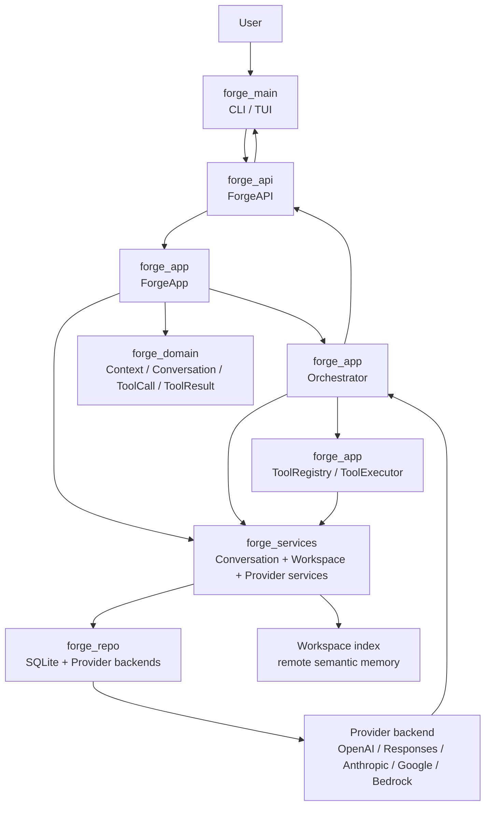

# ForgeCode Core Overview

## Короткий вывод

`forgecode` устроен как Rust workspace, где ядро агента собрано не в одном месте, а из нескольких слоев:

- `forge_main` — CLI/TUI entry
- `forge_api` — фасад между UI и приложением
- `forge_app` — orchestration: prompts, hooks, loop, tools
- `forge_domain` — модель данных: `Context`, `Conversation`, `Message`, `Tool*`
- `forge_services` — сервисный слой: conversations, workspace index, provider service
- `forge_repo` — persistence и provider backends

Главная идея: не “один prompt + один вызов модели”, а цикл:

`conversation -> prompt assembly -> provider request -> streamed response -> tool execution -> append to context -> next request`

## Карта модулей

## Где читать код

- Entry: `source/crates/forge_main/src/main.rs:58`
- UI handoff: `source/crates/forge_main/src/ui.rs:3768`
- API handoff: `source/crates/forge_api/src/forge_api.rs:132`
- Main chat assembly: `source/crates/forge_app/src/app.rs:60`
- Turn loop: `source/crates/forge_app/src/orch.rs:228`
- System prompt assembly: `source/crates/forge_app/src/system_prompt.rs:68`
- User prompt assembly: `source/crates/forge_app/src/user_prompt.rs:34`
- Core memory object: `source/crates/forge_domain/src/context.rs:431`
- Conversation object: `source/crates/forge_domain/src/conversation.rs:43`
- Provider routing: `source/crates/forge_repo/src/provider/chat.rs:133`

## Что важно для своего агента

- У них сильная сторона в том, что `Context` и `Conversation` явно отделены.
- Prompt assembly вынесен в отдельные сервисы, а не растворен в orchestration loop.
- Tool execution встроен в основной loop, а не идет “снаружи”.
- Память тоже не одна:
  - живая память текущего turn в `Context`
  - сохраненная история в `Conversation`
  - внешняя кодовая память через workspace semantic index

Именно это надо держать в голове дальше: Forge не пытается решить все одной историей чата.
