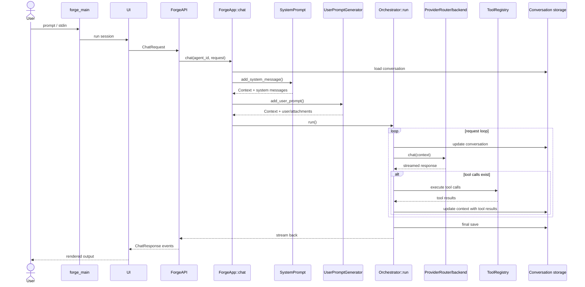

# ForgeCode Turn Pipeline

## Путь одного хода

Нормальный ход в Forge идет так:

1. `main.rs` поднимает CLI/TUI, читает stdin и config.
2. `UI::on_chat()` отправляет `ChatRequest`.
3. `ForgeAPI::chat()` берет active agent.
4. `ForgeApp::chat()` поднимает conversation, agent, provider, tools и custom instructions.
5. `SystemPrompt::add_system_message()` вставляет system block.
6. `UserPromptGenerator::add_user_prompt()` добавляет user message, todos-on-resume, piped context и attachments.
7. `ApplyTunableParameters` и `SetConversationId` дополняют `Context`.
8. `Orchestrator::run()` начинает loop.
9. `execute_chat_turn()` трансформирует `Context` и вызывает provider.
10. Ответ модели приходит stream'ом.
11. Если есть tool calls, они исполняются, результаты пишутся в `Context`.
12. `append_message()` добавляет assistant message + tool results.
13. Conversation сохраняется.
14. Если turn не завершен, loop идет на следующий request.

## Diagram

## Ключевые точки в коде

- `source/crates/forge_app/src/app.rs:60`
  Главная сборка turn перед запуском оркестратора.
- `source/crates/forge_app/src/orch.rs:228`
  Основной loop запроса.
- `source/crates/forge_app/src/orch.rs:195`
  Request-time transform и вызов `chat_agent`.
- `source/crates/forge_app/src/agent.rs:42`
  Провайдер резолвится здесь.
- `source/crates/forge_repo/src/provider/chat.rs:133`
  Развилка по backend'ам.

## Что отсюда важно вынести

- В Forge один “ход пользователя” это не один request к модели.
- Один turn может включать несколько model requests внутри одного orchestration loop.
- Именно `Orchestrator` является сердцем системы, а не `ForgeApp`.
- `ForgeApp` собирает состояние; `Orchestrator` гоняет цикл.
