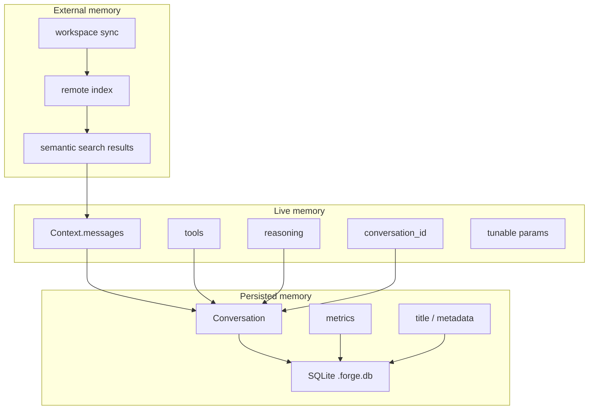

# ForgeCode Memory

## Главная мысль

У Forge нет одной памяти. Есть минимум три разных слоя:

- `Context` — живая память текущего разговора
- `Conversation` — сериализованная история, которая сохраняется между сессиями
- semantic index workspace — внешняя память по коду, не равная chat history

## Memory Layers

## 1. Живая память: `Context`

Основной объект здесь — `source/crates/forge_domain/src/context.rs:431`.

Внутри `Context` лежат:

- `messages`
- `tools`
- `tool_choice`
- `max_tokens`
- `temperature`
- `top_p`
- `top_k`
- `reasoning`
- `response_format`
- `conversation_id`
- `initiator`

Ключевые операции:

- `set_system_messages()` — перезаписывает system block в начале истории
- `add_attachments()` — добавляет file contents / directory listings
- `append_message()` — добавляет assistant message и сразу tool results

## 2. Persisted memory: `Conversation`

`Conversation` живет в `source/crates/forge_domain/src/conversation.rs:43`, а сохраняется через:

- `source/crates/forge_services/src/conversation.rs:13`
- `source/crates/forge_repo/src/conversation/conversation_repo.rs:8`

Сохраняется это в SQLite `.forge.db`, путь берется из:

- `source/crates/forge_domain/src/env.rs:108`

Тут важно: persisted history это не просто сырая строка ответа. Сохраняется структурированный `Context`.

## 3. Автосжатие памяти: compaction

Compaction включается hook'ом после response:

- `source/crates/forge_app/src/hooks/compaction.rs:29`

Основная логика:

- `source/crates/forge_app/src/compact.rs:41`
- `source/crates/forge_domain/src/compact/compact_config.rs:89`
- `source/crates/forge_domain/src/compact/strategy.rs:69`

Что делает compaction:

- выбирает диапазон старых сообщений
- фильтрует `droppable` messages
- строит summary
- переносит usage на summary
- сохраняет только последнее `reasoning_details`, если это нужно для continuity

## Diagram: compaction

## Что не стоит копировать бездумно

- Attachments у них не считаются долговременной памятью.
- `add_attachments()` помечает file content и directory listing как `droppable`.
- Compaction потом их удаляет.

То есть attachment в Forge это “временный injected context”, а не durable memory.

## Практический вывод для своего агента

Если ты хочешь долговременную рабочую память, то надо разделять:

- `ephemeral context`
- `durable episodic memory`
- `external retrieval memory`

Forge это разделение уже делает, но не называет его явно в одном месте.
