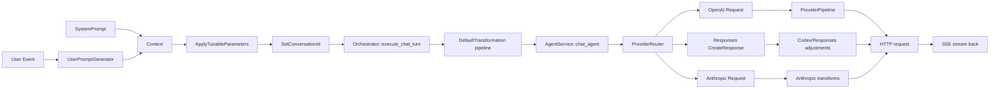

# ForgeCode Request Shaping

## Главная цепочка

У Forge запрос к модели строится не напрямую из user text.

Реальный путь такой:

`Event -> UserPromptGenerator -> Context -> execute_chat_turn() -> provider-specific DTO -> provider transformer pipeline -> HTTP/SSE`

## Diagram

## 1. До провайдера: подготовка `Context`

Ключевые шаги:

- `source/crates/forge_app/src/system_prompt.rs:68`
  Собирает system prompt из agent markdown template, custom instructions, env, files, tools, skills и model capabilities.
- `source/crates/forge_app/src/user_prompt.rs:34`
  Рендерит user prompt из `Event`, terminal context и attachments.
- `source/crates/forge_app/src/apply_tunable_parameters.rs:13`
  Вставляет в `Context` tunables: `temperature`, `max_tokens`, `top_p`, `top_k`, `reasoning`, `tools`.
- `source/crates/forge_app/src/set_conversation_id.rs:5`
  Ставит `conversation_id` в `Context`.

Именно после этого `Context` уже содержит почти все, что нужно для провайдера.

## 2. Внутри `execute_chat_turn()`

Здесь к `Context` применяют еще один слой нормализации:

- `source/crates/forge_app/src/orch.rs:195`

Что там делается:

- сортировка tools
- нормализация аргументов tool calls
- fallback для моделей без native tools
- image handling
- отключение reasoning для моделей без reasoning support
- нормализация reasoning при смене модели

То есть реальный payload формируется не только из `Context`, но и из capability-aware transform pipeline.

## 3. OpenAI-compatible path

Для обычного OpenAI-compatible запроса:

- `source/crates/forge_app/src/dto/openai/request.rs:344`
  `impl From<Context> for Request`
- `source/crates/forge_app/src/dto/openai/transformers/pipeline.rs:33`
  provider/model-specific mutation pipeline
- `source/crates/forge_repo/src/provider/openai.rs:177`
  сериализация, headers, SSE transport

В payload попадают:

- `messages`
- `tools`
- `tool_choice`
- `stream`
- `max_tokens`
- `temperature`
- `top_p`
- `top_k`
- `session_id` из `conversation_id`
- `reasoning`

Важно:

- request часто собирается “оптимистично”, а потом правится transformers
- `parallel_tool_calls` сначала включен, затем может быть убран провайдерными трансформерами

## 4. OpenAI Responses / Codex path

Для `gpt-5`/Codex/Responses path:

- `source/crates/forge_repo/src/provider/openai_responses/request.rs:182`
- `source/crates/forge_repo/src/provider/openai_responses/repository.rs:136`

Здесь есть несколько важных деталей:

- первый `system` становится `instructions`
- остальные system messages идут как developer messages
- `conversation_id` становится `prompt_cache_key`
- tool results передаются как `FunctionCallOutput`
- reasoning config добавляет `ReasoningEncryptedContent` для continuity

Это уже ближе к stateless reasoning replay, чем к обычному chat completion API.

## 5. Anthropic path

Anthropic идет своей DTO-веткой:

- `source/crates/forge_repo/src/provider/anthropic.rs:88`

Там request сначала конвертируется, потом проходит transform pipeline:

- auth system message
- tool ID sanitation
- cache strategy
- schema enforcement
- reasoning transform

И уже после этого уходит в SSE.

## 6. Что это значит для твоего агента

Если ты хочешь повторить сильную часть Forge, то request builder лучше проектировать в 3 слоя:

1. `semantic context builder`
2. `capability-aware normalization`
3. `provider adapter`

Самая частая ошибка в своих агентах — смешать эти три вещи в один огромный prompt builder. У Forge они разведены достаточно неплохо.
