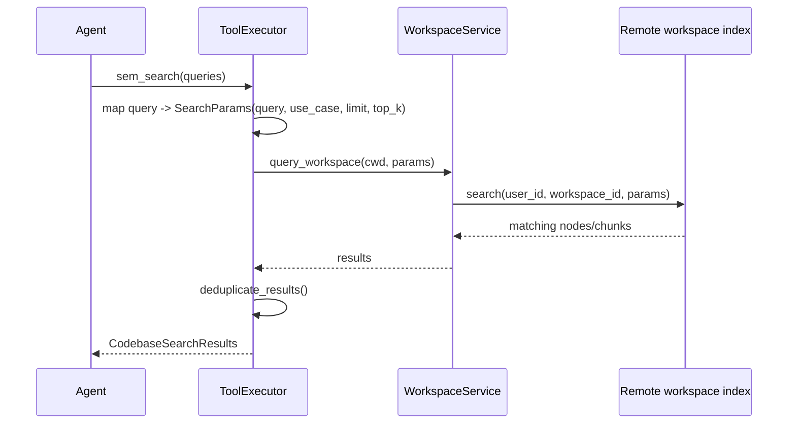

# ForgeCode Semantic Memory

## Что это такое

`sem_search` у Forge это не “поиск по текущему чату”, а отдельный канал памяти по workspace.

Сначала workspace индексируется, потом агент может делать semantic retrieval по коду.

Главные точки:

- `source/crates/forge_app/src/tool_executor.rs:187`
- `source/crates/forge_services/src/context_engine.rs:19`
- `source/crates/forge_domain/src/node.rs:142`
- `source/crates/forge_domain/src/tools/catalog.rs:314`

## Как идет запрос

## Почему это память, а не просто tool

Потому что это retrieval из состояния, которое живет вне chat history:

- файлы синкаются отдельно
- индекс хранится отдельно
- поиск использует `query` и `use_case`
- результаты потом возвращаются обратно в `Context` как tool output

То есть это классический RAG-подобный слой, только не для веба, а для локального codebase.

## Что важно

- Без workspace sync этот слой бесполезен.
- Доступность `sem_search` зависит от auth/indexed status.
- Tool может быть скрыт, если workspace не готов.

Именно поэтому у Forge есть два разных способа “помнить код”:

- вложить кусок файла напрямую как attachment
- поднять из индекса релевантные куски через semantic search

Второй способ масштабируется лучше.

## Вывод для твоего агента

Если ты хочешь агента “для всех задач”, то почти наверняка нужен такой же split:

- short-term memory: conversation context
- medium-term memory: summaries / episodic state
- long-term workspace memory: index + retrieval

Без последнего агент быстро упрется в контекстное окно.
