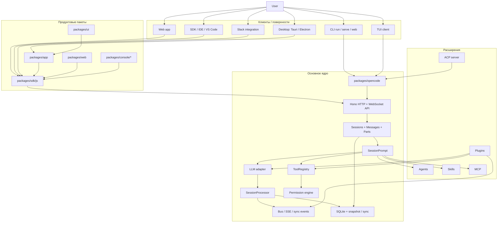
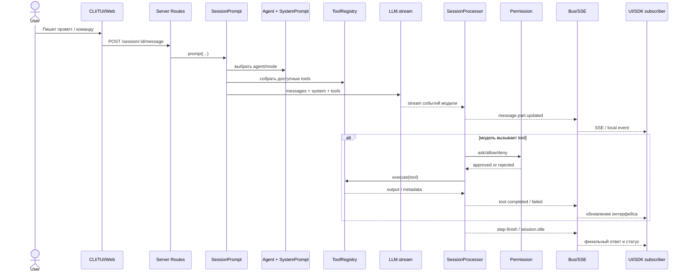
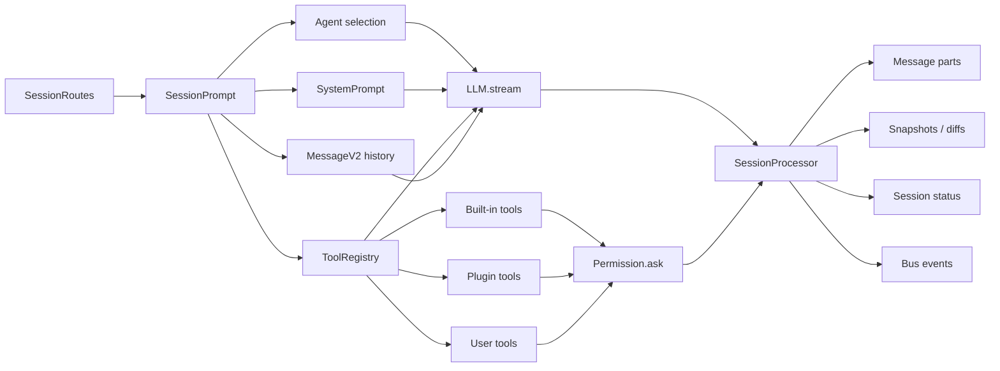

# OpenCode Architecture Map

Эта заметка нужна как короткая карта репозитория `opencode`: что является ядром, как проходит один запрос и где читать код в правильном порядке.

## 1. Карта монорепозитория

## 2. Как проходит один запрос

## 3. Ключевая внутренняя петля

## 4. Что здесь является настоящим ядром

- `packages/opencode` это не просто CLI, а серверное ядро всей системы.
- `packages/app` это браузерный клиент поверх того же backend.
- `packages/sdk/js` это общий клиентский слой для web, IDE и сторонних интеграций.
- `packages/ui` это общие UI-компоненты.
- `packages/web` это docs/marketing слой, а не runtime backend.
- `.opencode/` показывает, как сами разработчики используют agents, commands, tools и project-level config.

## 5. Что важно для своего агента

- В OpenCode агент это не только prompt.
- Агент у них = `prompt + permissions + tool surface + default model + role(primary/subagent)`.
- Главная архитектурная идея: один backend, много клиентов.
- Вторая идея: UI не держит свою отдельную логику агента, он подписывается на события backend-а.
- Третья идея: расширения встроены глубоко. Есть markdown-agents, JS/TS tools, plugins, MCP и ACP.

## 6. Где читать код в правильном порядке

1. `README.md`
   Сначала product-level описание и client/server mental model.
2. `packages/opencode/src/index.ts`
   Общая точка входа CLI и список команд.
3. `packages/opencode/src/server/server.ts`
   Как собирается HTTP/API слой.
4. `packages/opencode/src/server/instance/index.ts`
   Какие instance routes вообще существуют.
5. `packages/opencode/src/session/prompt.ts`
   Настоящая orchestration layer.
6. `packages/opencode/src/session/llm.ts`
   Как подготавливается запрос в модель и tools payload.
7. `packages/opencode/src/session/processor.ts`
   Как поток событий модели превращается в persisted parts.
8. `packages/opencode/src/tool/registry.ts`
   Как строится tool surface.
9. `packages/opencode/src/permission/permission.ts`
   Где реально реализованы `allow / ask / deny`.
10. `packages/opencode/src/agent/agent.ts`
    Где собраны built-in modes и их default permissions.
11. `packages/app/src/context/sdk.tsx`
    Как web/app клиент подписывается на события backend-а.
12. `packages/app/src/context/global-sync.tsx`
    Как UI кэширует проекты, сессии и синхронизирует состояние.

## 7. Практические выводы для проектирования своего агента

- Если хочешь повторить подход OpenCode, проектируй не “чат-обёртку”, а event-driven backend.
- Разделяй `orchestration`, `model adapter`, `tool registry`, `permission engine`, `transport`.
- Не смешивай UI и agent loop. Пусть UI только инициирует запросы и подписывается на события.
- Делай subagents отдельными сессиями или отдельными ветками состояния, а не просто “режимами внутри одного ответа”.
- Самые сложные и самые полезные для вдохновения файлы:
  - `packages/opencode/src/session/prompt.ts`
  - `packages/opencode/src/session/processor.ts`
  - `packages/opencode/src/session/llm.ts`
  - `packages/opencode/src/tool/task.ts`
  - `packages/opencode/src/permission/permission.ts`
  - `packages/opencode/src/agent/agent.ts`

## 8. Наблюдения по репозиторию

- Документация про архитектуру в целом согласована с кодом: core действительно живёт вокруг `packages/opencode`.
- Расширяемость у них многослойная: agents, plugins, skills, MCP, ACP.
- В репо есть как минимум две desktop-ветки: `packages/desktop` и `packages/desktop-electron`.
- Есть следы старых шаблонных README в части пакетов, поэтому ориентироваться лучше на `README.md`, `packages/web/src/content/docs/*` и код ядра.
