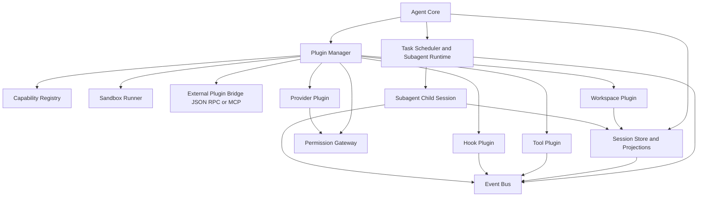

# Аналитический отчёт по репозиторию opencode для проектирования ядра модульного агента

## Исполнительное резюме

Репозиторий opencode на entity["organization","GitHub","code hosting platform"] — это не просто «CLI-агент для кода», а довольно зрелое TypeScript/Bun-монорепо, в котором ядро агента разложено по слоям: `agent`, `session`, `tool`, `plugin`, `provider`, `server`, `permission`, `bus`, плюс отдельный SDK и отдельный пакет типизированных плагинных контрактов. В корне видны `packages/opencode/src` как основной рантайм, `packages/plugin` как SDK/контракты расширений, `packages/sdk/js` как клиент-серверная обвязка, а сама сборка и разработка завязаны на Bun, workspaces и Turbo. citeturn48view0turn50view0

Главная ценность этого репозитория для вашего ядра — не UI и не конкретные промпты, а архитектурная дисциплина:  
типизированный tool-contract через Zod, единый hook-интерфейс плагинов, отдельный контракт адаптеров рабочих пространств, session-centric модель состояния, event-driven обновление частей сообщений и контролируемая компактация контекста. Важный вывод: в opencode «агентность» в основном строится вокруг профилей агента, инструментов, событий и сессий, а не вокруг сложной peer-to-peer сети независимых акторов. citeturn22view0turn19view2turn20view0turn47view1turn46view3turn39view5

Для вашего модульного ядра я рекомендую **взять** следующие решения почти без изменений:  
типизированные tool-интерфейсы, session/event/projection-подход, отдельный `WorkspaceAdapter`, явный lifecycle плагина и трекинг версий/изменений плагина. **Модифицировать** нужно две вещи: механизм hook-ов и загрузчик плагинов. В opencode hook-обработчики исполняются последовательно в одном процессе и мутируют общий `output`, а плагины загружаются через `import(...)` и получают достаточно сильные capability-права, включая shell и клиент API. Это даёт простоту и производительность, но слабую изоляцию. Для вашего ядра лучше сохранить in-process режим только для доверенных плагинов, а для недоверенных и тяжёлых расширений добавить отдельный out-of-process слой с capability negotiation и JSON-RPC/MCP-подобным протоколом. citeturn42view0turn40view1turn19view2turn53search0turn53search1turn53search4turn53search6

По сути opencode показывает очень сильный шаблон: **агент = профиль + state machine сессии + tool registry + hook bus + policy layer**. Это хорошая база для вашего ядра. Но если вы строите именно **модульного агента**, а не только приложение «один trusted host + trusted plugins», то вам нужен дополнительный уровень: декларативный манифест capability-плагина, протокол совместимости и изоляция исполнения. В этом месте opencode полезен скорее как «внутренний trusted-runtime», чем как законченный blueprint для marketplace-уровня расширений. citeturn39view6turn47view2turn45view0turn40view3turn42view4

## Что представляет собой репозиторий

С архитектурной точки зрения это Bun/TypeScript ESM-монорепо. В корневом `package.json` заданы `type: "module"`, `packageManager: "bun@1.3.13"`, workspaces для `packages/*`, `packages/console/*`, `packages/sdk/js`, `packages/slack`, а в scripts используются Bun, Turbo, oxlint и Husky. В корне также лежат `bun.lock`, `flake.nix`, `sst.config.ts`, `turbo.json`, что указывает на сочетание обычной JS/TS toolchain со сборкой через Bun и дополнительной Nix/SST-инфраструктурой. citeturn50view0

README подтверждает, что это open-source AI coding agent с двумя встроенными агентами — `build` и `plan`, а также внутренним subagent `@general`. При этом `plan` описан как read-only агент, который по умолчанию запрещает редактирование файлов и спрашивает разрешение перед bash-командами. Это важный сигнал: в системе уже есть разделение между «исполнителем» и «аналитиком», но оно реализовано не как отдельный orchestration framework, а как профиль агента поверх общего tool/session runtime. citeturn48view0

Ниже — карта модулей, которые действительно важны для проектирования вашего ядра.

| Модуль | Роль в opencode | Почему важен для вашего ядра | Рекомендация |
|---|---|---|---|
| `packages/opencode/src/agent` | Реестр профилей агентов, merge permission/options, выбор default agent, запрет делать subagent агентом по умолчанию. `build`/`plan`/`general` логически живут здесь и в README. citeturn39view0turn48view0 | Полезно как модель «агент = профиль поведения, а не отдельный процесс». | **Взять** |
| `packages/opencode/src/session` | Сессии, parent/child-связи, workspace binding, summary/revert, обновление message parts, event publication. citeturn47view1turn47view2turn47view3turn47view4turn47view5 | Это лучший слой репозитория: именно здесь видно настоящую state model. | **Взять** |
| `packages/opencode/src/session/processor.ts` | Основной processing loop: поток LLM-событий, tool-call lifecycle, retry policy, переходы `continue/stop/compact`. citeturn39view4turn46view0turn46view1turn46view2turn46view3turn46view6 | Даёт реальную machine-модель для агентного рантайма. | **Взять** |
| `packages/opencode/src/tool` | Built-in инструменты: `read`, `write`, `edit`, `bash`, `grep`, `glob`, `plan`, `task`, `todo`, `lsp`, `webfetch`, `websearch`, registry. citeturn37view0turn39view6 | Показывает, как организовать capability surface агента. | **Взять** |
| `packages/opencode/src/plugin` | Загрузка server-плагинов, install/resolve/compatibility, hook dispatch, встроенные auth/provider-плагины, metadata/fingerprint. citeturn36view0turn40view1turn42view0turn42view4turn42view6 | Самый полезный слой для вашей плагинной подсистемы. | **Модифицировать** |
| `packages/plugin` | Публичные TypeScript-контракты для server-plugin, tui-plugin, tool API, workspace adaptors, auth/provider hooks. citeturn19view2turn20view0turn20view4turn21view0turn22view0turn23view2turn24view2 | Это почти готовый SDK-дизайн. | **Взять** |
| `packages/sdk/js` | Клиент/серверные обёртки, запуск локального сервера/TUI, directory/workspace scoping. citeturn26view0turn27view0turn27view1turn29view0turn29view1turn29view2 | Полезно для embedding-режима и интеграционных тестов. | **Взять** |
| `packages/opencode/src/permission` | Wildcard policy engine: `allow/deny/ask`, last-match-wins, дефолт `ask`. citeturn45view0turn45view3turn45view4 | Очень простой и audit-friendly policy layer. | **Взять** |

Ключевой архитектурный вывод по структуре: **ядро opencode — это не plugin-first монолит и не event-sourced platform в чистом виде; это pragmatic layered runtime**, где самая сильная инженерная мысль живёт в `session`, `processor`, `tool registry` и `plugin SDK`. Именно эти четыре зоны дают полезные идеи для вашего собственного ядра. citeturn47view1turn39view4turn39view6turn19view2

## Плагинная система и контракты расширения

В opencode плагинная система разделена на два независимых семейства контрактов: **server plugins** и **TUI plugins**. Для server-plugin ключевая сигнатура выглядит как функция `Plugin(input, options) => Promise<Hooks>`, где хост передаёт `client`, `project`, `directory`, `worktree`, `experimental_workspace.register`, `serverUrl` и shell-объект `$`. Это очень сильный контракт: плагин получает и контекст проекта, и API-клиент, и shell, и возможность добавить workspace adaptor. citeturn19view2turn20view0

Для вашего ядра особенно важно, что contract surface не ограничен «добавь новый tool». Плагин может вмешиваться в разные фазы рантайма через `Hooks`:  
`tool`, `auth`, `provider`, `chat.message`, `chat.params`, `chat.headers`, `permission.ask`, `command.execute.before`, `tool.execute.before`, `shell.env`, `tool.execute.after`, `experimental.chat.messages.transform`, `experimental.chat.system.transform`, `experimental.session.compacting`, `experimental.compaction.autocontinue`, `experimental.text.complete`, `tool.definition`. Это очень мощная расширяемость: плагинный API идёт не только «в ширину» через новые capability, но и «в глубину» через interception важных точек жизненного цикла. citeturn20view0turn20view2turn20view3turn20view4turn21view0

Типизация инструмента сделана очень чисто. `ToolContext` включает `sessionID`, `messageID`, `agent`, `directory`, `worktree`, `abort`, `metadata()` и `ask()`, а helper `tool(...)` требует `description`, `args` на Zod и `execute(args, context)`. Это один из самых сильных участков всего проекта: контракт достаточно узкий, чтобы быть стабильным, и достаточно богатый, чтобы не вынуждать каждый tool напрямую знать о внутреннем устройстве session processor. citeturn22view0

Ниже — сводка по ключевым интерфейсам расширения.

| Контракт | Что делает | Преимущества | Недостатки | Применимость к вашему ядру | Референс |
|---|---|---|---|---|---|
| `PluginInput` | Даёт plugin host-контекст: клиент, проект, directory/worktree, shell, workspace-register. citeturn19view2 | Богатый контекст, мало boilerplate. | Слишком сильные права по умолчанию. | **Модифицировать**: резать capability по manifest. | `packages/plugin/src/index.ts` |
| `Hooks` | Единая точка для tool/auth/provider/chat/permission/shell/compaction hooks. citeturn20view0turn20view2turn20view3turn20view4turn21view0 | Очень гибко, мало фреймворк-кода. | API быстро разрастается и tight-coupled к host internals. | **Взять**, но делить на стабильные и experimental hook-группы. | `packages/plugin/src/index.ts` |
| `tool(...)` + `ToolContext` | Типизированный контракт инструмента с Zod-схемой и execution context. citeturn22view0 | Отличная discoverability, модель-понятные параметры, строгий runtime contract. | Если schema формально валидна, но семантически опасна, host всё равно должен дополнительно проверять. | **Взять** | `packages/plugin/src/tool.ts` |
| `WorkspaceAdaptor` | Контракт удалённого/локального рабочего пространства: `configure/create/remove/target`. citeturn19view2turn16view3 | Удачное отделение среды выполнения от логики агента. | Сейчас помечено как `experimental_workspace`. | **Взять** | `packages/plugin/src/index.ts`, `example-workspace.ts` |
| `AuthHook` / `ProviderHook` | Позволяют встраивать OAuth/API-key авторизацию и добавлять модели/provider metadata. citeturn21view0 | Расширяет ядро без patching provider layer. | Ставит плагины очень близко к security boundary. | **Модифицировать**: выносить в privileged plugin tier. | `packages/plugin/src/index.ts` |
| `TuiPluginApi` | Команды, маршруты, KV, theme, event bus, slots, plugins lifecycle. citeturn23view2turn24view0turn24view1turn24view2turn24view3 | Хорошее разделение UI API и host state. | Для headless ядра избыточно. | **Отказаться** для ядра, **сохранить** как отдельный adapter layer. | `packages/plugin/src/tui.ts` |

Короткий пример server-plugin и tool-контракта, который стоит перенести в ваш дизайн почти без изменений:

```ts
type ServerPlugin = (input: PluginInput, options?: PluginOptions) => Promise<Hooks>

const myTool = tool({
  description: "Read-only analysis",
  args: { path: tool.schema.string() },
  async execute(args, ctx) {
    ctx.metadata({ title: "analysis" })
    return "..."
  },
})
```

Сигнатура функции плагина, helper `tool(...)` и shape `ToolContext` следуют тому, как это сделано в `packages/plugin/src/index.ts` и `packages/plugin/src/tool.ts`; у opencode есть и минимальный пример собственного plugin/tool usage. citeturn19view2turn22view0turn18view3

Теперь о загрузке. Внутренний loader делает четыре вещи:  
сначала нормализует spec, затем resolve-ит target и при необходимости устанавливает npm-плагин, затем ищет нужный entrypoint (`server` или `tui`), затем проверяет совместимость npm-плагина с `InstallationVersion` и только после этого делает динамический `import(row.entry)`. Загрузчик умеет отличать `file` и `npm` источники, умеет отдельно обрабатывать «плагин существует, но entrypoint не найден», а для file-плагинов умеет один раз повторить загрузку после внешней подготовки зависимостей. Это очень продуманный loader lifecycle. citeturn40view1turn40view3turn42view6turn42view7

Но изоляции на уровне процесса здесь фактически нет. Если плагин успешно прошёл resolve/compatibility и был импортирован, он работает в том же процессе и может использовать предоставленный `$` shell и API-клиент. Для trusted plugin environment это нормально; для marketplace, plugin ecosystem с third-party кодом или B2B/embed-сценария с разными trust tier — недостаточно. Поэтому загрузчик как **lifecycle manager** стоит взять, а как **security boundary** — нет. citeturn40view1turn19view2

Отдельно отмечу удачную идею с метаданными плагина. В `meta.ts` ведутся `requested`, `version`, `modified`, `first_time`, `last_time`, `time_changed`, `load_count`, а fingerprint для file-plugin строится из `target + modified`, для npm-plugin — из `target + requested + version`. Это очень хороший практический паттерн для ваших hot reload, compatibility report и UI/telemetry вокруг плагинов. citeturn42view4

## Агентный рантайм, состояние и координация

В opencode агенты — это скорее **профили поведения внутри общего runtime**, а не отдельные автономные процессы. README прямо разделяет `build` как full-access профиль и `plan` как read-only профиль, а также упоминает внутренний subagent `@general` для сложных поисков и многошаговых задач. В коде `agent.ts` видно, что agent-конфигурации сливаются с пользовательским config, для них объединяются permissions/options, а `default_agent` не может указывать на subagent. Это хороший и важный дизайн: «агент» — это объявление capability/policy envelope поверх одной execution machine. citeturn48view0turn39view0

Самая сильная часть всей системы — session layer. `Session.create` создаёт новую сессию, сохраняя `directory`, `path`, `workspaceID`, `parentID`, `permission`, а сама session info содержит `summary`, `share`, `revert`, timestamps и ссылку на `projectID`. Обновления messages и parts идут через отдельные операции (`updateMessage`, `updatePart`, `removePart`, `getPart`), а `updatePart` и `PartDelta` публикуют события через sync/bus слой. Это по сути хороший гибрид event-log и projection-ориентированной модели: содержание разговора хранится как message/part, а быстрые UI/runtime-реакции происходят через события. citeturn47view1turn47view2turn47view3turn47view4turn47view5

`SessionProcessor` связывает всё вместе. Его default layer зависит от `Session`, `Config`, `Bus`, `Snapshot`, `Agent`, `LLM`, `Permission`, `Plugin`, `SessionSummary`, `SessionStatus`; он умеет обновлять и завершать tool calls, стримить ответ модели, прерывать обработку при необходимости compaction, применять retry policy и возвращать всего три исхода обработки: `continue`, `stop`, `compact`. Это очень хороший state machine-паттерн для агентного ядра: наружу выдаются не внутренние флаги, а **явный результат шага обработки**. citeturn39view4turn46view0turn46view1turn46view2turn46view3

Важный вывод для «межагентного общения»: opencode не выглядит как система, где агенты общаются друг с другом через полноценный actor-protocol. Вместо этого координация строится через:  
`session parent/child`, built-in subagent (`@general`), named tools `task` и `read` в `ToolRegistry`, а также через общий session/message/toolcall state. Это более иерархическая, чем сетево-распределённая модель. Для прикладного coding-agent это, на мой взгляд, правильный выбор: если подзадача становится отдельным subagent run, у неё должен быть собственный контекст и собственная запись в состоянии, а не «чат напрямую между двумя агентами». citeturn39view6turn47view2turn48view0turn37view0

Планирование в opencode встроено в tool layer. В каталоге `tool` присутствуют `plan.ts`, `task.ts`, `todo.ts`, а рядом с ними лежат `plan-enter.txt`, `plan-exit.txt`, `task.txt`, `todowrite.txt`. Архитектурно это означает, что planner здесь не вытащен в отдельный orchestration service; вместо этого планирование и decomposition встроены как специализированные инструменты внутри единого tool/runtime цикла. Для вашего ядра это полезный ориентир: **не обязательно иметь отдельный «planner engine»**, если planner можно выразить как capability и state transition внутри общего рантайма. citeturn37view0turn39view6

Ещё один очень сильный участок — компактация контекста. `SessionProcessor` умеет переключаться в состояние `compact`, а `session/compaction.ts` перед compaction вызывает plugin-hook `experimental.session.compacting`, позволяя плагину либо добавить контекст, либо полностью заменить prompt компактации. В hooks SDK есть и `experimental.compaction.autocontinue`, который решает, добавлять ли synthetic user turn `"continue"` после успешной compaction. Это не просто detail — это правильный архитектурный пример того, как делать «extension points around memory management», а не только вокруг tools. citeturn46view0turn46view3turn39view5turn21view0

Ниже — сводка паттернов координации и их ценности для вашего ядра.

| Паттерн | Как сделано в opencode | Сильные стороны | Слабые стороны | Что делать у вас |
|---|---|---|---|---|
| Агент как профиль | `build`/`plan`/`general`; default agent нельзя делать subagent. citeturn48view0turn39view0 | Простая mental model, легче policy control. | Меньше автономности на уровне multi-agent network. | **Взять** |
| Подзадача как отдельный runtime context | Есть `parentID`, `workspaceID`, named tools `task`/`read`; subagent упомянут в README. citeturn47view2turn39view6turn48view0 | Отличная трассируемость. | Нужна явная агрегация результатов child-run. | **Взять** |
| Event-driven state updates | `updatePart`, `PartUpdated`, `PartDelta`, plugin `event` hook. citeturn47view1turn47view3turn42view0 | Хорошо для UI, логирования и observability. | Требует дисциплины в schema событий. | **Взять** |
| Планирование как tool | `plan.ts`, `plan-enter.txt`, `plan-exit.txt`. citeturn37view0 | Не нужен отдельный planner engine. | Легко смешать planner и executor semantics. | **Модифицировать** |
| Compaction как часть state machine | Processor возвращает `compact`; plugins могут менять prompt compaction. citeturn46view0turn39view5turn21view0 | Очень зрелое управление длинным контекстом. | Experimental hooks надо стабилизировать. | **Взять** |

## Безопасность, изоляция, тесты и требования окружения

Слой permission в opencode минималистичен и поэтому хорош. `evaluate(permission, pattern, ...rulesets)` разворачивает все правила, берёт **последнее совпадение** по wildcard-маске и возвращает `allow`, `deny` или `ask`; если совпадений нет, дефолт — `ask`. Это очень удачный policy engine для агентного ядра: поведение предсказуемо, правило легко объяснить пользователю, и engine не перегружен сложной логикой. citeturn45view0turn45view3turn45view4

Однако security story у плагинов заметно слабее, чем у tools. Server-plugin получает `$` shell и API client ещё на этапе инициализации, hooks могут модифицировать `chat.params`, `chat.headers`, `shell.env`, `tool.definition`, а loader после валидации просто делает dynamic import entrypoint. Это означает, что real trust boundary проходит не между «host» и «plugin», а между «trusted config» и «untrusted code» — и второй класс практически не изолирован. Для закрытого developer tool это допустимо; для вашей плагинной платформы — нет. citeturn19view2turn20view2turn20view3turn21view0turn40view1

С точки зрения совместимости и жизненного цикла loader сделан хорошо. Источники плагина различаются как `file` и `npm`, виды entrypoint — `server` и `tui`, а совместимость по версии host-а проверяется для npm-плагинов через `checkPluginCompatibility(...)`. Слой meta поверх этого хранит fingerprint, requested version, фактическую version и load count. То есть вопрос «плагин найден / совместим / обновился?» решён лучше, чем вопрос «плагин безопасен?». Для вашего ядра это означает: lifecycle и compatibility logic можно заимствовать почти полностью, а enforcement isolation нужно строить отдельно. citeturn42view6turn42view7turn40view3turn42view4

CI/CD у репозитория развитый. В `.github/workflows` присутствуют `test.yml`, `typecheck.yml`, `opencode.yml`, `deploy.yml`, `publish.yml`, `containers.yml`, `storybook.yml`, review/triage/docs/Nix workflow-ы и release/publish сценарии. Отдельно видно, что root `package.json` намеренно запрещает запуск `test` из корня, то есть тестирование организовано не как «один root test script», а как пакетный/CI-оркестрируемый набор задач. Это говорит о зрелой поставке и полезно как пример для вашего собственного monorepo, если ядро и плагины будут жить рядом. citeturn51view0turn52view0turn50view0

По окружению картина такая: первый класс гражданина здесь — Bun (`bun@1.3.13`), но toolchain одновременно учитывает Node-экосистему через типовые зависимости `@types/node`, `@tsconfig/node22`, `cross-spawn`, `node-pty`-related postinstall; серверный слой абстрагирован и по умолчанию использует Hono backend, а JS SDK умеет запускать локальный `opencode serve` на `127.0.0.1:4096` и локальный TUI как отдельный процесс. Плюс в корне есть Nix и SST configs. Для вашего ядра это означает: если вам нужна максимальная переносимость, лучше не повторять полную Bun-centric привязку, а выделить runtime-agnostic plugin contract поверх process/worker boundary. citeturn50view0turn27view0turn27view1turn29view1turn39view8

Ниже — матрица решений по безопасности и эксплуатации.

| Подход из opencode | Что он даёт | Риск | Моя рекомендация |
|---|---|---|---|
| Wildcard permissions + default `ask` citeturn45view0 | Простая объяснимая policy model | Правила легко сделать слишком широкими | **Взять** |
| Hook `shell.env` + доступ к `$` shell citeturn19view2turn20view3 | Очень мощная интеграция расширений | Плагин фактически получает privileged execution path | **Модифицировать**: только trusted tier |
| Dynamic import plugin entrypoint citeturn40view1 | Простая и быстрая загрузка | Нет process isolation | **Отказаться** для untrusted plugin tier |
| Compatibility check для npm plugins citeturn40view3turn42view6 | Защищает от несовместимых API | Не решает runtime-права и побочные эффекты | **Взять** |
| Plugin fingerprint / version tracking citeturn42view4 | Hot reload, diagnostics, telemetry | Нужен store maintenance | **Взять** |
| Local server wrapper через SDK spawn citeturn27view0turn27view1turn29view1 | Очень удобный embedding и e2e режим | Если использовать как isolation boundary, это ложное чувство безопасности | **Взять** как integration helper |

## Архитектура плагинной подсистемы для вашего ядра

Если собрать лучшее из opencode и кратко сопоставить это с общими практиками протокольных agent/tool систем, то картина такая. opencode сильнее всего в **in-process typed extensibility**: hooks, tools, workspace adaptors, session state, compaction hooks. Протокольные системы вроде MCP, наоборот, сильнее всего в explicit lifecycle, capability negotiation, transport-level separation, JSON-RPC request/response/notification model и формальной версии протокола. MCP прямо требует базовый протокол, lifecycle management и совместимый обмен capability на стадии инициализации; сообщения идут как requests/responses/notifications в стиле JSON-RPC. Для вашего ядра это означает, что идеальный дизайн — **двухконтурный**: локальный TS-first API для trusted plugins и внешний protocol-first API для isolated plugins. citeturn53search0turn53search1turn53search4turn53search6turn53search7

Моя конкретная рекомендация: строить плагинную подсистему как **capability-oriented host**, где plugin manager не просто «загружает модуль», а проводит полный lifecycle: discovery → verify → compatibility → capability grant → isolated activation → runtime hook dispatch → quiesce → unload. При этом state и межагентное взаимодействие не должны жить внутри plugin manager; они должны жить в отдельном session/task/event слое, а plugin manager должен только регистрировать расширения и выдавать им ограниченные адаптеры к host API. Здесь опора на opencode очевидна: именно так у них уже разделены `session`, `tool`, `plugin`, `agent`, только пока без жёсткой изоляции. citeturn47view1turn39view6turn42view0turn40view1

### Предлагаемая схема плагинной подсистемы



В этой схеме я бы развёл плагины на три trust-tier.

| Tier | Способ загрузки | Для чего | Политика |
|---|---|---|---|
| `trusted/in-process` | Прямой import в runtime | Встроенные host-плагины, быстрые hooks, provider adapters | Полный API, но только для ваших собственных модулей |
| `trusted/local-isolated` | Worker thread или child process | Сторонние плагины без сетевого multi-tenant риска | Ограниченный capability set |
| `external/protocol` | JSON-RPC/MCP bridge | Marketplace, корпоративные расширения, remote tools | Handshake, capability negotiation, auth, quota |

### API, который я рекомендую для вашего ядра

| API | Назначение | Что перенять из opencode | Что добавить |
|---|---|---|---|
| `PluginManifest` | Идентичность, тип, entrypoints, совместимость | Идею `spec/source/target/requested/version/fingerprint`. citeturn42view4turn42view7 | `apiVersion`, `hostVersionRange`, `permissions`, `signature`, `capabilities` |
| `activate(ctx)` | Инициализация плагина | Идею `PluginInput` и разделения server/tui. citeturn19view2turn24view2 | Возвращать только capability-limited adapters |
| `deactivate()` / `dispose()` | Освобождение ресурсов | Идею lifecycle signal у TUI plugins. citeturn24view2 | Жёсткие timeout и forced cleanup |
| `ToolDefinition` | Инструменты | Zod-like schema + execution context. citeturn22view0 | Budget, side-effect class, sandbox hint |
| `HookSet` | Interception points | `chat.params`, `tool.before/after`, `permission.ask`, `compaction`. citeturn20view2turn20view3turn20view4turn21view0 | Стабильные и experimental hook namespaces |
| `WorkspaceAdapter` | Локальные/удалённые рабочие среды | `configure/create/remove/target`. citeturn19view2turn16view3 | Явный healthcheck и migration |
| `PluginCompatibility.check(...)` | Версионирование и совместимость | Идею pre-load compatibility check. citeturn40view3turn42view6 | Handshake + negotiated capability set |
| `PluginTelemetry` | Наблюдаемость | `first_time/last_time/time_changed/load_count`. citeturn42view4 | Crash count, cold start, permission denial stats |

Минимальный API-контур для вашего ядра я бы зафиксировал так:

```ts
interface PluginManifest {
  id: string
  kind: "tool" | "hook" | "provider" | "workspace"
  apiVersion: string
  hostVersionRange: string
  permissions: string[]
  capabilities: string[]
  entrypoints: { main: string }
}

interface HostContext {
  session: SessionApi
  events: EventBusApi
  permissions: PermissionApi
  storage: ProjectionStoreApi
  tools: ToolRegistryApi
  abort: AbortSignal
}

interface PluginModule {
  manifest: PluginManifest
  activate(ctx: HostContext): Promise<PluginExports>
  deactivate?(): Promise<void>
}
```

Это уже не цитата из opencode, а рекомендуемый мной синтез его сильных сторон: типизация и lifecycle из `packages/plugin`, state/event model из `session`/`processor`, совместимость и telemetry из `plugin/meta.ts` и `plugin/loader.ts`. citeturn22view0turn42view4turn40view1turn47view1turn46view0

### Что конкретно брать, что менять, от чего отказаться

| Подход | Краткое описание | Плюсы | Минусы | Для вашего ядра | Пример / референс |
|---|---|---|---|---|---|
| Типизированный tool-contract | Tool со schema + execute + ToolContext | Стабильный API, проще тестировать и объяснять модели | Нужен отдельный policy gate | **Взять** | `packages/plugin/src/tool.ts` citeturn22view0 |
| Hook-архитектура | Плагин возвращает `Hooks`, host триггерит точки расширения | Очень гибкая extensibility | Tight coupling, рост surface | **Взять, но модульно стабилизировать** | `packages/plugin/src/index.ts`, `packages/opencode/src/plugin/index.ts` citeturn20view0turn20view2turn42view0 |
| Последовательный trigger с shared output | Каждый hook мутирует общий `output` по цепочке | Просто реализовать | Сложно делать deterministic conflict resolution | **Модифицировать**: вводить explicit precedence и merge-strategy | `packages/opencode/src/plugin/index.ts` citeturn42view0 |
| Workspace adapters | Отдельный контракт среды выполнения | Красивое отделение runtime-среды | Пока experimental | **Взять** | `packages/plugin/src/index.ts`, `example-workspace.ts` citeturn19view2turn16view3 |
| Session-centric state | Сессии, parentID, workspaceID, summary/revert, parts/events | Отличный фундамент для агентного ядра | Требует нормальных projectors | **Взять** | `packages/opencode/src/session/session.ts` citeturn47view1turn47view2turn47view4turn47view5 |
| Processor как state machine | `continue/stop/compact` и toolcall lifecycle | Очень чистый runtime loop | Нужно внимательно проектировать retries и breaks | **Взять** | `packages/opencode/src/session/processor.ts` citeturn46view0turn46view1turn46view2turn46view3 |
| Compaction hooks | Плагин может менять prompt compaction | Сильная memory extensibility | Экспериментальный API легко ломать | **Взять** | `packages/opencode/src/session/compaction.ts`, plugin hooks citeturn39view5turn21view0 |
| Планирование как tool | `plan.ts`, `task.ts`, `todo.ts`, prompt templates | Не нужен отдельный planner service | Planner может стать слишком implicit | **Модифицировать**: добавить explicit task graph | `packages/opencode/src/tool/*` citeturn37view0turn39view6 |
| Loader file/npm + compatibility | Resolve/install/check/import/retry pipeline | Очень зрелый lifecycle | Не является sandbox boundary | **Взять** как lifecycle, **не брать** как isolation | `plugin/loader.ts`, `plugin/shared.ts` citeturn40view1turn40view3turn42view6 |
| In-process plugin execution | Dynamic import внутри хоста | Минимальный overhead | Высокий риск для untrusted code | **Отказаться** для внешних плагинов | `plugin/loader.ts`, `PluginInput.$` citeturn40view1turn19view2 |
| Fingerprint и plugin telemetry | requested/version/modified/load_count/time_changed | Очень полезно для hot reload и support | Нужен store и housekeeping | **Взять** | `plugin/meta.ts` citeturn42view4 |
| Wildcard permissions | last-match-wins, default ask | Простой и audit-friendly policy engine | Может быть слишком coarse-grained | **Взять** | `permission/evaluate.ts` citeturn45view0 |

### Итоговая рекомендация

Если сформулировать решение в одном абзаце, то для вашего ядра я бы строил систему так:  
**session/state/event backbone по образцу opencode**, **typed tool/plugin contracts по образцу `packages/plugin`**, **иерархические subagent-задачи вместо peer-to-peer межагентного чата**, **planner/todo/task как capability layer**, **compatibility + plugin telemetry из `plugin/meta.ts`/`loader.ts`**, и поверх этого — **два режима плагинов: trusted in-process и isolated external**. Именно такая комбинация забирает сильные стороны opencode и устраняет его главное ограничение — недостаточную изоляцию расширений. citeturn22view0turn47view1turn46view0turn42view4turn40view1turn53search0turn53search6

Практически это означает следующее. Для первой версии вашего ядра можно безболезненно повторить opencode-подход для **инструментов, сессий, planner/task/todo слоя и session processor**. Но плагинный loader с trusted dynamic import я бы оставил только для ваших встроенных модулей. Всё, что потенциально будет писаться сторонними разработчиками, нужно сразу проектировать через capability manifest и изолированный transport. Это даст вам возможность начать просто, а расти — правильно. citeturn40view1turn42view4turn53search1turn53search4